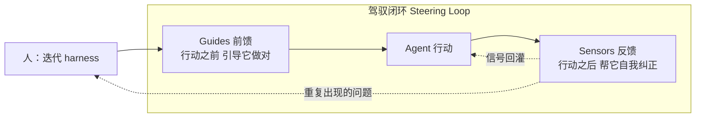

Agent 先靠 Guides 在行动前尽量做对，再靠 Sensors 在行动后看见偏差、自我纠正。那些在循环里反复出现的问题，最后由人沉淀回 harness，变成下一轮更可靠的引导。

```mermaid
flowchart LR
    H[人：迭代 harness] --> G
    subgraph Loop[驾驭闭环 Steering Loop]
        direction LR
        G["Guides 前馈
行动之前 引导它做对"] --> A[Agent 行动]
        A --> S["Sensors 反馈
行动之后 帮它自我纠正"]
        S -.信号回灌.-> A
    end
    S -.重复出现的问题.-> H
```
