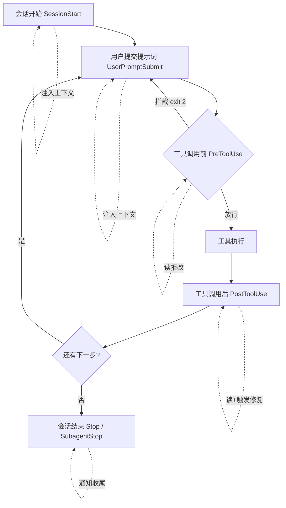

> [!NOTE]
> 一句话结论：Hook 是 Agent 装配体系里专门管「确定性自动化」的那一层。它不靠模型自觉，而是在 Agent 运行循环的固定节点上强制触发你的脚本。凡是「每次都该发生、不该靠人或模型记得」的事，都该下沉成 Hook。

# Hook 是什么

Hook（钩子）是你预先写好的一段脚本，会在 Agent 跑到某个固定节点时自动触发，比如工具调用前、用户提交提示词时、会话结束时。它跟「让模型自己决定要不要做某件事」的根本差别在于确定性：事件一到就跑，不看模型想不想得起来。

# 为什么这两年 Hook 突然重要

原来那套「每步操作弹窗让人批准」的安全机制基本失效了。Anthropic 自己的数据显示，用户对 93% 的权限弹窗直接点了批准，老手里超过 40% 干脆设成自动批准，人根本看不过来。于是业界转向用 Hook 在工具调用前后做程序化拦截，把「人肉审批」换成「代码审批」[钩子机制：新兴的 Agentic 运行时执行层](https://www.secrss.com/articles/90433)。

# Hook 能干的事，归到底是四件：读、拒、改、注

挂载点只决定「在哪触发」。真正决定 Hook 能干嘛的，是它拿到什么、能返回什么。剥开各种花样，底层就四种能力。

| 能力 | 怎么实现 | 能拿来做什么 |
|-|-|-|
| **观察（读）** | Hook 触发时，工具的上下文以 JSON 从 stdin 灌进来：要改哪个文件、要跑什么命令、提示词是什么。 | 审计、日志、埋点。光靠读就能做。 |
| **拦截（拒）** | 在工具调用前用退出码把操作摁住。这里有个高频坑：很多人以为 `exit 1` 会阻断，其实它只记个错误，真要拦截必须 `exit 2`。 | 在危害发生前拦下危险操作。这是 Hook 区别于普通日志的关键。 |
| **改写（改入参）** | 新版本 Hook 能在 stdout 吐 JSON，用 `updatedInput` 字段重写工具调用参数，比如重定向写文件的路径、给命令加前缀；`permissionDecision` 还能直接替模型拍板 allow / deny / ask。 | 在执行前修正参数、代模型做权限决策。 |
| **注入（反向喂上下文）** | SessionStart、UserPromptSubmit 这类事件，stdout 的输出会作为上下文反向喂给模型。 | 会话启动或提问时，主动往模型脑子里塞信息，不只是在旁边监工。 |

一句话：挂载点决定时机，这四种能力决定动作。

# 挂载点决定时机

不管哪家工具，能挂的点高度趋同，核心就这几个。其中工具调用前这个点在安全上最要紧，它是唯一能在危害发生前拦下来的位置，其余大多只能事后补救。

# Hook 的典型用途一览

把常见玩法拆开，其实就是这几类。看一眼「挂在哪、干什么活、图什么」就够了。

| 用途 | 挂载点 | Hook 干的活 |
|-|-|-|
| 提交门禁 | 工具调用前 | 拦 git commit，先跑 commit message 格式校验和轻量测试，不过就 `exit 2` 直接阻断。 |
| 敏感文件保护 | 工具调用前 | 拦 .env、secrets.yaml 这类文件，直接拒写，防止密钥被误改误传。 |
| 配置文件兜底 | 工具调用前 | 拦对工程核心配置的改动，避免一改就把工程搞崩。 |
| 自动修复闭环 | 工具调用后 | 匹配 Edit/Write，AI 一改完代码就自动跑 Lint 和类型检查，不合格就把错误反馈给 Agent 自动修复重试，把「写、测、改、再测」的串行流程压成分钟级闭环。 |
| 代码贡献度量 | 工具调用后 | 把 AI 生成的代码 diff 上报到度量平台，算出 AI 代码贡献率。 |
| 执行链路可视化 | 工具调用后 / 会话结束 | 把执行记录同步到链路追踪平台，把 Agent 的执行流程画出来，方便排查。 |
| 长任务通知 | 会话结束 / 权限请求 | 会话停止时自动把状态推到 IM（如飞书、Slack），做到任务完成即通知，人不用一直盯着。 |
| 会话启动喂料 | 会话开始 | 自动跑 git status、git log，把结果塞进上下文，省掉每次手动贴。 |
| 提问时补信息 | 用户提交提示词 | 自动注入今天日期等易过期的信息，避免模型用过期常识。 |

> [!NOTE]
> 放开自动化前先收敛权限边界：别一次性把任意 Shell、强推、删库的权限全开给 Agent，却没有白名单和 Hook 兜底。一旦失误就是不可逆破坏。

# 常见坑

| 坑 | 解法 |
|-|-|
| 想拦截却拦不住 | `exit 1` 只记录，`exit 2` 才阻断。 |
| Stop Hook 测试失败无限重试 | 必须加 `stop_hook_active` 守卫，否则失败测试触发死循环、耗光 token。 |
| 项目级 Hook 进 git 后坑到别人 | 脚本开头加一句「缺依赖就安静跳过」，别让别人的 Agent 整天报错。 |
| 长任务 Hook 阻塞主进程 | 用 detached 加 unref 的 fire-and-forget 模式 spawn 子进程，保证 Hook 在超时内退出。 |

# 一句话总结

Hook 是装配体系里负责确定性自动化的那一层，专治模型不靠谱、会漏项。能力上就是读、拒、改、注四招，用途上从门禁兜底一路做到可观测加通知闭环。
