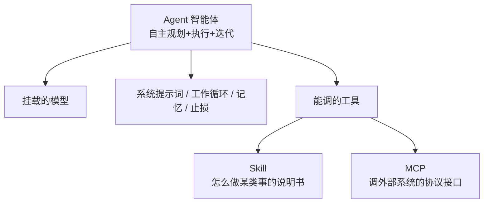
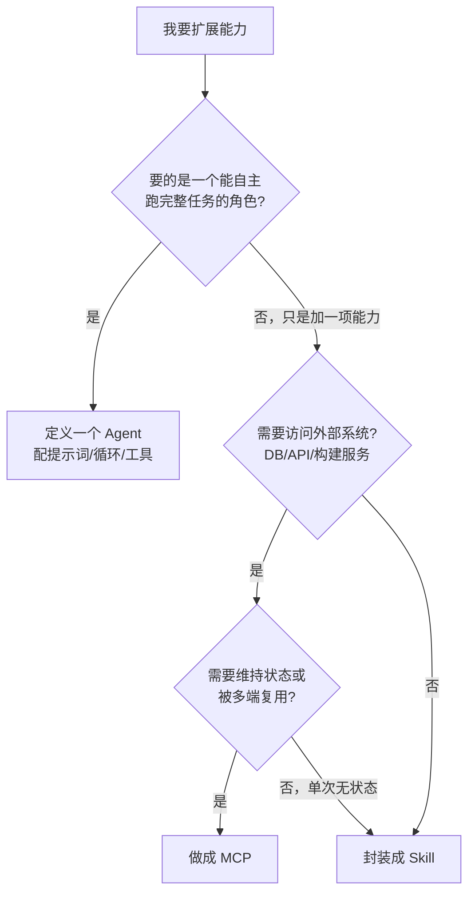
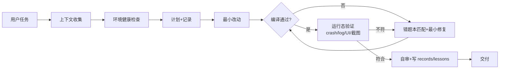

> [!NOTE]
> **一句话先理清三者：**
> **Agent** 是会自主干活的"人"
> **Skill** 是教他某类活怎么干的"招式说明书"
> **MCP** 是接到外部系统的"工具箱接口"。
> 三者不是并列竞品，而是**层层包含**的关系。本文讲清区别，重点是什么场景用哪个。

# 一、常见误解 vs 实际

| 常见说法 | 实际 |
|-|-|
| Skill 就是一份接口文档，写个 Markdown 就行 | 入口确实是 Markdown（`SKILL.md`），但它是**工作流说明书 + 配套脚本/资源**，给模型读的操作手册，不是程序契约 |
| MCP 就是个 RPC 接口 | 方向对。它是基于 **JSON-RPC 2.0** 的标准协议，可类比"为大模型设计的 gRPC"，自带 Tools / Resources / Prompts 三类能力 |
| Agent、Skill、MCP 是三种平行方案，选一个就行 | 不是平行关系，而是**包含关系**：Agent 是容器，Skill 和 MCP 是挂在它身上的能力 |

---

# 二、三者的层次关系

最关键的认知：它们不在同一层。Agent 在最外层，Skill / MCP 是喂给它的"料"。

> [!NOTE]
> 类比：**Agent 是"人"，Skill 是"教他的招式"，MCP 是"给他的工具箱接口"。**你配一个 Agent，可以给它挂若干 Skill 和若干 MCP，也可以一个都不挂。

---

# 三、三者对比

| 维度 | Agent | Skill | MCP |
|-|-|-|-|
| **本质** | 自主智能体（容器） | 行为说明书 | 通信协议 |
| **层级** | 最外层，包含后两者 | 挂在 Agent 上 | 挂在 Agent 上 |
| **执行主体** | 自己规划并驱动循环 | 模型按说明书执行 | 独立 Server 进程执行 |
| **状态** | 有，记忆/断点/看板 | 无，按需加载 | 有，连接/缓存 |
| **载体** | 提示词+工具+循环配置 | 文件夹（SKILL.md+脚本） | 常驻 Server 进程 |
| **解决什么** | "谁来干完整件事" | "某类事怎么干" | "怎么调到外部系统" |

---

# 四、怎么选：决策路径

> [!NOTE]
> **判据：**要"一个会干活的角色" → Agent；给角色加"标准动作" → Skill；让角色"接到外部系统/常驻服务" → MCP。

---

# 五、实战：用「iOS 自闭环开发流水线」三层拆解

拿一个真实方案落地——它本身就是个 Agent，里面同时用到了 Skill 思路和 MCP 工具，三层都齐了。

## ① 整体是一个 Agent

这套流水线的核心就是一个自主智能体：用户给任务目标，它自己**收集上下文 → 健康检查 → 计划 → 改代码 → 编译测试 → 运行态验证 → 自审沉淀 → 交付**，失败了还会错误分类、查错题本、限次止损。这套自主工作循环 + 记忆（logs/records/lessons）+ 看板，是典型的 **Agent** 级能力，远超单个 Skill。

## ② 其中可以抽成 Skill 的部分

方案第 7.2 节的"独立技能模块模式"就是把通用能力**抽成 Skill**，跨项目复用：

| 抽成 Skill 的能力 | 解决的问题 |
|-|-|
| `config_wizard` | 自动找工程、列 scheme、列设备、提取 bundle id |
| `doctor` | 首次运行就知道环境缺什么 |
| `runtime_smoke` | 通用启动 / crash / UI 树 / 截图能力 |
| `dashboard` | 统一展示所有项目状态 |

这些是"某类事怎么干"的标准动作，无状态、按需调用、写成说明书+脚本即可——典型 **Skill**。

## ③ 其中应该做成 MCP 的部分

方案里的 **build helper / XcodeBuildMCP** 就是 MCP 形态的最佳落点：

> [!NOTE]
> **为什么是 MCP**  
> 编译要接 Xcode / 构建服务、要维持环境状态、企业工程构建链路复杂、多任务多项目复用——这些都是"调外部系统 + 有状态 + 跨端复用"的典型特征。

> [!NOTE]
> **为什么不是 Skill**  
> 编译不是"教模型怎么写"，而是要真正驱动外部构建工具、回采运行态证据。让模型裸跑 xcodebuild 既不稳也无状态——必须由独立服务接管。

> [!NOTE]
> **串起来看：**这套流水线 = 一个 **Agent**（自闭环工作循环）+ 若干 **Skill**（config_wizard / doctor / runtime_smoke 等标准动作）+ **MCP**（XcodeBuildMCP 接管编译运行）。三层各司其职，这就是它们真实的协作方式。

---

# 六、一句话速记

| 概念 | 记住这句 |
|-|-|
| **Agent** | 会自己跑完整件事的"人"——你在 TRAE 里配的智能体就是它 |
| **Skill** | 教这个人某类活怎么干的"招式说明书"，无状态、按需读 |
| **MCP** | 给这个人接外部系统的"工具箱协议"，有状态、常驻服务 |
