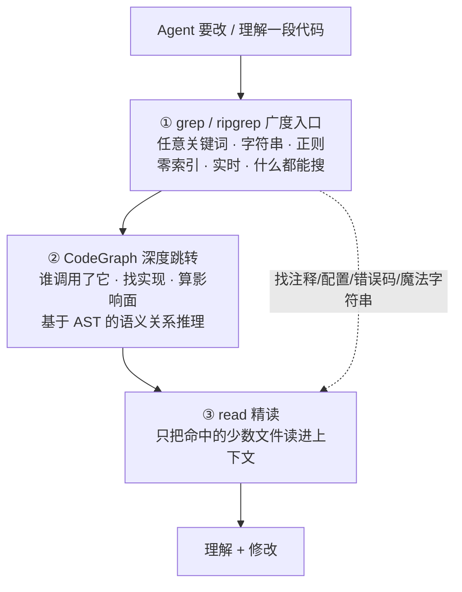

> [!NOTE]
> **核心结论：**CodeGraph 是一个预索引代码知识图谱工具，通过 tree-sitter + SQLite FTS5 构建代码结构索引，以 MCP Server 形式为 AI 编码 Agent 提供精准的代码上下文检索能力。实测可降低 \~35% 成本、减少 \~59% token 消耗、提升 \~49% 速度、减少 \~70% 工具调用次数。

# 一、项目概述

CodeGraph 由 **colbymchenry** 开源，GitHub 地址为 [github.com/colbymchenry/codegraph](https://github.com/colbymchenry/codegraph)。项目核心理念：**让 AI Agent 在编码前先"理解"代码库的结构与依赖关系**，而非每次都从零开始全文检索（grep 仍是不可替代的广度兜底，详见第二章后的对比）。

| 属性 | 说明 |
|-|-|
| 技术栈 | tree-sitter（AST 解析）+ SQLite FTS5（全文搜索）+ MCP Server |
| 许可证 | MIT |
| 主要语言 | TypeScript / JavaScript |
| 支持平台 | macOS / Linux / Windows（Node.js 环境） |
| 适配 Agent | Claude Code、Cursor、Windsurf、Cline 等支持 MCP 的客户端 |

---

# 二、解决的核心问题

> [!NOTE]
> **痛点：**传统 AI 编码 Agent 在大型代码库中工作时，需要大量 `grep`、`find`、`read_file` 调用来定位代码，导致 token 消耗高、响应慢、成本贵。注意：这不是说 grep 该被淘汰，而是缺少一层"语义索引"来分担定位压力——两者如何分工，见下一节。

CodeGraph 的解决思路：

1. **预索引**：在 Agent 工作前，先用 tree-sitter 解析整个代码库，提取函数、类、方法、模块的定义与引用关系
2. **构建知识图谱**：将解析结果存入 SQLite 数据库，建立符号间的调用/依赖/继承关系图
3. **MCP 暴露**：通过 MCP Server 将知识图谱的查询能力暴露给 AI Agent，Agent 可精准定位而非盲搜

---

# 二· CodeGraph 与 grep：不是替代，是分层协作

> [!NOTE]
> **一句话定调：**CodeGraph 让 Agent 从"按字面找"升级到"按语义找"，但它依赖解析器和预索引，有覆盖盲区和时效成本；grep 笨，但零依赖、实时、什么都能搜。不是谁淘汰谁，而是 grep 当广度兜底的"万能搜"，CodeGraph 当深度跳转的"语义透镜"。

## 检索栈的分层结构

成熟的 Agent 代码检索不是二选一，而是一个"广度入口 → 深度跳转 → 精读"的漏斗：



举个真实流程：Agent 要改 `parseConfig` —— 先 grep 找到它定义在哪（顺带搜到配置文件里相关字段名），再用 CodeGraph 查"谁调了它、改了会炸哪些测试"，最后 read 精读那几个文件。**grep 管"在哪"，CodeGraph 管"关系"，各司其职。**

## 能力边界对比

| 场景 | CodeGraph | grep |
|-|-|-|
| 精确符号的调用关系（谁调了谁） | ✅ 强项 | ❌ 分不清重名 |
| 类的子类 / 接口实现 | ✅ 强项 | ❌ |
| 改动影响面分析 | ✅ 强项 | ❌ |
| 注释 / TODO / 字符串字面量 | ❌ 通常不入图 | ✅ 直接命中 |
| 配置 / YAML / SQL / 日志 / 错误码 | ❌ 无解析器就无图 | ✅ 全文都能搜 |
| 语法报错 / 半成品代码（调试时） | ❌ 解析失败建不出图 | ✅ 照搜不误 |
| 刚改完、索引未更新的最新代码 | ⚠️ 可能过期 | ✅ 实时 |

> [!NOTE]
> **行业现状佐证：**Sourcegraph、GitHub 的代码导航都是"图谱做精确跳转 + 全文检索做兜底"双轨并行，没有任何一家敢只留一个——这本身就说明了问题。所以 CodeGraph 上线后，`grep` / `find` 的调用次数会大幅下降，但不会归零。

---

# 三、性能基准测试

官方在 SWE-bench Verified 子集上的测试结果（对比无 CodeGraph 的 baseline）：

| 指标 | 提升幅度 | 说明 |
|-|-|-|
| 成本节省 | \~35% ↓ | API 调用费用降低 |
| Token 消耗 | \~59% ↓ | 输入+输出 token 总量 |
| 响应速度 | \~49% ↑ | 任务完成时间缩短 |
| 工具调用次数 | \~70% ↓ | Agent 探索步骤减少 |

> [!NOTE]
> **Swift/iOS 开发者关注：**CodeGraph 已完整支持 Swift 语言。在 Alamofire 项目上实测：成本降低 38%，工具调用减少 77%。对大型 iOS 项目效果显著。

---

# 四、支持的语言

**完整支持（有专用 tree-sitter grammar）：**
- Swift
- TypeScript / JavaScript
- Python
- Rust
- Go
- Java / Kotlin
- C / C++
- Ruby
- PHP

**社区贡献 / 实验性：**
- C#
- Dart
- Elixir
- Scala
- Zig
- Lua
- Haskell

---

# 五、快速开始

## 5.1 安装

```bash
npm install -g @anthropic/codegraph
```

## 5.2 索引代码库

```bash
# 进入项目根目录
cd ~/Projects/MyiOSApp

# 运行索引（生成 .codegraph/ 目录）
codegraph index .
```

## 5.3 配置 MCP Server

在 Claude Code 的 MCP 配置文件中添加：

```json
{
  "codegraph": {
    "command": "codegraph",
    "args": ["serve", "--project", "/path/to/your/project"]
  }
}
```

## 5.4 验证

```bash
codegraph status
# 输出：Indexed 1,234 files, 5,678 symbols, 12,345 references
```

---

# 六、核心功能与 MCP 工具

CodeGraph MCP Server 暴露以下工具供 AI Agent 调用：

| MCP 工具 | 功能 |
|-|-|
| `search_symbol` | 按名称模糊搜索函数/类/方法定义 |
| `find_references` | 查找某个符号的所有引用位置 |
| `get_definition` | 获取符号的完整定义代码 |
| `get_dependencies` | 获取符号的上下游依赖关系 |
| `get_file_symbols` | 列出某文件中的所有符号 |
| `get_call_graph` | 获取函数调用图（谁调用了谁） |

> [!NOTE]
> **与 IDE 的区别：**CodeGraph 不是给人用的 IDE 插件，而是给 AI Agent 提供结构化的代码理解能力。Agent 通过 MCP 协议调用这些工具，就像拥有了一个"代码 GPS"。

---

# 七、高阶玩法

## 7.1 codegraph affected — CI 智能测试

CodeGraph 提供 `affected` 命令，基于依赖图分析代码变更的影响范围，只运行受影响的测试：

```bash
# 分析 git diff，找出受影响的测试文件
codegraph affected --since HEAD~1

# 集成到 CI pipeline
codegraph affected --since $CI_MERGE_REQUEST_DIFF_BASE_SHA | xargs xcodebuild test -only-testing
```

> [!NOTE]
> **iOS 场景价值：**大型 iOS 项目全量跑测试可能需要 30-60 分钟，通过 `affected` 只运行被变更影响的测试，CI 时间可缩短 60-80%。

## 7.2 自定义索引规则

```json
{
  "include": ["**/*.swift", "**/*.m", "**/*.h"],
  "exclude": ["Pods/**", "Carthage/**", "DerivedData/**"],
  "maxFileSize": "1MB",
  "symbolTypes": ["function", "class", "protocol", "struct", "enum"]
}
```

## 7.3 多项目联合索引

对于模块化 iOS 架构（主 App + 多个 Framework），可以联合索引：

```bash
codegraph index . --include-deps ./Modules/NetworkKit ./Modules/UIComponents
```

## 7.4 与 CLAUDE.md 协同

在项目根目录的 `CLAUDE.md` 中引导 Agent 优先使用 CodeGraph：

```markdown
# Code Navigation
- Always use codegraph tools (search_symbol, find_references) before grep/find
- Use get_call_graph to understand function relationships before refactoring
- Use get_dependencies to check impact before modifying shared code
```

## 7.5 增量索引与 Git Hooks

```bash
#!/bin/sh
# .git/hooks/post-commit
codegraph index . --incremental
```

---

# 八、适用场景与工具链集成

**最佳适用场景：**
- 大型代码库（> 500 文件）
- 复杂依赖关系的模块化架构
- 频繁重构需要影响分析
- CI/CD 测试优化
- 多人协作的团队项目

**支持的 AI 客户端：**
- Claude Code（官方推荐）
- Cursor（通过 MCP）
- Windsurf（通过 MCP）
- Cline / Roo Code
- 任何支持 MCP 协议的客户端

---

# 九、注意事项与局限

> [!NOTE]
> **注意：**
> - 首次索引大型项目可能需要数分钟（取决于文件数量）
> - 索引产物（`.codegraph/`）建议加入 `.gitignore`
> - 动态语言（如 ObjC runtime 特性）的符号解析准确度低于静态类型语言（Swift）
> - tree-sitter grammar 更新可能滞后于语言最新语法
> - 项目仍在活跃开发中，API 可能有 breaking changes

---

# 十、总结与建议

| 维度 | 评价 |
|-|-|
| 实用性 | 高 ↑ — 直接降低 AI 编码成本和时间 |
| iOS 适配 | 好 ↑ — Swift 完整支持，Alamofire 实测优秀 |
| 学习成本 | 低 ↓ — npm install + codegraph index 即可 |
| 成熟度 | 中等 — 活跃开发中，功能快速迭代 |
| 社区活跃 | 高 ↑ — GitHub 星标快速增长，贡献者活跃 |

> [!NOTE]
> **推荐行动：**建议在你的 iOS 项目中试用 CodeGraph，从 `codegraph index` + Claude Code MCP 配置开始，先在日常编码中感受效果；效果满意后再引入 `codegraph affected` 优化 CI 流水线。
