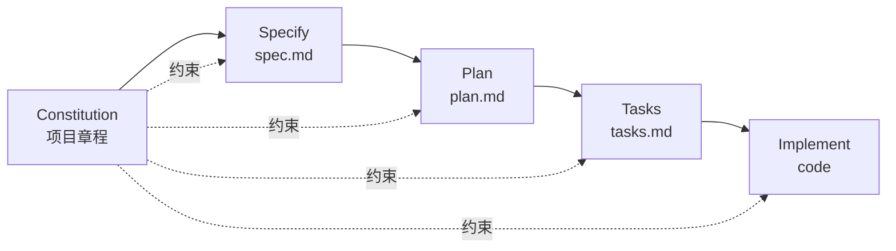

> [!NOTE]
> **一句话结论**：Spec Kit 是 GitHub 官方推出的 **Spec-Driven Development（规约驱动开发）**开源工具包，给 Claude Code、Copilot、Gemini CLI 等 30+ AI Coding Agent 套上一层"先把需求讲清楚再写代码"的流程脚手架。它不是新 Agent，也不内置模型，而是一层**方法论 + 命令模板 + 产物结构**。

**调研对象**：[GitHub Spec Kit 官方文档](https://github.github.io/spec-kit/)

---

# 一、是什么 / 解决什么问题

当代码 Agent 越来越能写代码后，新的瓶颈不在"写得多快"，而在"写得对不对"。常见痛点是：跟 AI 聊半天得到一段看起来对、跑起来错的代码，根因是**需求和约束没在前面讲清楚**，让代码本身成了事实上的规约。

Spec Kit 把"先 Spec 后 Code"的流程脚手架化，让 AI Agent 在动手前先产出可审阅、可迭代、可追溯的**需求 / 计划 / 任务**三层 Markdown 产物，再进入实现。

# 二、核心工作流（默认四阶段）

> [!NOTE]
> Spec Kit 默认提供 **Specify → Plan → Tasks → Implement** 四阶段流水线，每阶段产出一份 Markdown，作为下一阶段的结构化上下文。

| 阶段 | 命令 | 产物 | 解决的问题 |
|-|-|-|-|
| **① Specify** | `/specify` | spec.md（要做什么、为什么） | 防止 Agent 跑偏、需求漂移 |
| **② Plan** | `/plan` | plan.md（技术栈、架构、约束） | 把架构决策从代码里前置 |
| **③ Tasks** | `/tasks` | tasks.md（可执行任务清单） | 拆成 Agent 能逐条干的颗粒 |
| **④ Implement** | `/implement` | 真正的代码 | Agent 按 task 干活、可追溯 |

另有一份贯穿全流程的 **Constitution（章程）**——项目级铁律（编码规范、安全要求、不可妥协项），所有阶段都必须遵守。



# 三、核心命令与产物

## 3.1 安装

```bash
uvx --from git+https://github.com/github/spec-kit.git \
  specify init my-project --integration claude
```

支持 30+ Agent 集成：`copilot` / `claude` / `gemini` / `codex` / `cursor` / `windsurf` / `kiro` / `forge` 等；不在列表中的也可用通用集成兜底。

## 3.2 命令一览

| 命令 | 作用 | 产物 |
|-|-|-|
| `/specify` | 把高层目标转成详尽 Spec | spec.md |
| `/plan` | 结合技术栈输出技术方案 | plan.md |
| `/tasks` | 把方案拆成可执行任务 | tasks.md |
| `/implement` | 逐任务交给 Agent 实现 | 源码 + commits |
| `/speckit.checklist` | 对 Spec 做"自然语言单测"，按 UX/安全/性能等维度查欠规约 | checklist.md |

## 3.3 目录结构

```text
.specify/
├── memory/          # constitution 等长期记忆
├── scripts/         # 流程脚本
└── templates/       # spec / plan / tasks 模板
.github/prompts/     # Agent 命令文件（/specify、/plan...）
```

# 四、最佳实践

> [!NOTE]
> **推荐**：把 Spec Kit 当成"工地的项目管理 SOP"——别图省事跳过 Spec 直接 `/implement`，那等于退回到 vibe coding。

1. **先写 Constitution，再开 Spec**：把"绝不能破"的红线（必须有测试、必须用某 ORM、安全合规要求）写死，所有后续阶段自动遵守，避免 Agent 跨过红线。
2. **Spec 阶段只谈 What / Why，禁止聊技术栈**：技术决策留到 Plan 阶段，避免过早锁死方案。
3. **用 `/speckit.checklist` 做"自然语言单测"**：按 UX、安全、可访问性等维度检查 Spec 是否欠规约（underspecified），社区公认高 ROI。
4. **每阶段做 Git checkpoint**：Spec / Plan / Tasks 各自独立 commit，错了能回滚到某一层而不是从头来。
5. **小步快跑**：一个 feature 走一遍完整循环，别把 10 个 feature 塞进一份 Spec。
6. **分批 Implement**：tasks.md 不要让 Agent 一口气全做完，按依赖关系分批，每批做完跑测试再推进。

# 五、高阶玩法

## 5.1 Presets — 换一套流程

不喜欢默认四步？社区有 **18 个预设流程**可换：

| Preset | 适用场景 |
|-|-|
| **AIDE** | 7 步 AI 工程生命周期，更重设计 + 测试 |
| **Canon** | baseline-driven：spec-first / code-first / spec-drift 三种基线 |
| **Product Forge** | PM 视角的 SDD，强调用户价值和验收标准 |
| **FX→.NET** | .NET Framework 老系统迁移到 .NET 的 7 阶段流水线 |
| **MAQA** | 多 Agent 协同 + 质量门禁，适合大团队 |

## 5.2 Extensions — 91 个社区扩展

- **CI Guard**：把 CI 检查嵌进 SDD 流程，未通过不让进 Implement
- **Architecture Guard**：架构守护，违反 plan.md 决策时报警
- 其他还有合规、安全、A11y、i18n 等专用扩展

## 5.3 企业自托管 catalog

> [!NOTE]
> 支持**离线运行 + 防火墙后部署**，可在公司内网自建 extension/preset 目录，只允许装审过的扩展，对大厂合规友好。

## 5.4 跨 Agent 切换

同一份 spec / plan / tasks 是**纯 Markdown 产物**，不绑定特定 Agent。今天用 Claude Code 跑 `/implement`，明天换 Codex 接着跑——产物通用，团队可以按预算/效果自由换后端。

## 5.5 老项目反向 SDD

不止给绿地项目用：对老代码可以"反向写出 spec → 让 Agent 按 spec 重构"，相当于把"代码"重新逆向成"需求 + 计划"，再往前推进。

# 六、与 Claude Code 的关系与差异

> [!NOTE]
> **关键认知**：Spec Kit 与 Claude Code **不是竞品，是上下层关系**。Spec Kit 把 Claude Code 当作可调用的后端 Agent 之一。

| 维度 | Spec Kit | Claude Code |
|-|-|-|
| **定位** | 方法论 + 流程脚手架 | AI Coding Agent（命令行版 Claude） |
| **谁在写代码** | 不写代码，只生成 prompt 模板和 Markdown 骨架 | 真正读文件、改代码、跑命令 |
| **是否含 LLM** | 不含模型，借用别人的 Agent | 内置 Claude 模型 |
| **核心关注** | "怎么把需求讲清楚" | "怎么把代码写出来" |
| **可替代性** | 可换成 Cursor/Kiro/Tessl 等同类 SDD 工具 | 可换成 Copilot/Codex/Gemini CLI |
| **关系** | 把 Claude Code 当后端 Agent 之一 | 是 Spec Kit 的执行引擎之一 |

> [!NOTE]
> **形象比喻**
> **Claude Code** = 会写代码的**施工队**，给图纸就开干
> **Spec Kit** = 工地的**项目管理 SOP**，规定先出图、出施工方案、再开工

> [!NOTE]
> **组合用法**
> 1. 用 Spec Kit 跑完 `/specify`+`/plan`+`/tasks`
> 2. 把 tasks.md 喂给 Claude Code 执行 `/implement`
> 3. Claude Code 按 task 一条条改代码、跑测试

# 七、适用场景与不适用场景

> [!NOTE]
> **该上 Spec Kit**

- 新功能 / 跨多文件改动
- 多人协作、需要可审阅产物
- 有合规 / 架构红线必须守
- 要交付给非自己维护的团队
- 老系统重构 / 大版本迁移
- 面向生产、对质量要求高

> [!NOTE]
> **不该上 Spec Kit**

- 一次性脚本 / 临时工具
- 5 分钟能改完的 bug
- 原型探索阶段（拖慢节奏）
- Demo / Hackathon
- 个人 side project 早期
- 纯文案 / 配置类改动

> [!NOTE]
> 判断标准：**改动是否值得让团队先达成共识？**答"是"就上 Spec Kit；答"否"就直接 vibe coding。

# 八、落地建议

## 8.1 试点路径（推荐）

1. **选 1 个中等复杂度的新 feature**（非紧急、非纯探索）作为第一次试点
2. **团队先共识 Constitution**——把团队的代码规范、测试要求、安全红线写成项目章程
3. **跑一遍完整四阶段**，每阶段独立 review，记录哪一步耗时最长、哪一步价值最大
4. **做对比 Retro**：与之前 vibe coding 同类 feature 对比，关注返工率、bug 率、Code Review 时间
5. **固化模板**：把团队偏好的 spec / plan / tasks 模板沉淀成内部 Preset

## 8.2 风险与限制

| 风险 | 缓解 |
|-|-|
| 前期投入大，小改动 ROI 低 | 按"该不该上"判断，不要一刀切 |
| Spec/Plan 写得敷衍 → 等于没写 | 用 `/speckit.checklist` 做欠规约检查 |
| Agent 不严格遵守 Constitution | 装 Architecture Guard / CI Guard 做硬门禁 |
| 跨 Agent 产物兼容性差异 | 团队内统一一种 Agent，避免在中途切换 |
| 项目还在快速探索期 | 先 vibe coding，定型后再补 Spec 反向沉淀 |

## 8.3 团队内部潜在结合点

- **Coding Agent**：可借鉴 SDD 的"Spec → Plan → Tasks → Implement"分阶段产物结构，做团队 SDD Skill
- **项目管理工具**：spec.md 与 PRD / 故事卡可双向同步，让产物天然对齐项目管理系统
- **协作文档**：spec / plan / tasks 三份产物可直接挂团队知识库，作为知识沉淀

# 九、参考资料

- [Spec Kit 官方文档（GitHub Pages）](https://github.github.io/spec-kit/)
- [github/spec-kit GitHub 仓库](https://github.com/github/spec-kit)
- [GitHub Blog：Spec-driven development with AI](https://github.blog/ai-and-ml/generative-ai/spec-driven-development-with-ai-get-started-with-a-new-open-source-toolkit/)
- [Microsoft Developer Blog：Diving Into Spec-Driven Development With GitHub Spec Kit](https://developer.microsoft.com/blog/spec-driven-development-spec-kit)
- [Den Delimarsky：What's The Deal With GitHub Spec Kit](https://den.dev/blog/github-spec-kit/)
- [Martin Fowler：Understanding Spec-Driven-Development（Kiro / spec-kit / Tessl 对比）](https://martinfowler.com/articles/exploring-gen-ai/sdd-3-tools.html)
- [YouTube：The ONLY guide you'll need for GitHub Spec Kit](https://www.youtube.com/watch?v=a9eR1xsfvHg)

---

# 读完之后：Spec Kit 给 iLoop 的启发

调研 Spec Kit 的起点，是手头在做的 iOS 通用 agent（**iLoop**）有个老毛病——能查清问题、能给方案，但一遇到「大任务、多轮、跨会话」就容易跑偏、断了接不上。Spec Kit 这套「先把需求讲清楚再写代码」的流程，正好是冲着这个痛点来的。读下来，它照出 iLoop 三个具体缺口。

## 1. iLoop 的 investigate 只产「方案」，没产「能逐条干的任务清单」

Spec Kit 的核心是 **Specify → Plan → Tasks → Implement** 四段，每段产一份可审阅的 Markdown，下一段拿上一段当结构化输入。关键在 **Tasks** 这一环：它把方案拆成 agent 能一条条干的颗粒，还带验收标准。

iLoop 现在的 investigate 跑完，产出的是一段「方案描述」——看着对，但它不是一份「可勾选、可逐条执行」的任务清单。结果就是方案和执行之间断了一截，agent 不知道下一步具体干哪条。该借的就是这个：让 investigate 的产物从「一段分析」升级成「一张带验收标准的 tasks 清单」，方案和执行之间用任务树接上。

## 2. iLoop 的 log_round 是「流水账」，不是「能断点续传的任务树」

Spec Kit 的 tasks.md 带勾选状态、可恢复——这让长任务能「断点续传」：哪怕换个会话回来，也知道做到第几步、还剩哪些。

iLoop 现在的 log_round 是**按轮记录**的流水账，不是任务树。轮次记下来了，但「整件事做到哪了、还差什么」这个全局状态是缺的。这正是长任务最容易塌方的地方——多会话一断，agent 就失忆重来。该补的是一份显式的、带状态的任务树，把「按轮记录」升级成「按任务追踪」。

## 3. iLoop 有项目记忆，但不是「结构化、每次开工强制复读」的铁律

Spec Kit 有个贯穿全程的 **Constitution（项目章程）**——把「绝不能破」的红线（必须有测试、必须用某套规范、安全合规要求）写死，所有阶段自动遵守。它是「项目级铁律，每次开工先读」。

iLoop 现在有 project memory，但它是松散的，不是结构化、不是强制每轮复读的。结果就是同样的约定 agent 时记时忘。该借的是把项目记忆里那部分「不可妥协的铁律」单独拎出来，做成 constitution 式的结构化条款，每次开工强制复读——而不是埋在一堆记忆里靠运气命中。

## 4. 还能顺手抄的一招：给方案做「欠规约检查」

Spec Kit 有个 `checklist`，对 spec 做「自然语言单测」——按 UX、安全、性能等维度查「这份需求是不是哪里没说清楚」（社区公认高 ROI）。iLoop 的 investigate 产出方案后，也可以加一道这样的自检：在动手前先扫一遍「这个方案有没有没讲清的地方」，比直接开干返工率低。

> [!NOTE]
> 一句话收口：Spec Kit 对 iLoop 最大的启发，是把「大任务怎么不跑偏、断了怎么续」拆成了可操作的三件事——**investigate 要产任务树（不只是方案）、log_round 要带可恢复状态（不只是流水账）、项目记忆里的铁律要结构化强制复读（不只是松散记忆）**。这三样补齐，iLoop 才扛得住长任务。
