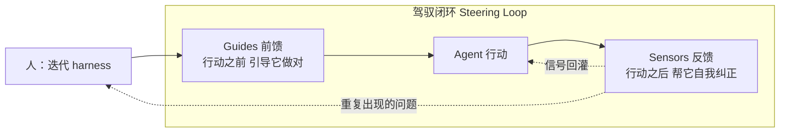
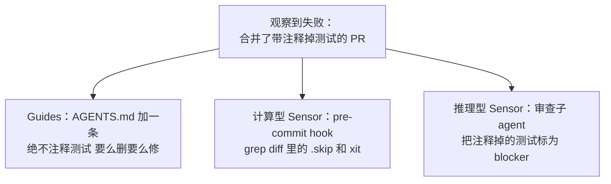
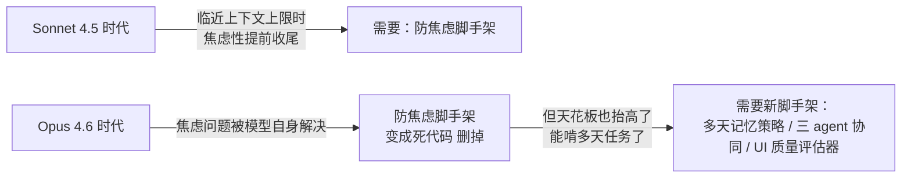

> [!NOTE]
> **一句话结论：**Agent = Model + Harness。模型是野马，Harness 是缰绳。决定一个 coding agent 好不好用的，不是模型参数量，而是包在模型外面那套让它能真正干完活的工程系统。有人拆开 Claude Code 发现，约 98% 是 harness，只有 2% 是模型调用。

本文回答两个问题：**Harness Engineering 到底是什么**，以及**为什么它正在成为 AI 编码的胜负手**。材料来自 Martin Fowler 团队、Addy Osmani、Anthropic 工程团队及张汉东《驾驭工程》。

---

# 一、这个词的来历

Harness 字面是「马具」——套在马身上那套缰绳、嚼子、鞍。比喻精准到可怕：**模型（马）本身是野的、不可控、不可预测的；真正决定它能不能拉好车、跑对方向的，是你给它套的那套装备。**张汉东把那本逆向 Claude Code 源码的书取名《驾驭工程》，正是这个意思。

Viv Trivedy 提出了 harness engineering 这个术语，并给了一句被反复引用的定义：

> Agent = Model + Harness。如果你不是那个模型，那你就是 harness。

Martin Fowler 团队的 Birgitta Böckeler 把定义收得更紧：**harness 就是一个 AI agent 里除了模型之外的一切**——系统提示词、工具、上下文策略、钩子、沙箱、子 agent、反馈回路、恢复路径，全是 harness [Harness engineering for coding agent users](https://martinfowler.com/articles/harness-engineering.html)。

> [!NOTE]
> **最硬的证据：**在 Terminal Bench 2.0 上，同一个 Claude Opus 4.6，装在 Claude Code 里的得分远低于装在定制 harness 里的得分；Viv 的团队只改 harness、不换模型，就把一个 coding agent 从 Top 30 拉到了 Top 5 [Agent Harness Engineering](https://addyosmani.com/blog/agent-harness-engineering/)。同一个模型，套在 Cursor、自研插件、Claude Code 里表现天差地别——差的不是脑子，是缰绳。

---

# 二、是什么：从控制论看，它是一个「调速器」

别把 harness 当成一堆零散的配置文件。它的本质是一个**控制论意义上的调速器（cybernetic governor）**——用前馈和反馈两种手段，把代码库持续调节到你想要的状态 [Harness engineering for coding agent users](https://martinfowler.com/articles/harness-engineering.html)。这套调速器由两个对子构成，是整个 Harness Engineering 最核心的思想框架。

## Guides（前馈控制）——在马跑之前，先告诉它往哪跑

提高 agent「第一次就做对」的概率。系统提示词、AGENTS.md / CLAUDE.md 里的项目约定、工具的描述、技能包、LSP 代码智能，都属于这一类。

## Sensors（反馈控制）——马跑歪了，缰绳一拉拽回来

在 agent 行动之后观察结果，帮它自我纠正。测试、linter、类型检查、AI 代码审查都是传感器。**精妙之处：**最强的传感器，是那些产出「专门给 LLM 看」的信号的——比如一条自定义 linter 报错，里面直接附上「该怎么改」的指令，本质上是一种**良性的提示词注入** [Harness engineering for coding agent users](https://martinfowler.com/articles/harness-engineering.html)。

> [!NOTE]
> **记死这个因果：**只有 Guides 没有 Sensors，agent 永远不知道规则有没有生效；只有 Sensors 没有 Guides，agent 会一遍遍重犯同样的错。两手都得硬。

## 再切一刀：计算型 vs 推理型

Guides 和 Sensors 各自又分两种执行方式，这一刀决定了成本和可靠性 [Harness engineering for coding agent users](https://martinfowler.com/articles/harness-engineering.html)。

|  | 计算型 Computational | 推理型 Inferential |
|-|-|-|
| 谁来跑 | CPU，确定性 | GPU / NPU，概率性 |
| 例子 | 测试、linter、类型检查、结构分析 | AI 代码审查、LLM-as-judge、语义查重 |
| 速度成本 | 毫秒到秒级，便宜，可靠 | 慢、贵、不确定 |
| 用法 | 每次改动都能跑 | 选择性地跑，补语义判断 |

**实践含义：**能用确定性工具（类型检查、测试）接住的错，就别花钱让 LLM 去判断。把便宜可靠的计算型传感器铺在每一次改动上，把贵的推理型留给真正需要语义判断的地方。

---

# 三、为什么它有效：四个反直觉的洞察

这是全文的核心。把这四点想透，就抓住了 Harness Engineering 的灵魂。

## 洞察一：「skill issue」重构——别再骂模型蠢

工程师有个坏默认：agent 干了蠢事 → 怪模型 → 「等下一代模型吧」。Harness Engineering 直接否定它。HumanLayer 那句话是纲领：**「这不是模型问题，是配置问题。」**大多数 agent 失败是可归因、可修的 [Agent Harness Engineering](https://addyosmani.com/blog/agent-harness-engineering/)：

- agent 不知道某个约定 → 加进 AGENTS.md
- agent 跑了危险命令 → 加一个 hook 拦住它
- agent 在 40 步的任务里迷路了 → 拆成 planner + executor
- agent 总把跑不过的代码当「完成」 → 把类型检查的反压（back-pressure）信号接进循环

> [!NOTE]
> **心智转变：**模型答错时，第一反应不该是「模型真笨」，而是「我的 Guides 是不是没说清？我的 Sensors 是不是没接住？」

## 洞察二：棘轮原则（The Ratchet）——每个错误都变成一条永久规则

这是 Harness Engineering 最重要的工作习惯。**把 agent 的每一次犯错都当成永久信号，而不是「这把运气差，重试一下」。**Addy Osmani 举例：如果 agent 提了个带「注释掉的测试」的 PR 而你不小心合了，你要在三个层面同时上棘轮 [Agent Harness Engineering](https://addyosmani.com/blog/agent-harness-engineering/)。

> [!NOTE]
> **铁律：**好的 AGENTS.md 里每一行，都应该能追溯到一次具体的、真实发生过的失败。只在见到真实失败时才加约束，只在某个强模型让约束变得多余时才删它——「上棘轮，别头脑风暴」。这也是为什么 Harness Engineering 是一门**手艺**而非框架：适配你代码库的 harness 是被你的失败史塑造的，**你下载不到**。

## 洞察三：模型变强，harness 不会消失，只会「移位」

最反直觉的一点。天真的故事是：模型越强，harness 越没用。Anthropic 的结论恰恰相反：**模型变强时，有趣的 harness 组合空间不会缩小，它会移动**。它把原理讲得极干净：**「harness 里的每一个组件，都编码了一个关于『模型自己做不到什么』的假设。」** [Agent Harness Engineering](https://addyosmani.com/blog/agent-harness-engineering/)

**实践含义：**当模型在某件事上变强了，对应组件就「不承重」了，该拆掉；当模型解锁新能力，新天花板带来新失败模式，需要新脚手架去够。**所以 harness 是一个活系统，不是一次性配好的配置文件。**

## 洞察四：模型和 harness 是「共同训练」出来的

Viv 点破的底层机制：今天的 agent 产品，模型是**带着 harness 一起做后训练的**。模型会专门在 harness 设计者认为它该擅长的动作上变强——文件操作、bash、规划、子 agent 派发 [Agent Harness Engineering](https://addyosmani.com/blog/agent-harness-engineering/)。这解释了两个怪现象：为什么 Opus 4.6 在 Claude Code 里手感和别处不一样；为什么你把工具的 str_replace 换成 apply_patch 有时会引起莫名其妙的性能回退——一个真正通用的模型不该在乎这个，但共同训练造成了过拟合。

**实践含义：**模型「出生时」所在的 harness，不一定是它能力的天花板。为你的具体任务定制 harness，可以解锁原厂 harness 漏在地上的能力。Top 30 → Top 5 就是最硬的证据。

---

# 四、一个好 harness 由什么组成（可抄的清单）

把思想落到零件上。逻辑是「从你想要的行为，倒推出该有哪个零件」——**如果你说不出某个组件是为了交付哪个行为而存在，它就不该在那儿** [Agent Harness Engineering](https://addyosmani.com/blog/agent-harness-engineering/)。

| 零件 | 解决的问题 | 关键设计 |
|-|-|-|
| 文件系统 + Git | 模型只能操作上下文里装得下的东西 | 给它工作区、把中间结果卸载到磁盘、多 agent 用共享文件协作；Git 白送版本管理和回滚 |
| Bash + 代码执行 | 没法为每个动作预造工具 | 与其给一个厨房小工具，不如把整个厨房交给它，让它现造工具 |
| 沙箱 + 默认工具链 | 在你笔记本上跑 agent 生成代码有风险，也无法并行 | 隔离环境、命令白名单、网络隔离、预装 runtime / 测试 CLI / 无头浏览器（让它能自我验证） |
| 记忆 + 搜索 | 模型只有权重 + 当前上下文，没法改权重 | AGENTS.md 每次启动注入，agent 改了就重载——粗糙但有效的持续学习；web 搜索补训练截止后的新知 |
| 上下文管理 | 上下文塞满后模型推理会「腐烂」（context rot） | 压缩、工具输出卸载（留头尾、全文进磁盘）、技能渐进式披露；超长任务甚至要完整重置上下文，从紧凑交接文件重建 |
| 长程执行 | 早停、分解差、跨多窗口后失去连贯 | Ralph Loop（hook 拦截退出、把原始 prompt 重新注入新窗口，逼它干完）；planning 写到磁盘 |
| 钩子 Hooks | 「我告诉过 agent」≠「系统强制执行」 | 生命周期节点跑脚本：改完文件就跑类型检查 / lint / 测试、拦截危险命令、PR 前需审批 |

> [!NOTE]
> **两条特别值钱的原则：**
> **1. 成功是沉默的，失败是吵闹的。**类型检查过了，agent 什么都听不到；一旦失败，错误文本被注入循环，agent 自我纠正。让反馈回路在常见情况下几乎零成本，出问题时又直接可执行。
> **2. 生成与评估必须分家。**Anthropic 明确指出，把生成和评估拆成两个独立 agent，效果好过让一个 agent 自评——因为 agent 给自己的活打分时，可靠地会偏向乐观。配套的「sprint contract」模式更狠：让生成方和评估方在写代码之前，先谈拢「done 到底是什么意思」 [Agent Harness Engineering](https://addyosmani.com/blog/agent-harness-engineering/)。

---

# 五、为什么这件事正在变成一门独立学科

## AGENTS.md 是杠杆率最高的点，但要克制

仓库根目录那个扁平的 markdown 规则文件，是目前**单点杠杆率最高**的配置，因为它每一轮都进系统提示词。但两条血泪教训 [Agent Harness Engineering](https://addyosmani.com/blog/agent-harness-engineering/)：

- **要短。**HumanLayer 把自己的控制在 60 行以内。每一行都在抢模型的注意力，规则越多，每条规则越不值钱。它是「飞行员的检查清单」，不是「风格指南」。
- **每行都要挣来。**规则要么追溯到一次具体失败，要么对应一条硬性外部约束，否则就是噪音。

工具同理：**10 个聚焦的工具，胜过 50 个互相重叠的**，因为模型能把这份「菜单」记在脑子里。还有个安全坑：工具描述会进提示词，所以你装的任何 MCP server 都是模型会读的「可信文本」——一个草率或恶意的 MCP，能在你还没敲任何字之前就把你的 agent 给提示词注入了 [Agent Harness Engineering](https://addyosmani.com/blog/agent-harness-engineering/)。

## 不是所有代码库都同样好「驾驭」（Harnessability）

组织层面的深刻洞察。强类型语言天生自带类型检查这个传感器；清晰的模块边界天生支持架构约束规则；Spring 这类框架把 agent 本不该操心的细节抽象掉，隐式提高成功率。**没有这些属性，对应的控制手段你压根建不起来** [Harness engineering for coding agent users](https://martinfowler.com/articles/harness-engineering.html)。

> [!NOTE]
> **残酷的推论：**harness 最被需要的地方（债台高筑的遗留系统），恰恰是最难建 harness 的地方。绿地项目可以从第一天就把「可驾驭性」焊进技术选型里。

这里还藏着一条控制论定律——**Ashby 必要多样性定律**：一个调节器，必须拥有至少和它所治理的系统一样多的多样性。LLM 几乎能产出任何东西，但一旦你把它约束到某种确定的拓扑（比如「就用这套服务模板」），就缩小了它的输出空间，使全面的 harness 变得可行。**定义拓扑，本身就是一次「降低多样性」的治理动作** [Harness engineering for coding agent users](https://martinfowler.com/articles/harness-engineering.html)。

## 趋势：从「调 LLM API」到「调 Harness API」

Viv 提出的 HaaS（Harness-as-a-Service）框架点明方向：我们正从「在 LLM API 上搭东西」（给你一个补全结果）转向「在 harness API 上搭东西」（给你一个运行时）。Claude Agent SDK、Codex SDK、OpenAI Agents SDK 都指向同一处——循环、工具、上下文管理、钩子、沙箱开箱即用，你只做定制 [Agent Harness Engineering](https://addyosmani.com/blog/agent-harness-engineering/)。

把顶级 coding agent（Claude Code、Cursor、Codex、Aider、Cline）摆一起看，**它们彼此之间的相似度，高于它们底层模型之间的相似度。模型各不相同，harness 模式却在收敛**——这不是巧合，是行业在慢慢摸清那些把生成模型变成「能交付东西」的承重脚手架到底是哪几块 [Agent Harness Engineering](https://addyosmani.com/blog/agent-harness-engineering/)。

---

# 六、一句话总结：为什么你要在意

人的角色变了。过去我们把经验当成一种隐式的 harness 带进每个代码库——我们对 300 行的函数会本能反感，知道「我们这儿不这么干」，知道自己的名字会签在 commit 上。**Agent 这些全没有：没有社会责任感，没有审美厌恶，没有组织记忆。Harness Engineering，就是把人类开发者的经验外化、显性化成一套约束、传感器和自我纠正回路的工程努力** [Harness engineering for coding agent users](https://martinfowler.com/articles/harness-engineering.html)。

所以这门手艺的目标，不是彻底消灭人的输入，而是**把人的输入，导向最需要它的地方**。

> [!NOTE]
> **贯穿所有材料的那条哲学：**在 AI Agent 系统里，控制行为的最佳方式不是更多代码，而是更好的约束。决定胜负的不是模型的参数量，而是驾驭模型的工程能力。
