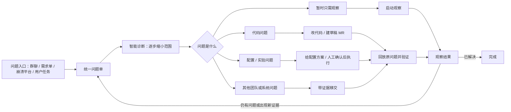
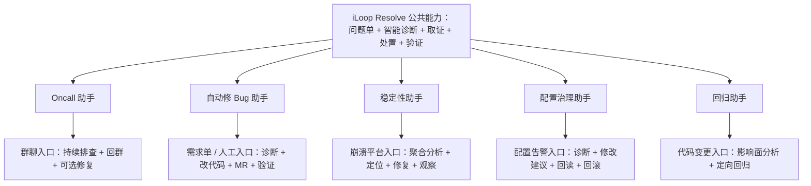

> iLoop Resolve 不是从一张抽象架构图开始的。我们先做了一个 Oncall 助手，发现 AI 已经能接住排查里最费人的部分：从模糊现象出发，沿着证据不断缩小范围，直到找到根因。既然最复杂的诊断已经可以复用，修 Bug、稳定性治理、配置排查这些助手，就不必再各造一套。Resolve 做的，是把这条已经跑通过的链路拆成原子能力，再按不同任务重新组装。

---

## 一、Resolve 从 Oncall 排查里长出来

我们最先做 Oncall 助手，原因很直接：**查线上问题太耗人的精力。**

一个问题从群里冒出来时，信息通常是散的。有人贴一句现象，有人补一张截图，日志和平台链接落在后面，版本、时间、设备、入口还要来回追问。值班同学得先把这些碎片拼起来，再提出几种可能原因，找证据逐个排除。复杂问题一轮查不完，还得记住前面排除了什么、下一步该查什么。

这件事费人，但并非毫无规律。问题发生的时间、影响范围、版本差异、接口数据、配置变化、代码改动都有迹可循；有经验的工程师也一直在重复相似的动作：补上下文、列假设、找区分度最高的证据、排除错误方向，直到证据能够解释现象。于是我们把这套过程交给 iLoop，让它从群聊接住问题，持续读取消息和运行证据，围绕同一个问题一轮轮缩小范围。

实际结果不错。它不仅能省掉收集和搬运信息的时间，更重要的是，排查过程开始变得可持续：假设不会散在聊天里，已经排除的方向不会反复重查，新证据回来后也能继续沿着原问题往下走。这说明 Oncall 中最麻烦的部分——**从一个模糊现象走到有证据支撑的根因**——可以被结构化，也可以被复用。

后来看到一些团队在做 Bug 修复助手，我们开始重新想这件事。很多 Bug 真正难的并不是怎么改代码，而是先判断到底该不该改代码。

稳定性问题相对收敛。比如崩溃平台报出一个 Crash，它大概率来自客户端，还有堆栈帮助定位到具体类和调用路径。根因范围已经很小，后面的修改往往不难。QA 提来的问题则完全不同：页面没展示、状态不对、某个入口不可用，原因可能在客户端，也可能在服务端下发、配置、实验或测试环境。助手如果从一开始就把任务理解成"修客户端 Bug"，就会带着答案找原因，最后很容易在无辜的客户端代码里加兜底，把表面现象盖住，也把系统改得越来越复杂。

而这恰好是 Oncall 排查已经在解决的问题：先不预设责任归属，从多个可能原因出发，用证据把范围缩小，再决定应该由谁、用什么方式处理。iLoop 还补上了另一半能力：问题确认后，它可以修改代码、编译运行，再用日志、UI、截图或崩溃记录验证修复是否真的生效。这样看，Bug 修复所需的两块关键能力其实都已经存在——前面是 Oncall 沉淀下来的诊断，后面是 iLoop 原有的执行与验证闭环。

顺着这个思路再往外看，边界就清楚了：诊断后接代码修改和回放验证，可以组成 Bug 修复助手；前面接崩溃聚合、后面接灰度观察，可以组成稳定性助手；接配置处置和平台回读，可以组成配置治理助手。它们的入口和处置方式不同，最难的那段诊断过程却是同一套。

因此，我们没有继续复制更多完整助手，而是开始解耦：把接收问题、整理上下文、建立假设、平台取证、确认根因、选择处置、验证结果、持续观察分别定义成原子能力，再通过明确的协议把它们组装成不同助手。Resolve 就是这次泛化后的公共底座。

这些助手虽然面向不同场景，底层都沿着同一条问题处理链工作：

```text
接收问题 → 收集上下文 → 建立可能原因 → 取证排除 → 找到根因
        → 选择处理方式 → 验证结果 → 持续观察
```

如果每个助手各造一套，诊断逻辑、防自欺和收口标准也会各有一份。一套里学到的经验传不到另一套，能力改进无法复用。Resolve 把公共链路收进底座以后，新增助手只需要选择入口、原子能力和放权边界；底座里的诊断或验证增强一次，所有组合都会一起受益。

---

## 二、把“查问题”和“处理问题”切开

这是整套 Resolve 最重要的设计决策。

先看不切会怎样。一个既会查、又会改的助手，很容易犯两类错，而且这两类错都很隐蔽：

- **被处理能力反向绑架归因。** 它手上只有"改客户端代码"这一把锤子，于是看什么都像客户端的钉子——明明是服务端下发错了，它也倾向于归到端上，然后在端上加一段兜底代码把现象盖住。因为"改端上"是它唯一会做的事，归因就被它的处置能力带偏了。
- **拿"好查"当"根因"。** 哪个平台数据最容易拿到，它就倾向于在那里找答案，把平台返回的相关性直接当成因果。查得动的地方不一定是出问题的地方。

Resolve 的做法是：**系统先纯粹根据证据把问题查清楚，这一步完全不考虑"我待会儿准备怎么改"。** 归因阶段只回答"问题是什么、根在哪"，处置阶段才回答"那怎么办"。两段之间用证据交接，不允许处置预期倒流回来污染归因。

这一刀切下去换来两个结构性的好处：

1. **诊断能力对所有处理方式复用。** 同一套归因，后面可以接"改代码"，也可以接"改配置""移交外部""只观察"，诊断不需要为每种处置各写一遍。
2. **处置能力可以随便增删，不动诊断。** 今天只会改客户端，明天补上改配置、改实验，诊断内核一行都不用改——新增的只是"根因确认后多一条可选的处置路径"。

整条链路串起来是这样：所有入口先汇进同一个问题单，问题单驱动诊断逐步收敛，确认根因后按"问题是什么"分流到不同处置方式，最后统一回放验证；没解决或出新证据就回到问题单继续跑。



---

## 三、问题单是一台版本化的状态机

无论问题来自群聊、需求平台、崩溃平台还是用户直接发起，都先进入**同一个问题单**。问题描述、截图、日志、代码结论、被排除的方向、修复记录、验证结果，全都持续写回这一个单子，不再散落在多个助手和多轮对话里。

但这里有个关键设计：**这个"问题单"不是一个不断追加的文档，也不是一段聊天记录，而是一台版本化的状态机。** 为什么必须是状态机，得从聊天记录的毛病说起。

聊天记录擅长保存"我们说过什么"，不擅长保存"此刻凭什么相信哪个原因"。一次排查跨十几轮之后，早期的假设、后来被推翻的方向、当前站得住的证据，在一长串对话里是混在一起的——你没法一眼看出"现在这个根因是基于哪几条证据、如果那几条被推翻会怎样"。

所以问题单被建成四段**彼此正交**的状态：

```text
问题单
├── 诊断 (diagnosis)     ── 当前根因是什么，基于哪几条证据；按 revision 冻结
├── 处置 (disposition)   ── 打算怎么处理，每个处置计划绑定"确切的某一版根因"
├── 验证 (verification)  ── 处理完有没有真的解决，用证据说话
└── 观察 (observation)   ── 线上是否复发，稳定还是回归
```

四段正交、各记各的，带来几个直接的能力：

- **根因按 revision 冻结。** 每确认一版根因，就冻结成一个带证据清单的版本。处置计划不是绑在"问题单"上，而是绑在"根因的第 N 版"上。
- **出反证就重开诊断，而不是硬圆。** 如果冻结的根因遇到反证，或者观察阶段发现回归，系统会**重开诊断、清空旧的四道关、废止绑在旧根因上的处置计划**，而不是把新证据强行塞进旧结论里自圆其说。
- **"曾经诊断对"不能给后来变了的系统背书。** 这是版本化最本质的价值：系统一直在变，三天前那次诊断即使当时是对的，也不能默认现在还成立。绑定 revision，就让每个结论都清楚地知道自己"是对哪一版系统负责的"。

> 对照聊天记录：聊天记录会让你越查越"舍不得推翻"——已经写了这么多，倾向于往原方向补。状态机反过来，重开诊断是廉价、干净、被鼓励的动作。

---

## 四、找到根因不等于问题已解决

这一节专门用来堵一种很常见的自欺：**把“我查明白了”说成“问题解决了”。**

Resolve 把两件事分开记录：

- **问题查清楚了没？**（诊断线）
- **问题处理并验证完成了没？**（处置 + 验证线）

于是可以出现这样一个诚实的中间状态：

> **根因已确认，等待外部处理。**

比如确认了是服务端问题，但对方还没接手。这时系统明确停在"根因已确认、处置未完成"，而不是因为"我这边能做的都做了"就宣布问题已解决。同理，外部移交时找不到具体负责人，不阻塞技术归因（根因该确认还是确认），但也绝不允许因此把问题标成 resolved。

**完成，只能由证据定义，不能由"我尽力了"定义。**

---

## 五、诊断凭什么可信：证据分级 + 四道关

前面把"查"和"处理"切开了，但还有个问题没回答：**凭什么相信"查"这一步给的根因是对的，而不是模型编的？** 如果诊断本身是个黑盒，前面的切分就没意义。所以 Resolve 给诊断装了两道客观约束。

### 5.1 证据分级：看到的 vs 推出来的

每一条证据都必须标清它是**观测到的**还是**推断出来的**：

- **观测（observed）**：真的跑了、真的看到了——一条真实日志、一张截图、一次崩溃记录、一次编译产物。
- **推断（inferred）**：从源码或现象推出来的——"这段代码逻辑上会导致空指针"。

红线是：**推断不许当观测。** 推断可以引导下一步去查什么，但不能作为"结论成立"的地基。这一条把"我 grep 到了这个字段，所以 UI 一定正确"这类偷换直接挡在门外——grep 到的是代码文本（推断），不是用户真看到的画面（观测）。

### 5.2 四道关：一个根因要过四问才算数

一条根因结论要被接受，至少得回答四个问题，缺一关都只能说"仍需证据"、不能写成确定事实：

| 关卡 | 要回答什么 | 不过会怎样 |
|-|-|-|
| **时间** | 证据和现象是同一次发生的吗？ | 拿昨天的日志解释今天的崩溃 |
| **范围** | 证据覆盖了问题真实影响的端、版本、入口、条件吗？ | 只看了一个机型就下全量结论 |
| **机制** | 能讲清"为什么会这样"，而不只是"它俩同时出现"吗？ | 把相关性当因果 |
| **反证** | 换一个关键条件，现象应该消失或变化——试过吗？ | 没做对照，无法排除巧合 |

其中**反证**这关最容易被跳过，也最能体现 VDD 的态度：不是找一堆"支持我"的证据就算赢，而是主动去找"能推翻我"的条件，推翻不了才敢下结论。

这两道约束合起来，让"智能诊断"从一个玄学黑盒，变成一个**每一步都可复核、每个结论都标清底气**的过程。

---

## 六、原子能力怎么组合：装配协议

回到最开始那句话：把动作拆成原子能力，让助手自由组合。可“组合”到底是什么意思？没有一个明确的协议，“自由组合”就是句空话。Resolve 用一条装配链把它定死：

```text
助手 (AssistantRecipe)
  └─ 由若干"应用动作" (Action) 组成
        └─ 每个动作声明它需要的"能力端口" (Capability)
              └─ 端口在运行时路由到具体"提供方" (Provider)
                    └─ 提供方跑在某个"部署节点" (Deployment) 上
```

每一层只回答一个问题，职责不重叠：

- **助手（Recipe）**：这个助手由哪些动作组成、默认放权到哪一档、哪些操作必须人确认、什么条件算完成。它**不关心在哪运行**。
- **动作（Action）**：要完成什么、输入输出是什么、风险多大。比如"定位改动影响面""创建隔离分支改代码"。
- **能力端口（Capability）**：动作需要的抽象能力，比如"编译""取日志""截图""崩溃报告"。端口是接口，不是实现。
- **提供方（Provider）**：端口的具体实现。"编译"这个端口，在客户端工程上由客户端插件实现，换个平台就换个 Provider。
- **部署节点（Deployment）**：这套东西实际跑在哪台机器、那里有哪些 Provider 可用。

这样切开之后，所谓"助手 = 一份 Recipe"就有了准确含义：

> **一个助手 = 一份能力组合清单 + 一个问题入口 + 一个默认放权档 + 若干人工确认点 + 一组完成条件。**

助手之间不再各自拥有诊断和处置系统，它们共享同一套 Action/Capability，区别只在"选了哪几个、从哪进来、放权到哪"。

### 六.1 有哪些原子能力

按"问题处理过程中真正要完成的动作"来划分，而不是按"某某助手"划分：

| 原子能力 | 干什么 | 关键约束 |
|-|-|-|
| **接收与整理** | 接不同入口；读文字/截图/视频/日志/链接；提取时间、版本、设备、入口、用户范围；识别缺失信息 | 一次只追问当前最关键的一项，不一股脑问 |
| **智能诊断** | 同时保留多个可能原因；每轮只选最能区分它们的一项检查；证据冲突就换方向重分诊 | 走第五节的证据分级 + 四道关 |
| **平台与源码取证** | 查日志、指标、崩溃、实验、配置、接口；定位仓库/版本/文件/调用链/影响入口 | 平台只提供证据，判断权仍在诊断；先检查源码够不够新，别拿错版本下结论 |
| **代码处理** | 按根因生成修改建议；授权后建隔离分支做最小改动；编译运行验证；生成带根因/证据/回滚的草稿 MR | 不自动合入、不自动发布 |
| **配置与实验处理** | 定位具体配置项/实验/版本；给修改建议、影响范围、回滚方案 | 高风险必须人确认；改完回读平台确认真生效 |
| **外部移交** | 根因不在可处理范围时，打一个完整问题包（现象/触发条件/根因/影响/证据/建议动作） | 记录是否已有人接手；找不到负责人不阻塞归因，但不能宣称已解决 |
| **验证与观察** | 用原始问题回放，比对处理前后结果；按问题类型选证据；线上继续观察防复发 | 验证失败就把结果当新证据送回问题单继续诊断 |

### 六.2 组合成不同助手的样子

所有助手共享中间那台发动机（问题单 + 诊断 + 取证 + 处置 + 验证），各自只在入口和能力组合上不同：



| 助手 | 入口 | 能力组合 | 特别之处 |
|-|-|-|-|
| **Oncall** | 群聊 | 接入 + 整理 + 诊断 + 取证 + 回群 + 观察 | 若根因是本仓代码问题且用户授权，可继续接上"代码处理 + 回放验证"，不再停在"找到问题" |
| **自动修 Bug** | 需求单 / 人工 | 诊断 + 源码定位 + 代码处理 + MR + 回放验证 | 和 Oncall 共用同一套诊断，不会因为目标是"修 Bug"就跳过归因、直接加兜底 |
| **稳定性** | 崩溃平台 | 崩溃聚合 + 版本机型分析 + 变更定位 + 代码处理 + 灰度观察 | —— |
| **配置治理** | 配置/实验告警 | 诊断 + 配置定位 + 人工确认 + 修改回读 + 指标观察 | —— |
| **回归** | 代码改动 | 影响面分析 + 入口选择 + 构建运行 + 定向验证 | —— |

> 新助手需求来了，**先问现有原子能力能不能重新组合**。只有确实冒出一个全新的通用动作，才新增一个原子能力，而不是再造一条独立链路。这条纪律，就是"发动机改进一次、所有车受益"能持续成立的前提。

---

## 七、怎么落地：先改底座，再让助手迁移

落地不是推翻已经跑通的 Oncall 重来，而是先把公共底座改造好，再逐个把现有助手接上去。

1. **统一问题单。** 把 Oncall 当前保存的群事件和诊断过程，合并进同一个问题单，确保一个问题只有一份状态和证据。——先解决"状态散落"。
2. **保留并强化智能诊断。** 复用已实现的多方向判断、逐轮取证、证据回写和根因确认。先保证"查清问题"这一步不受后续处置能力影响。——守住第二节那一刀。
3. **抽出代码处理链路。** 把现在长在 Oncall 流程里的"改建议→隔离分支→改代码→编译→验证→草稿 MR"抽成公共能力，Oncall 和自动修 Bug 共用。——第一个被复用的处置能力。
4. **补齐其他处置能力。** 逐步加配置处理、实验处理、外部移交、线上观察，让诊断结果能流向不同处理方向。——把处置侧铺开。
5. **用能力组合定义助手。** 把 Oncall、修 Bug、稳定性、配置治理、回归改写成不同的能力组合，新增助手时不再复制问题单、诊断和验证链路。

最终，iLoop 的演进方式会从"不断开发新助手"变成：

> **持续增强一组通用原子能力，再用不同组合解决不同问题。每增强一次，所有用到这项能力的助手同时受益。**

---

## 八、几个刻意的边界

- **诊断不下自动处置的决策权。** 找到根因后，改代码、改配置这类写操作，尤其是高风险的，默认停在"给出方案 + 人确认"，不自动合入、不自动发布、不自动回滚。
- **平台永远只是证据源，不是裁判。** 任何平台（日志、崩溃、配置、抓包）都只负责把数据交出来，最终判断权收敛在诊断内核。这样换平台、加平台都不改变"谁说了算"。
- **能处理的范围有限，是正常状态。** 根因不在当前可处理范围时，走外部移交、诚实标注"等待外部"，是一等公民路径，不是失败兜底。
- **远端/跨节点执行是接口预留，不是已完成的分布式系统。** 装配链里的"部署节点"把"在哪跑"抽象出来了，但真正的远端拉取、任务分发、节点身份这些，按接口逐步接入、逐个验证，不在设计上假装已经具备。
