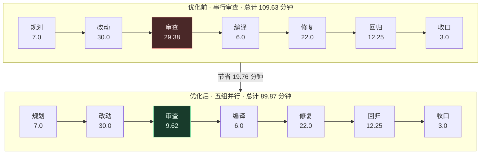

> 数据区间：2026-08-19 至 2026-08-25，全部取自本机真实运行日志和宿主调度记录，不依赖截图推断。
> 核心结论：先减少不必要的验证，再把互不依赖的部分并行。并行审查已经证明有效，编译和 UI 自动化还需要真实样本。

## 先看结论

iLoop 基于 VDD，验证不能省。提速的目标是在不降低证据质量的前提下，减少重复验证和串行等待。

| 结论 | 数据 | 边界 |
|-|-|-|
| 并行审查已经有效 | rc.5 审查从 29.38 分钟降到 9.62 分钟，缩短 67.3%，提速 3.05 倍 | 只证明互不依赖的代码审查可以并行 |
| 整项任务确实变快 | rc.5 从 109.63 分钟降到 89.87 分钟，节省 19.76 分钟 | 修复、回归和收口仍有串行部分 |
| 下一步不能直接复制这组数字 | 本周 UI 自动化 T1 至 T6 样本数为 0 | 编译和 UI 自动化的提速比例仍未知 |

这次采用的方案有明确边界：先按影响范围决定验证到哪里，再让独立任务并行；共享环境、存在前后依赖或会修改同一对象的任务继续串行。

## 任务时间花在哪

前文所说的「墙钟时间」，就是从一批工作开始到全部完成，现实中实际过去了多久。串行执行时，各段时间相加；并行执行时，以最慢一组完成的时间为准。后文统一写「实际耗时」。

以 rc.5 大版本任务为样本，其他阶段保持不变，只调整五组审查的执行方式：

| 阶段 | 主要工作 | 串行基线 | 并行后 | 数据口径 |
|-|-|-|-|-|
| 规划 | 对齐目标、方案和验收 | 7.0 分钟，6.4% | 7.0 分钟，7.8% | 首轮估算 |
| 改动 | 实现功能、修改代码 | 30.0 分钟，27.4% | 30.0 分钟，33.4% | 首轮估算 |
| 审查 | 五组独立代码审查 | 29.38 分钟，26.8% | 9.62 分钟，10.7% | 串行反事实 / 并行实测 |
| 编译 | 构建与冒烟 | 6.0 分钟，5.5% | 6.0 分钟，6.7% | 首轮估算 |
| 修复 | 处理审查与测试问题 | 22.0 分钟，20.1% | 22.0 分钟，24.5% | 首轮估算 |
| 回归 | 全量复核 | 12.25 分钟，11.2% | 12.25 分钟，13.6% | 首轮估算 |
| 收口 | 整理证据与提交 | 3.0 分钟，2.7% | 3.0 分钟，3.3% | 首轮估算 |
| 合计 | 完整任务 | 109.63 分钟 | 89.87 分钟 | 反事实推算 / 实测 |

审查原来占整项任务的 26.8%，是一段连续等待。并行后，这一段降到 10.7%。完整任务没有同步下降 67.3%，因为改动、修复、回归和收口仍按原顺序执行。

## 提速要先少跑，再并行

iLoop 没有把所有验证同时启动。当前策略按这个顺序执行：先确定验证范围，便宜的验证先跑，只并行互不依赖的部分，修复后只重跑受影响的部分。

验证范围由改动影响面决定：

| 范围 | 典型改动 | 验证方式 | 是否需要全量回归 |
|-|-|-|-|
| R0 控件 | 文案、颜色、显隐 | 截图或 UI 树 | 不需要 |
| R1 页面 | 布局、滚动、局部交互 | 当前页面点验 | 通常不需要 |
| R2 模块 | 共享 View、VM、Service、业务状态机 | 受影响页面和定向用例 | 按模块决定 |
| R3 全局 | 路由、账号态、公共组件、构建配置 | 核心或全量回归 | 需要 |

并行前还要过一层判断：

| 判断 | 可以并行 | 必须串行或共享一次 |
|-|-|-|
| 任务关系 | 互不依赖，结果可独立产出 | 后一步依赖前一步结果 |
| 验收对象 | 同一个冻结的 commit、验收包和证据快照 | 验收期间对象还在变化 |
| 运行资源 | 独立设备、端口、临时目录和证据目录 | 共用模拟器、真机、数据库或可变工作区 |
| 任务权限 | 审查 Agent 只读，只给判定 | 多个 Agent 同时改代码 |
| 结果处理 | 同批启动，统一汇总，集中修一次 | 每返回一组就修改并重新全量审查 |
| 重跑范围 | 只重跑受影响通道 | 每轮把所有通道重新跑一遍 |

便宜验证也要先挡在前面。静态检查、增量编译和单测先失败就先修，不急着启动昂贵的 UI 全量回归。UI 问题每轮仍要看目标页面，确认没有连累其他页面的全量回归放到收口阶段。

## 这次先落地并行审查

本轮先选代码审查，原因很直接：审查占比高，分组之间可以只读隔离，iLoop 现有子 Agent 能力可以直接承接，也不依赖尚未完成的 `build.*` 执行底座。

| 候选方案 | 本轮选择 | 原因 |
|-|-|-|
| 独立代码审查并行 | 已落地 | 依赖少、隔离容易、能直接测量 |
| 按影响范围裁剪验证 | 阶段一 | 已有范围建议，暂不自动执行验证 |
| 编译并行 | 未选择 | 多组重复编译浪费资源，应先编译一次再分发 |
| UI 自动化并行 | 未选择 | 缺独立环境、冻结产物和真实耗时样本 |
| 异步验证 Worker | 未选择 | 依赖 `build.*`、调度去重和结果回收 |

rc.5 没有随意拆成五份，而是按业务边界和调用链拆组：

| 分组 | 审查范围 | 重点 |
|-|-|-|
| G1 | Suite 控制面与安装状态 | `production_ready`、preflight、smoke、install、status |
| G2 | 平台 Adapter 与候选提交链 | 参数绑定、授权、回读、幂等和敏感信息 |
| G3 | Capability 执行与签名回执 | receipt 绑定、旁路、旧回执复用、策略指纹 |
| G4 | Oncall 与 BugFix 运行态 | 授权语义、共享心跳、canary 隔离、危险动作 |
| G5 | Stability 远端执行链 | 副作用、回执新鲜度、重复调度、Linux 假成功 |

执行过程也有固定约束：

| 步骤 | 做法 | 目的 |
|-|-|-|
| 冻结输入 | 固定 candidate commit、验收包和证据快照 | 保证五组审的是同一个对象 |
| 拆分范围 | 按业务边界和调用链拆成互不依赖的分片 | 避免重复审查 |
| 同批启动 | 一次性发出全部独立任务 | 形成真实并发 |
| 只读取证 | 子 Agent 不修改代码 | 防止审查对象漂移 |
| 隔离产物 | 每组使用独立证据目录 | 防止相互覆盖 |
| 集中汇总 | 主 Agent 去重并归并根因 | 避免五份结论直接叠加 |
| 集中修复 | 汇总后统一修改一次 | 降低返工次数 |
| 定向复核 | 只重跑受影响分组 | 避免再次全量审查 |

## 数据证明了什么

判断并行是否成立，只看宿主记录里有没有多个 Agent 同时处于 `running`。页面上同时出现几个任务，不算证据。

| 案例 | 执行形态 | 审查串行基线 | 实际耗时 | 审查降幅 | 完整任务降幅 | 质量结果 |
|-|-|-|-|-|-|-|
| rc.1 | 六组同时运行 | 25.35 分钟 | 6.75 分钟 | 73.4% | 27.8% | 19 条发现确认 18 条，精度 94.7% |
| rc.5 | 五组同时运行 | 29.38 分钟 | 9.62 分钟 | 67.3% | 18.0% | 22 条发现归并为 10 类，637 项测试通过 |
| rc.6 | 十一轮依次运行 | 不适用 | 98.40 分钟 | 没有 | 没有 | 能发现问题，但 7 条标准重复判定约 77 次 |

两个并行样本合计：

| 维度 | 串行基线 | 并行实际耗时 | 效果 |
|-|-|-|-|
| 审查阶段 | 54.73 分钟 | 16.37 分钟 | 缩短 70.1%，提速 3.34 倍 |
| 完整任务 | 176.55 分钟 | 138.18 分钟 | 缩短 21.7%，提速 1.28 倍 |

这些耗时来自 iLoop 的 45 份日志、事件、trace、acceptance 文件，以及宿主的 `spawn_agent`、`list_agents`、`wait_agent` 记录。宿主尚未把每个 Agent 的起止时间直接写进 iLoop event，所以分组耗时以公共输入准备完成到结果文件落盘计算，属于可复核估算。

## 现在还缺什么

| 问题 | 现有证据 | 影响 | 修法 |
|-|-|-|-|
| Agent 起止时间没有进入 event | 当前要靠文件落盘时间还原 | 看板不能直接计算并发度 | 写入 `agent_run_id`、`started_at`、`completed_at`、`duration_ms` |
| 修复后容易重新全量审查 | rc.6 重复判定约 77 次 | 并行收益被串行复审吃掉 | 根据真实 diff 只重跑受影响分组 |
| 验收对象可能变化 | 没有统一冻结标识时前后输入可能不同 | 结论不能直接比较 | 绑定 commit、验收包 hash 和证据快照 |
| 共享运行资源会相互干扰 | UI 验证会争用设备、端口和目录 | 证据覆盖或状态串扰 | 每个 Worker 独立设备或会话，并隔离证据目录 |
| 重验证没有真实样本 | `runtime-evidence/timing/` 中 T1 至 T6 为 0 | 不能估算编译和 UI 提速 | 先采样，再决定并行还是先治单次慢 |
| 单次拉起本身可能很慢 | 并行只能减少等待，不能缩短一次启动 | 盲目并行会放大资源消耗 | 优先复用环境、缓存构建和减少冷启动 |

## 后续提速怎么做

下一步先补时间账本和定向重验。它们能直接解决当前证据不足和 rc.6 式重复复审，也为后面的分片、异步和预测选择提供数据。

| 优先级 | 方案 | 怎么落地 | 解决什么 | 验收指标 |
|-|-|-|-|-|
| P0 | 建时间账本 | 在 event 记录阶段、Agent 起止时间、run_id、重试次数和是否阻塞主 Agent | 先知道慢在哪 | 任一任务可直接算阶段占比、并发度和重试系数 |
| P0 | 只重跑受影响通道 | 用真实 diff 匹配 `verification-map.yaml`，输出 R0 至 R3 范围和用例列表 | 避免修一点又全量重验 | rc.6 类重复判定明显下降，漏判率不升 |
| P1 | 按历史耗时均衡分片 | 保存每个用例历史耗时，最长任务优先分配到当前最短队列 | 避免最慢分组拖住全部任务 | 最快与最慢分组耗时差持续收窄 |
| P1 | 编译一次再分发 | 冻结一个 `.app` 或构建产物 hash，分发给多个验证通道 | 避免每个 Worker 重复编译 | 编译次数从每分片一次降为每候选一次 |
| P1 | UI 全验异步化 | 主 Agent 提交冻结产物后继续做独立工作，Worker 回传结构化证据和 verdict | 回收主线程等待时间 | 主线程阻塞时间下降，缺陷检出率不降 |
| P2 | 复用模拟器、真机和缓存 | 建常驻设备池，区分冷启动与热启动，复用构建缓存 | 缩短单次拉起和安装 | T1 至 T3 中位数下降 |
| P2 | 预测性测试选择 | 样本足够后，用历史失败与改动特征给用例排序 | 进一步减少要跑的用例 | 用更少用例保持原缺陷检出率 |
| P2 | 优化改动与修复阶段 | 复用已确认结论，并行做只读定位，代码写入仍由一个 Owner 串行完成 | 处理当前约 58% 的最大耗时段 | 改动与修复实际耗时下降，返工不增加 |

## 下一步先补时间账本和定向重验

| 动作 | 具体产物 | 完成标准 |
|-|-|-|
| 补时间账本 | T1 至 T6 和每个 Agent 的结构化事件 | 至少 10 个真实样本，覆盖局部 UI、模块共享和全局改动 |
| 接入定向重验 | `verification-map.yaml` 和范围规划结果 | 每次升档有规则依据，未映射改动标 `unknown` |
| 做一轮 UI 对照实验 | 同一候选分别串行和并行执行 | 候选 commit、设备、用例和证据快照一致 |
| 比较四个指标 | 实际耗时、主线程阻塞、重试系数、缺陷检出率 | 实际耗时下降，缺陷检出率不降 |
| 决定是否上异步 Worker | 基于 T1 至 T6 的占比判定 | 可并行部分超过 60%，且重试系数低于 1.3 |

如果单次编译、设备拉起和安装占比超过 40%，应先优化缓存和环境复用。如果重试系数超过 1.5，应先解决验证稳定性。两种情况下都不该急着增加 Worker。

## 结论

并行审查已经证明有效：审查实际耗时缩短约七成，完整任务缩短约两成，质量没有下降。这套执行约束起了作用：冻结对象、拆开独立范围、同批启动、集中汇总，再定向复核。

后续优先补时间账本和受影响通道重验。编译一次再分发、耗时均衡分片、UI 异步 Worker 和环境复用，都要建立在这两项基础上。真正跑几小时的编译与 UI 自动化还没有实测结果，暂时不能沿用代码审查的提速数字。

## 参考来源

1. Anthropic《How we built our multi-agent research system》(2025)：https://www.anthropic.com/engineering/multi-agent-research-system
2. Facebook《Predictive test selection》(2018)，论文 arXiv:1810.05286：https://engineering.fb.com/2018/11/21/developer-tools/predictive-test-selection/
3. Pinterest《Slashing CI wait times》(2025-12，InfoQ 中文报道)：https://www.infoq.cn/article/2hfyYr7NW6puMYkZJelN
4. Dropbox Affected Module Detector（InfoQ 同文引述）：https://github.com/dropbox/AffectedModuleDetector
5. 编排与执行解耦（Ranger、Testkube 工程实践）：https://www.ranger.net/post/common-cicd-cloud-testing-integration-mistakes
6. build-once-fanout UI 测试并行（GitHub 社区 PR 示例）：https://github.com/cad0p/vvterm/pull/39
