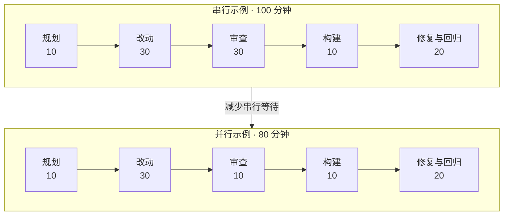

> 公开说明：本文只讨论方法。文中的时间和比例均为合成示例，不对应任何实际项目。

## 先看结论

iLoop 基于 VDD，验证不能省。提速的目标不是少拿证据，而是在不降低证据质量的前提下，减少重复验证和串行等待。

可以先记住三条：

1. 先按影响范围决定验证到哪里，避免小改动触发无关的全量回归。
2. 只并行互不依赖、只读取证的任务，共享环境和代码写入仍然串行。
3. 修复后只重跑受影响的验证通道，不让一次局部修复重新拖回全量流程。

## 一个合成的时间账本

假设一项任务原本需要 100 分钟，其中五组独立审查串行占 30 分钟。把这五组同时启动后，审查阶段可能缩短到约 10 分钟，完整任务则缩短到约 80 分钟。



这个例子只证明一件事：独立审查适合并行。它不能推出编译、安装和 UI 自动化也能得到同样比例的收益，因为这些任务经常争用同一个工作区、设备或构建产物。

## 提速要先少跑，再并行

验证范围由改动影响面决定：

| 范围 | 典型改动 | 验证方式 | 是否需要全量回归 |
|-|-|-|-|
| R0 控件 | 文案、颜色、显隐 | 截图或 UI 树 | 不需要 |
| R1 页面 | 布局、滚动、局部交互 | 当前页面点验 | 通常不需要 |
| R2 模块 | 共享组件、服务或状态机 | 受影响页面和定向用例 | 按模块决定 |
| R3 全局 | 路由、账号态、公共组件、构建配置 | 核心或全量回归 | 需要 |

并行前再过一层判断：

| 判断 | 可以并行 | 必须串行或共享一次 |
|-|-|-|
| 任务关系 | 互不依赖，结果可独立产出 | 后一步依赖前一步结果 |
| 验收对象 | 同一个冻结提交和证据快照 | 验收期间对象还在变化 |
| 运行资源 | 独立设备、端口和临时目录 | 共用模拟器、真机或可变工作区 |
| 任务权限 | 审查者只读，只给判定 | 多个执行者同时改代码 |
| 结果处理 | 同批启动，统一汇总 | 每返回一组就修改一次 |
| 重跑范围 | 只重跑受影响通道 | 每轮把所有通道重新跑一遍 |

便宜验证也应该先挡在前面。静态检查、增量编译和单测如果已经失败，就先修这些问题，不急着启动昂贵的 UI 回归。

## 为什么先选代码审查

代码审查适合作为第一批并行对象：

- 它通常是只读任务，彼此不修改代码。
- 不同模块可以按边界拆开，输入容易冻结。
- 每组结果可以独立输出，再由主流程统一去重。
- 它不需要同时争用一台设备或一个安装环境。

一套稳妥的执行方式是：

| 步骤 | 做法 | 目的 |
|-|-|-|
| 冻结输入 | 固定候选提交、验收目标和证据快照 | 保证审查对象一致 |
| 拆分范围 | 按模块边界拆成互不依赖的分片 | 避免重复审查 |
| 同批启动 | 一次性发出全部独立任务 | 形成真实并发 |
| 只读取证 | 审查过程不修改代码 | 防止对象漂移 |
| 集中汇总 | 主流程去重并归并根因 | 避免结论直接叠加 |
| 集中修复 | 汇总后统一修改一次 | 降低返工 |
| 定向复核 | 只重跑受影响分组 | 避免再次全量审查 |

## 编译和 UI 为什么不能照搬

编译和 UI 自动化经常共享资源：

- 多个任务同时写同一个构建目录，会互相污染。
- 多个 UI 流程争用同一台设备，会覆盖前台状态。
- 每个分片都重新编译一次，可能比串行更浪费。
- 产物没有绑定同一个哈希时，不同通道验的可能不是同一份代码。

更合理的路线是“构建一次，再分发验证”：

```text
冻结候选提交
  -> 构建一次并记录产物哈希
  -> 为每个验证通道准备独立环境
  -> 并行执行互不干扰的检查
  -> 汇总证据
  -> 只重跑受修复影响的通道
```

## 下一步怎么继续优化

| 优先级 | 方案 | 解决什么 | 完成标准 |
|-|-|-|-|
| P0 | 建时间账本 | 先知道慢在哪 | 能直接计算阶段占比和重试次数 |
| P0 | 只重跑受影响通道 | 避免修一点又全量重验 | 每次升档有明确规则 |
| P1 | 按历史耗时均衡分片 | 避免最慢分组拖住全部任务 | 各分组耗时差持续收窄 |
| P1 | 构建一次再分发 | 避免每个验证任务重复编译 | 每个候选只构建一次 |
| P1 | UI 验证异步化 | 减少主流程等待 | 阻塞时间下降，缺陷检出率不降 |
| P2 | 复用设备和缓存 | 缩短单次拉起与安装 | 冷启动和热启动分别可测 |

真正开始优化前，先采一批可公开复现的基准。如果单次构建和设备拉起占了大头，应先优化缓存和环境复用；如果重试很多，应先解决验证稳定性。两种情况下都不该急着增加并行任务。

## 结论

并行的价值不是“把所有事情同时跑”，而是消灭没有必要的串行等待。正确顺序是：先裁掉无关验证，再冻结对象，把独立任务并行，最后只复核受影响的部分。

验证的底线不变。任何提速方案如果让证据变少、对象漂移或结果不可复核，都不算优化。

## 参考来源

1. Anthropic《How we built our multi-agent research system》(2025)：https://www.anthropic.com/engineering/multi-agent-research-system
2. Facebook《Predictive test selection》(2018)：https://engineering.fb.com/2018/11/21/developer-tools/predictive-test-selection/
3. Dropbox Affected Module Detector：https://github.com/dropbox/AffectedModuleDetector
