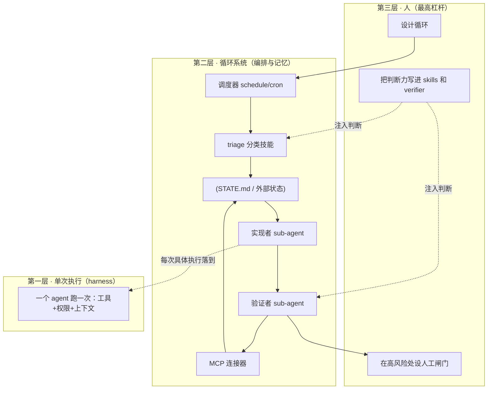
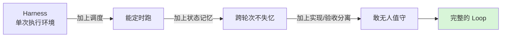
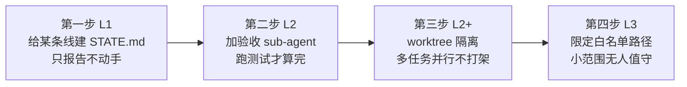

> [!NOTE]
> **一句话结论**：Loop Engineering 主张你别再亲手给 AI 敲每一条指令，而是去**设计一套自动敲指令、自动验收、自动记进度的系统**。它的真正价值不在那 6 个能 clone 的模板，而在它给「AI 编程的下一步」搭了一套清晰的分层骨架——这套骨架和我们熟悉的 harness 是「层级关系」而非「替代关系」。

仓库地址：[cobusgreyling/loop-engineering](https://github.com/cobusgreyling/loop-engineering)。作者是写 AI 文章的 Cobus Greyling，本质是一篇「可执行的博客」——23 个 star，但思路成体系，值得当作思考框架来读，而不是当工具库来用。

# 一、它到底在说什么

核心就一句迁移：**杠杆点从「打磨单条 prompt」搬到了「设计编排 agent 的控制系统」**。仓库引用了两个人的原话来立论。

> 「你不该再给编程 agent 写 prompt 了。你该去设计那些替你给 agent 写 prompt 的循环。」——Peter Steinberger

> 「我现在不给 Claude 写 prompt 了。我让一堆循环跑着，由它们去给 Claude 写 prompt、自己琢磨该干啥。我的活儿，是写循环。」——Boris Cherny（Anthropic，Claude Code 负责人）

这里它给「循环（Loop）」下了个挺关键的定义：**循环是一个递归的目标（recursive goal）**——你定个目的，AI 就自己一轮轮迭代（中间会派小弟、会自检、会把进度写进外部存储），直到目标完成，或者它自己判断「这事我搞不定」，把活儿连同完整上下文交还给人。

---

# 二、多层架构：这是全篇我最看重的部分

仓库没把「循环」当成一个扁平的脚本，而是拆成了**清晰的三层 + 六个零件**。理解这套分层，是理解整个范式的钥匙。

## 2.1 三层心智模型：人 → 循环系统 → 单次执行

这张图的要点：**人在最顶层，干的是「设计」和「兜底判断」；循环系统在中间，负责「发现活儿→派活→验收→记账」；最底层才是真正干活的那一次 agent 执行**。越往上杠杆越大，越往下越机械。

## 2.2 六个零件：每个都在解决一个具体痛点

仓库把循环拆成「5 个基础积木 + 1 个记忆」。我按「它到底治什么病」来列，这样更好记。

| 零件 | 它治什么病（大白话） | 典型实现 |
|-|-|-|
| **1. 调度 / Scheduling** | 心跳。没它，AI 只能「跑一次就停」，成不了循环 | Grok 的 /loop、Claude Code 定时任务、GitHub Actions |
| **2. Worktrees** | 防打架。两个 AI 同改一批文件 = 合并地狱；给每个 AI 一个独立工作目录，共享历史但互不踩脚 | git worktree、isolation: worktree |
| **3. Skills** | 长期记忆里的「规矩」。把项目约定、构建命令、「上次出过啥事故别再犯」写一次，每轮自动读 | SKILL.md + 脚本 |
| **4. 连接器 / MCP** | 让循环能伸手到真实世界——读写 Jira、发消息、查库、开 PR | MCP server |
| **5. Sub-agents（实现/验收分离）** | **作者认为最重要的结构**。写代码的 AI 绝不能给自己判分，必须另派一个 AI 验收 | Task + 不同模型/指令 |
| **+ 记忆 / State** | 大模型每轮都失忆。必须把「现在在干啥/上次试了啥/啥事卡着等人」写进耐久存储 | STATE.md、Linear 看板 |

> [!NOTE]
> **搭循环的正确姿势（很务实的一条）**：别一上来全堆上。最小可用循环 = **调度 + 一个 triage 技能 + 一个状态文件**。等这版证明有用了，再加 worktree 隔离，再加验收小弟，再加连接器。**每加一个零件，都得是上一版已经证明了价值（也暴露了坑）之后。**

---

# 三、和 Harness 的关系：层级，不是替代

这是你特别问的点，也是最容易绕进去的地方。仓库专门拿一行公式把两者钉死了。

> [!NOTE]
> **Harness = 单次会话的环境配置**（给一个 agent 配什么工具、什么权限、什么上下文）
> **Loop = Harness + 调度 + 状态记忆 + 验证链条**

用大白话翻译：

| 概念 | 类比 |
|-|-|
| **Harness** | 一个工人干一次活的「工位」——工位上摆好了工具、定好了权限边界、备好了这次任务的资料 |
| **Loop** | 「工位 + 排班表 + 交接班记录本 + 质检员」——它让工位无人值守地连轴转，还不出乱子 |

所以两者的关系是：**harness 是循环最底层的那一个执行单元，循环是把无数次 harness 执行「串起来、记下来、查起来」的上层系统**。作者还配了个更大的词叫「工厂模型」——harness 是流水线上的一个工位，loop engineering 是你「操作整个工厂车间」的方式，而不是亲手组装每一台。

> [!NOTE]
> **注意一个认知陷阱**：很多人以为「配好一个超强的 harness（塞满工具和上下文）就等于有了 loop」。错。harness 再强也只是「一次干得好」，loop 解决的是「连续干、还不塌方」——这中间隔着调度、记忆、验收三道坎，每道坎都是独立工程。

---

# 四、分层上线：L0 → L3 的成熟度阶梯

仓库给了一套很像「自动驾驶分级」的循环就绪度评级，配套还有 CLI 工具 loop-audit 给你的循环打分。这套阶梯本身就是「分层架构」在「信任度」维度上的体现。

| 等级 | 能干到什么程度 | 必备条件 |
|-|-|-|
| **L0 草稿** | 只写清楚意图 | 目标 + 非目标 |
| **L1 报告** | 分类→写状态，不自动动手 | + 调度 + triage 技能 + 状态文件 |
| **L2 辅助** | 带验收的小修小补 | + 实现/验收分离 + 人工闸门 + 连接器 |
| **L3 无人值守** | 你不盯着它也能跑 | + 成本上限 + 可观测 + 安全清单全齐 |

仓库还列了几条「红线」，出现就得停下来修，挺值得抄进我们自己的规范：

- 同一个 PR 自动修了 >3 次还没进展
- 验收者和实现者是**同一个** agent 会话（自己给自己判分）
- 没有状态文件——循环每轮都失忆
- 不管有没有发现问题，每轮都给人发通知（很快就会被无视）
- 没有路径白名单就开了自动合并

---

# 五、几个扎心的概念（思想层，比模板更值钱）

作者（借 Addy Osmani 的话）造了几个词，我觉得这些比那 6 个模板更值得琢磨。

> [!NOTE]
> **意图债（Intent Debt）**
> AI 每次都冷启动，缺的背景就用「自信的瞎猜」填上。Skills 就是用来还这笔债的——把约定写一次，每轮自动读。

> [!NOTE]
> **理解债（Comprehension Debt）**
> 循环跑得越快，你没亲手写的代码越多，「看不懂自己仓库」的窟窿就越大——除非你去读循环到底改了啥。

> [!NOTE]
> **认知投降（Cognitive Surrender）**——作者那句话挺狠：「用循环来辅助思考」和「用循环来逃避思考」，动作一模一样，结果天差地别。**循环不知道你属于哪种，你自己知道。**

> 「去搭那个循环。但要像一个打算继续当工程师的人那样搭它，而不是一个只想按下『开始』键的人。」——Addy Osmani

---

# 六、对我们的启示与可落地的应用

结合我们手头在大型代码仓库里让 Agent 干活、写方案让它自己填细节的实际，这套框架能给的不是「换工具」，而是「换组织方式」。

## 6.1 三条直接启示

> [!NOTE]
> **1. 我们其实已经在做半个 loop engineering 了。**「让 TRAE 自己补全方案细节」本质就是在设计「让 AI 自补全」的系统，而不是亲手写每行。我们缺的不是理念，是**那根「脊椎」——一个显式的 STATE 状态文件**，和**一个独立验收的小弟**。

> [!NOTE]
> **2. 最该先补的是「实现/验收分离」。**现在让 TRAE 写完代码，往往就是它自己说「我写完了」。按这套框架，必须另起一个 agent（最好换更强的模型 + 不同指令）专门跑测试、做对抗式 review。这是从「能用」到「敢无人值守」的分水岭。

> [!NOTE]
> **3. 警惕「理解债」在大仓里爆雷。**咱大仓那么大，循环跑得欢但你不读它改了啥，迟早出事。建议把「人工读 diff」设成 L2 阶段不可跳过的闸门。

## 6.2 一张可执行的落地路线

| 动作 | 具体做什么 | 对应零件 |
|-|-|-|
| **立刻能做** | 挑一条低风险的线（如依赖更新、changelog 起草），建一个 STATE.md，让 AI 每天只产「分类报告」，人来决策 | 调度 + 状态 |
| **下一步** | 给写代码的任务配独立验收 agent，跑测试通过才标记完成；实现者无权自判「done」 | 实现/验收分离 |
| **再下一步** | 多任务用 worktree 隔离并行；给 MCP 连接器最小权限（先只读 + 评论） | Worktrees + MCP |
| **谨慎推进** | 仅对白名单路径、低风险改动开自动提交；auth/支付/密钥/基建一律进 denylist | 安全闸门 |

> [!NOTE]
> **给大型代码仓库的特别提醒**：这套框架默认每个循环跑全量 `npm ci && npm test` 来验收。大仓里这么干成本和耗时都顶不住，验收环节必须**限定到本次实际改动的路径范围**，别让验收者去扫全仓。这点框架没替我们想，得我们自己改造。

---

# 七、一句话收尾

> [!NOTE]
> Loop Engineering 最大的贡献，是把「harness（一次干好）」和「loop（连续干好还不塌方）」这两件常被混为一谈的事，用**分层架构**清清楚楚分开了。对我们而言，工具早就够用，真正的功课是补上**状态记忆**和**独立验收**这两根脊椎——然后像「打算继续当工程师的人」那样，去读循环每一次到底改了什么。

---

# 八、读完之后：Loop 给 iLoop 的几点启发

我读这篇，不是为了 clone 那 6 个模板，是因为手头在做一个 iOS 通用 agent（**iLoop**），想看看「设计循环」这套已经被人想透的方法论，能照出我哪些没想清楚的地方。读下来最大的收获不是某个技巧，而是它把**「做 agent」这件事的骨架**讲明白了——下面几条，是正文里真正戳到 iLoop 的。

## 1. 它把「调好一次」和「连续干还不塌方」分清了，而 iLoop 还卡在前半句

正文第三章那个公式我盯了很久：**Loop = Harness + 调度 + 状态记忆 + 验证链条**。翻译成大白话——把一个 agent 的工具、权限、上下文配好，只是「让它一次干得好」；要让它「连着干、还不出乱子」，中间隔着调度、记忆、验收三道独立的坎。

这句话照出 iLoop 的真实状态：我现在做的大部分功夫，都还在「把单次执行配好」这一层——prompt、工具、上下文都在打磨。但 iLoop 想成为「闭环」，缺的恰恰是后面那三道坎里的两道：**持久的状态记忆**和**独立的验收**。这不是我之前没意识到，是这篇把它从「感觉缺点啥」变成了「明确缺哪两根脊椎」。

## 2. 「实现的人不能给自己判分」——这是 iLoop 最该先补的一道坎

正文反复强调一个结构：**写代码的 agent 绝不能自己说「我写完了」，必须另派一个 agent 来验收**。作者把它列为整套循环里最重要的零件，理由很朴素——自己改自己判，等于没判。

iLoop 现在就是这个毛病：跑完一轮，往往是它自己宣布通过。按这套思路，iLoop 该有一个独立的验收环节（哪怕只是换套指令、跑一遍真机/编译校验），实现方无权自己标「done」。这是 iLoop 从「能用」迈到「敢让它自己多走几步」的分水岭。

## 3. 给「自治程度」分级，用户才知道这个流会不会自己动手

正文第四章那套 L0→L3 成熟度阶梯（草稿→只报告→带验收的辅助→无人值守），本质是把「agent 有多大胆」做成了显式刻度，还配了个 loop-audit 给循环打分。

iLoop 的每个 flow 现在没有这个刻度——用户不知道某个流是「只会给建议」还是「会直接改我代码」。该借的就是这把尺子：给每个 flow 标一个放权级别（只报告 / 辅助改 / 自己跑），开场就声明出来。再往前一步，把 iLoop 现有的 verify/doctor 那种「过 / 不过」的布尔判断，升级成一个带分数和改进建议的「接入就绪度」，比一个冷冰冰的 PASS/FAIL 更有指导性。

## 4. 「失忆」和「看不懂自己的项目」，是循环跑起来后必然欠的两笔债

正文第五章那两个词很扎心：**意图债**（agent 每轮冷启动，缺的背景就用自信的瞎猜补上）和**理解债**（循环跑得越欢，你没亲手写的东西越多，越看不懂自己的仓库）。它给的解药分别是：把项目规矩写进长期记忆每轮自动读，以及强制人去读循环到底改了啥。

对 iLoop 的启发有两层。一是我现在的轮次记录是「按轮流水账」，不是一份能跨会话续上的持久任务态——这正是「意图债」的温床，该补一份显式的状态记忆。二是 iLoop 踩过的坑（比如那些一犯再犯的套路）现在散落在各处，该像正文里的 anti-patterns 目录那样，把「循环会怎么坏」体系化编成册，每轮自动复读，这是在还「意图债」。

## 5. 哪些我明确不搬

正文里有几样东西很好，但不是 iLoop 这个阶段该碰的，记下来省得以后反复纠结：

- **worktree 并行、定时 cron 无人值守**：这些依赖外部的循环运行时和调度能力，而 iLoop 的定位是「人在环里逐轮推进」，不是撒手不管的定时任务。强行上反而把简单问题复杂化。
- **GitHub 运维那套 pattern**（每日分类、PR 看护、CI 清扫）：那是仓库运维场景，跟 iOS 工程闭环不是一回事，借不上。

> [!NOTE]
> 一句话收口：Loop 这篇对 iLoop 最大的价值，是把「**做 agent**」拆成了可检查的几根脊椎——iLoop 现在补齐顺序应该是**独立验收 → 放权分级 → 状态记忆 → 反模式目录**，前两根直接提升可控性，后两根直接提升可持续性。至于无人值守那一层，等 iLoop 真长出前面这几根骨头再说。
