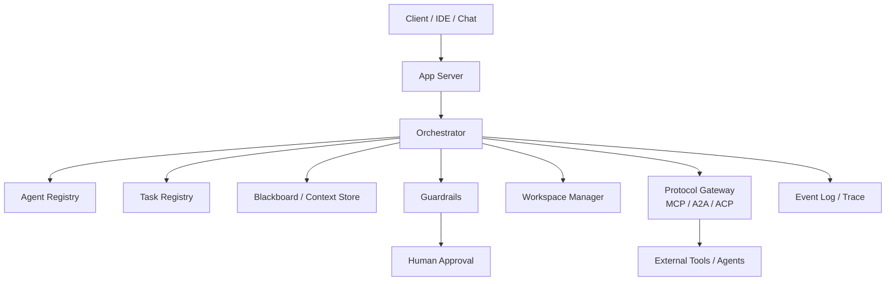

> [!NOTE]
> **一句话总结**：[Multi-Agent Wiki](https://multi-agent.wiki/) 是一个面向工程师的多智能体系统知识库，不是论文综述，也不是某个框架的宣传册。它用 **5 个工程维度**给 **29 个交互模式**做坐标系，并配套 **6 篇生产落地指南**，回答一个核心问题**："我这个任务，到底要不要、以及怎么用多智能体？"**

---

# 一、它到底是什么

这是一个由社区维护、聚焦"**多智能体（Multi-Agent System，MAS）**"的**工程化参考站**。作者的立场非常鲜明：

> [!NOTE]
> **它是什么**
> - 工程知识库：每个模式都回答"解决什么 / 通信结构 / 怎么实现 / 何时别用"
> - 选型工具：按任务特征 + 工程阶段推荐技术栈
> - 生产参考：Runtime / Observability / Guardrails 一应俱全

> [!NOTE]
> **它不是什么**
> - 不是论文综述
> - 不是 LangChain / AutoGen / ADK 的官方文档
> - 不是"多智能体很厉害"的鼓吹文

> [!NOTE]
> **作者的核心观点**：不要问"哪种多智能体最强"，而要问——任务能否拆解？子任务能否并行？是否需要专家接管？是否要审核回滚？是否跨系统互通？是否要长生命周期状态？**如果大多回答是 No，请先用单 Agent + 合适工具，更可靠。**

---

# 二、五维分类法（Taxonomy）

作者拒绝按厂商名分类，主张用 **5 个工程维度**给所有模式建坐标系。任何真实系统通常是多个维度的组合，例如**：Supervisor + Parallel Fan-out + Blackboard + Verifier + HITL + MCP**。

| 维度 | 关注问题 | 代表模式 |
|-|-|-|
| **1. 控制结构** | 谁掌握流程控制权 | Supervisor / Handoff / Hierarchical / Swarm |
| **2. 信息流** | 信息如何在 Agent 间流动 | Sequential Pipeline / Parallel Fan-out / Group Chat / Blackboard / Event Bus |
| **3. 决策方式** | 最终决策如何产生 | Generator-Critic / Refinement Loop / Debate / Voting / Market |
| **4. 执行环境** | Agent 跑在什么环境 | Role-playing/SOP / HITL / Workspace Isolation / Stigmergy |
| **5. 互联协议** | 跨系统如何对接 | MCP / A2A / ACP / Agent Client Protocol |

---

# 三、29 个核心模式速览

下面把 29 个模式按 6 大类压缩成"**一句话定位 + 典型用法**"，方便快速建立索引。

## 3.1 控制类（Control，7 个）

| 模式 | 一句话定位 / 何时用 |
|-|-|
| **Supervisor / Manager** | 一个 Manager 规划、路由、汇总；适合生产 triage、稳定主控；注意瓶颈与 token 爆炸 |
| **Agents-as-tools** | 把专家包装成可调用工具，Host 永不让出控制权；适合一次性专家咨询 |
| **Handoff / Router** | 当前 Agent 把对话交给另一个；适合客服分流、领域切换；要限制次数防死循环 |
| **Hierarchical Decomposition** | 多级 Manager-Worker 递归分解；适合大型工程；注意层级深度与失败级联 |
| **Graph / Workflow** | 显式节点+边+状态，LLM 只能选边不能越界；适合可恢复、可审计的生产系统 |
| **Peer-to-peer / Swarm** | 无中心、自组织；适合开放探索；企业生产慎用，要 TTL + 预算上限 |
| **Coordinator / Dispatcher** | 服务层路由器（非 LLM），负责任务状态/重试/超时；适合多租户 Agent 平台 |

## 3.2 信息流类（Information，6 个）

| 模式 | 一句话定位 / 何时用 |
|-|-|
| **Sequential Pipeline** | A→B→C 固定链；适合 ETL 式流程；每步用 schema 校验 |
| **Parallel Fan-out / Gather** | 并发分支 + 聚合器；适合多视角检索；聚合器要去重与冲突解决 |
| **Group Chat** | 多个 Agent 共享一个 thread，Moderator 选发言人；适合头脑风暴；易跑题 |
| **Nested Chat** | Agent 内部跑子对话，对外只返回结构化结论；适合封装复杂流程 |
| **Blackboard / Shared Memory** | 不直接对话，共享 workspace 读写；每条记录带 source/time/confidence/TTL |
| **Event Bus / Pub-Sub** | 异步事件流；支持 replay、幂等、DLQ；不适合简单同步任务 |

## 3.3 决策类（Decision，7 个）

| 模式 | 一句话定位 / 何时用 |
|-|-|
| **Debate / Judge / Voting** | 正反方辩论，裁判定论；可验证任务优先用工具校验而非 LLM 当裁判 |
| **Generator-Critic / Verifier** | 生成+校验；Critic 必须用不同 prompt/工具（跑测试、lint）；限循环次数 |
| **Refinement Loop** | 生成→评估→修订 直到达标；要提前定义退出条件，警惕"刷分数而非真目标" |
| **Market / Auction / Contract Net** | 任务竞标（成本/ETA/置信度）分配；适合资源动态调度 |
| **Mixture-of-Agents** | 分层堆叠，每层基于上层输出改进；层数 2-3 即可 |
| **Voting / Ensemble** | 多候选投票/打分；注意多数不一定对、相似候选偏差 |
| **Clarification-at-edge** | 对每条跨 Agent 消息打"模糊度"分，超阈值就主动问而非猜 |

## 3.4 环境类（Environment，4 个）

| 模式 | 一句话定位 / 何时用 |
|-|-|
| **Role-playing / SOP / Virtual Company** | 扮演 PM/架构师/工程师/测试角色，按 SOP 协作；交付物是 artifact 不是聊天 |
| **Human-in-the-loop** | 人作为特殊 Agent 审批/纠正；操作按风险分级（读/写/shell/部署/支付） |
| **Workspace / Sandbox Isolation** | 每个 Agent 独立 worktree/container，输出 patch；Reviewer 合并前查冲突 |
| **Stigmergy（环境介导）** | 不直接对话，通过留痕（TODO.md / 测试报告 / git diff）协作 |

## 3.5 协议类 + 特殊类（5 个）

| 模式 | 一句话定位 |
|-|-|
| **Protocol-mediated Network** | MCP（Agent↔Tool）、A2A/ACP（Agent↔Agent）、ACP（IDE↔Coding-Agent）打通跨框架协作 |
| **Composite Pattern** | 真实生产 = 多个模式组合：Pipeline + Parallel + Handoff + Critic + HITL + Blackboard |
| **Coalition / Federation** | 临时组队，关注治理、成员、自治边界 |
| **Social Simulation** | 模拟社会/组织，观察→反思→规划→行动；用于用研、NPC、组织建模 |
| **MARL / CTDE** | 多智能体强化学习，集中训练分布执行；适合策略研究而非 LLM 平台主力 |

---

# 四、决策矩阵：怎么选？

## 4.1 按任务特征选

| 任务特征 | 推荐 | 避免 | 原因 |
|-|-|-|-|
| 单轮专家咨询 | Agents-as-tools | Handoff / Group Chat | 主控不必让权 |
| 多轮领域接管 | Handoff | Agents-as-tools | 专家需直接对话用户 |
| 固定流程 | Sequential / Workflow | Swarm | 追求确定性 |
| 大量独立子任务 | Parallel Fan-out | Sequential | 并行提速最显著 |
| 长复杂任务 | Graph + Task Registry | 纯 prompt 编排 | 要可恢复/取消/trace |
| 需要质量审核 | Generator-Critic / Refinement | 单 Agent 自评 | 自评易复现同错 |
| 多方案对比 | Debate / Voting / MoA | 单路径 | 多候选暴露冲突 |
| 异步多方协作 | Blackboard / Event Bus | Group Chat | 共享状态比长对话稳 |
| 高风险操作 | HITL + Guardrails | 全自动 | 必须明确审批与问责 |
| 跨工具生态 | MCP | 自定义工具协议 | 降低集成成本 |
| 跨厂商 Agent 协作 | A2A / ACP | 私有 RPC | 互操作性更好 |

## 4.2 按工程阶段选

| 阶段 | 目标 | 推荐技术栈 |
|-|-|-|
| Demo | 证明可行 | Single Agent + Tools + Agents-as-tools |
| MVP | 能用 | Supervisor + Handoff + Trace |
| 内部平台 | 稳定可恢复 | Graph Workflow + Task Registry + Blackboard + MCP |
| 生产平台 | 安全可审计 | Runtime + Guardrails + HITL + Event Bus + Workspace Isolation |
| 生态 | 跨系统互通 | MCP + A2A/ACP + Agent Client Protocol |

## 4.3 五大反模式（Anti-patterns）

> [!NOTE]
> 1. **一上来就用 Group Chat**——看起来很"多智能体"，但很难收敛
> 2. **长任务不做状态机**——半途中断无法恢复、无法调试
> 3. **所有 Agent 共享同一 Context**——污染严重、权限边界消失
> 4. **代码生成无 Verifier**——Agent 会自信地生成错误 diff
> 5. **没有事件日志**——出问题时无法重建现场

---

# 五、生产落地：Runtime 架构

Wiki 提供了 **6 篇 Implementation 文档**，把"多智能体平台到底由什么组成"讲清楚。核心运行时模块如下：



| 模块 | 职责 |
|-|-|
| **Orchestrator** | 工作流引擎 + 策略引擎 + Agent 调度 + Trace 发射（路由可用规则/LLM/混合） |
| **Agent Registry** | 注册可替换的 Agent 单元（定义/版本/能力） |
| **Task Registry** | 任务状态机：pending / running / blocked / done，支持恢复与取消 |
| **Blackboard / Context Store** | 共享事实库；记录 source/timestamp/confidence/TTL |
| **Event Log / Trace** | JSONL → Postgres/ClickHouse → OpenTelemetry；支持回放 |
| **Guardrails** | 分层权限 L0(只读) → L5(生产/金融，默认拒绝)；输入/工具/输出/预算/状态/Handoff 六类护栏 |
| **Workspace Manager** | 沙箱/容器/worktree 隔离，输出 patch；支持 snapshot/rollback |
| **Protocol Gateway** | 对外暴露/对接 MCP、A2A、ACP；所有边界都要 auth + audit + rate limit |

## 5.1 可观测性事件模型

每条事件都遵循统一结构：

```json
{
  "traceId": "...", "spanId": "...", "parentSpanId": "...",
  "sessionId": "...", "runId": "...", "taskId": "...",
  "actor": "agent/tool/human/system",
  "type": "agent.start | tool.call | handoff | approval.request | ...",
  "payload": {...},
  "timestamp": 1779712267000,
  "schemaVersion": "1.0"
}
```

**关键指标**：任务成功率、Handoff 循环率、Verifier 拒绝率、Agent 深度、工具失败率、Cost-per-success、审批延迟、Context 压缩率。

## 5.2 安全护栏分级

| 等级 | 能力 | 默认策略 |
|-|-|-|
| **L0** | 只读查询 | 允许 |
| **L1-L2** | 写文件、内部 API | 允许 / 限速 |
| **L3** | Shell / 网络请求 | 白名单 + 审计 |
| **L4** | 部署 / 数据库写 | 需审批 |
| **L5** | 生产 / 金融操作 | 默认拒绝 |

---

# 六、对我们的启示

> [!NOTE]
> **可以直接借鉴**
> - **五维分类法**给团队建立统一语言，避免按框架名讨论
> - **决策矩阵**可直接套用做选型 PRD
> - **事件模型**可作为多 Agent Trace 协议起点
> - **Guardrails 五级**可对照现有系统补齐缺失等级

> [!NOTE]
> **需要注意**
> - 是社区站点，部分实现细节为**原则性指导**，落地仍需自研
> - 偏向英文生态（OpenAI Agents SDK、LangChain、ADK、MCP），国内框架案例较少
> - "反多智能体"的克制立场对追新团队是冷水，但**正好对症**

## 6.1 推荐阅读路径

1. **新手**：先看 [Taxonomy](https://multi-agent.wiki/taxonomy) 建立分类框架
2. **选型者**：直接看 [Decision Matrix](https://multi-agent.wiki/decision-matrix)
3. **平台建设者**：精读 Production Runtime / Orchestrator / Observability / Guardrails 四篇
4. **贡献模式**：用 Pattern Page Template
5. **查术语**：Glossary

---

# 七、自检清单（拿走即用）

- [ ] 这个任务真的需要多智能体吗？（能否单 Agent + 工具搞定？）

- [ ] 控制权在谁手里？（Centralized / Transfer / Hierarchical / Decentralized）

- [ ] 信息怎么流？（Linear / Parallel / Shared Thread / Shared State / Event Stream）

- [ ] 决策怎么做？（Manager / Critic / Loop / Debate / Vote / Market）

- [ ] Context 是否隔离？是否会污染？

- [ ] 是否有 Verifier？高风险操作是否经 HITL 审批？

- [ ] 事件日志是否完备？任务能否恢复/取消/回放？

- [ ] 跨系统集成是否走标准协议（MCP / A2A / ACP）？

---

> [!NOTE]
> **原站链接**：[https://multi-agent.wiki/](https://multi-agent.wiki/)
> **结论**：这是一个少见的"**不卖框架、只讲工程**"的多智能体参考站。它的真正价值不在某个具体模式，而在它给整个领域**建立了统一的工程坐标系**——让"我们用了 LangGraph 的 Supervisor + AutoGen 的 GroupChat"这种厂商混用表述，可以翻译成"中心化控制 + 共享 thread 信息流 + Manager 决策"这种工程语言。**值得团队 onboarding 时人手一份。**
