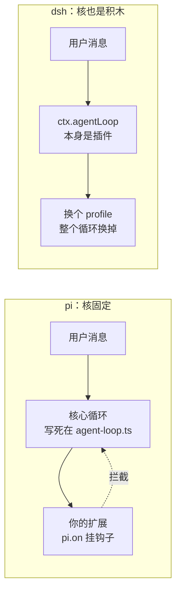
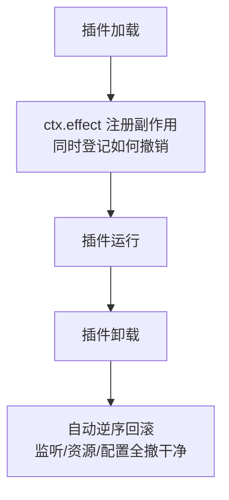

## 一分钟看完

两个仓库最近被媒体反复放在一起讲，说"很像"。看完源码，结论是：**理念同源，实现分道**。

- **pi**（earendil-works/pi，作者是 libGDX 的 Mario Zechner 和 Flask/Jinja 的 Armin Ronacher）：一个特权最小核 + 扩展 API 的极简 harness。核心自己写循环，你在外面挂钩子改行为。哲学是"把 pi 掰弯来适配你的流程"。
- **DeepSeek Harness**（deepseek-ai/deepseek-harness）：一切皆插件。连"agent 主循环"本身都是可替换的插件，底座是崔添翼那套 Cordis 依赖注入内核。哲学是"没有需要打补丁的特权核心"。

一句话记差异：**pi 是"给你一个稳定的核，你在边上加料"；dsh 是"连核都拆成积木，你自己拼"**。

对 iLoop（老羊的端侧 Agent Loop）来说，真正该偷的是三个具体机制：Cordis 的**可逆 effect**（治端侧活对象的生命周期）、dsh 的**单一 append-only 事件流**（对齐"可证明"）、pi 的**瘦核心 + 按需暴露**（防上下文全家桶膨胀）。架构风格本身反倒不用照搬。还有一件事要主动"别学"：别把 loop 本身插件化——iLoop 的价值恰恰在 loop 的确定性。

---

## 三个 harness 各自在解决什么问题

|  | pi | DeepSeek Harness | iLoop |
|-|-|-|-|
| 一句话定位 | 极简可扩展的通用 agent 核 | 全插件化的 agent 操作系统 | 端侧通用 Agent Loop |
| 核心结构 | 特权最小核 + 扩展 API | Cordis DI 内核 + 49 个插件包 | 平台无关核心循环 + 接入层 + 业务上下文 |
| 循环归谁管 | 核心自己写死，你挂钩子 | 循环也是插件，可整个替换 | 核心循环固定，换平台只动接入层 |
| 扩展方式 | `pi.on()` / `registerTool()` 拦截 | `ctx.effect()` 声明可逆副作用 | 核心目录只读 + 隔离扩展包 + 归属点选 |
| 特有价值 | 上下文极省（系统提示+工具约 1340 token） | 可逆 effect + Code 模式省 token | 端侧执行验证——"真机上真做对了，且能证明" |
| 包数量 | 10 个包 | 49 个包 | — |

三者补的洞不一样。pi 补的是"主流 harness 太重、太难改"；dsh 补的是"扩展一多，副作用互相打架、卸载不干净"；iLoop 补的是别人几乎都没碰的一块——**端侧执行验证**。云端 agent 跑完给个 diff 就算完事，端侧不行，代码得在真机、真模拟器、真构建链路上跑通，而且要能把"跑通了"这件事证明给人看。

---

## 网上怎么评这两个

**热度是真的高。** pi 上线后很快冲到约 8 万星、npm 周下载 130 万；dsh 更猛，24 小时内 4.6 万星以上。名人效应 + DeepSeek 招牌，媒体自然把它俩绑一起炒。

**但争议也集中在一个点：可维护性。** Hacker News 上对 dsh"一切皆插件"的质疑很直接——49 个包、连主循环都插件化，好处是灵活，代价是新人读代码要先理解整套 Cordis 依赖注入模型才敢动手，调用链被 effect 和 waterfall 中间件层层包裹，出问题时定位成本高。有人形容这是"把简单的事做复杂了"。pi 这边的批评相反：极简是极简，但真要做复杂 agent，很多东西得自己从头搭，官方给的就是个骨架。

**token 效率有人实测过。** pi 的系统提示 + 工具定义加起来约 **1340 token**，而 Claude Code 约 **23132 token**——差了 17 倍，大头是 Claude Code 那 27 个工具的描述文本。dsh 因为全家桶默认带一堆插件，单步上下文压力明显比 pi 大，实测约 14 步的任务里累计上下文是 pi 的近 3 倍。

这里有个关键判断，别被媒体带偏：**harness 影响的是效率（token/时间），不是最终质量。** 同一个模型，换 harness 不会让它突然更聪明或更笨，只会让它更省或更费。所以对比 harness，就看完成同样的活花多少 token、多少轮、多少人力维护。

---

## 深度解析：两条路线的分歧点

### 循环该不该被拆开

这是 pi 和 dsh 最本质的分野。

pi 说：循环这东西不该乱动，我帮你定死，你想改行为就在事件流里挂钩子拦截，返回 `{block:true, reason}` 就能截停。dsh 说：凭什么循环不能换？我把它做成 `ctx.agentLoop` 这个可替换插件，你连 Standard / Code / Minimal / Creator 四种运行模式都能整个切。

两种都对，看你信什么。pi 信"核心稳定压倒一切"，dsh 信"没有不该动的东西"。对 iLoop 来说，这个分歧极其重要，后面细说。

### 扩展的副作用怎么收场

这是 dsh 真正解决的硬问题，也是 iLoop 最该偷的一招。

一个插件挂了监听、占了资源、改了配置，卸载时怎么保证全都干净撤销？dsh 的答案是 **Cordis 的可逆 effect**：你用 `ctx.effect()` 注册的每个副作用，框架都记得怎么撤，插件卸载时自动逆序回滚。这跟 Rust 的 Drop、C++ 的 RAII、React 的 useEffect 清理函数是同一个思想——**谁申请，谁负责，且申请时就把"怎么还"一起登记好**。

Cordis 本身有学术背景，出自北大和 DeepSeek 合作的论文《A Programming Paradigm for Spatiotemporal Composability》，讲的就是时空可组合性——副作用不只在空间上要隔离，在时间上（加载/卸载）也要可回收。这套模式在 Rust、C++、React 里都被反复验证过，是扎实的工程经验。

---

## 对 iLoop 的启示

### 端侧的活对象，该用可逆 effect 管生命周期

iLoop 跟 pi、dsh 最大的不同，是它满手都是**活对象**：设备连接、模拟器实例、构建进程、真机调试会话。这些东西申请了必须回收，否则设备句柄泄漏、模拟器僵死、端口占着不放，跑几轮就崩。

dsh 的可逆 effect 正好治这个。设想把 iLoop 的每个活对象都包成一个"申请即登记回收"的 effect：连真机时登记"断开连接"，起模拟器时登记"关模拟器"，开构建进程时登记"杀进程"。一步失败、一轮结束、整个任务中断，框架都能自动把这些活对象逆序清干净，不用在每个错误分支里手写一堆 `finally`。

这比 pi 的钩子模型更适合 iLoop——pi 的扩展是"改行为"，iLoop 的痛点是"管资源"，而资源生命周期正是 Cordis effect 的主场。

### 取证收成一条 append-only 事件流，对齐"可证明"

iLoop 的立身之本是"能证明真机上真做对了"。dsh 有一条设计原则特别值得抄：**append-only 的 SessionEvent 日志，加一条不变量——"模型看得见的，必然被记录"**。

把这条搬到 iLoop：所有取证（构建日志、真机截图、测试结果、DoD 校验）都往一条只增不改的事件流里写，且规定"凡是进入验收判断的证据，必然已落到这条流里"。这样"可证明"就落到实处——有一条不可篡改、可回放的完整证据链兜底。验收看板、HITL 介入、事后复盘，全从这一条流里长出来，各处日志再也不会对不上。

### 上下文预算要防全家桶膨胀，学 pi 的瘦核心

dsh 全家桶默认带一堆插件，实测单步上下文压力是 pi 的近 3 倍——这是"一切皆插件"的隐性代价：插件越多，塞进模型的工具描述、上下文就越臃肿。

iLoop 内置 18 个工作流 + 自治档，天然有膨胀风险。这里该学 pi 两点：**瘦核心**（系统提示和工具定义压到极致，pi 做到约 1340 token 是标杆）和**按需暴露**（别一上来把 18 个工作流的说明全灌给模型，用到哪个再展开哪个）。端侧模型的上下文窗口往往比云端更紧，这条对 iLoop 是刚需，省不得。

### 有一件事要主动别学：别把 loop 本身插件化

dsh 把主循环做成可替换插件，很酷，但 iLoop **千万别跟**。

iLoop 的核心价值主张是"平台无关核心循环固定，换平台只动接入层"——**循环的确定性和稳定性就是它的护城河**。端侧交付要的是可复现、可验收、可追责，靠的正是循环行为可预期。如果学 dsh 把 loop 拆成积木让人随便换，等于亲手拆掉自己的地基。dsh 能这么玩，是因为它面向的是"探索式、高度可定制"的场景；iLoop 面向的是"确定性交付"，两者诉求相反。

**可逆 effect、事件流、瘦核心，这三样尽管往过搬；唯独 loop 不能拆。**

---

## 落地建议

给 iLoop 排个优先级，从投入产出比高的开始：

- **先做取证事件流**。这直接强化 iLoop 最核心的"可证明"卖点，且不依赖大改架构，把现有散落的取证收拢到一条 append-only 流即可，还能顺带把验收看板做扎实。
- **再做活对象的可逆 effect**。这解决端侧最容易出的资源泄漏问题，稳定性收益大。可以先拿一两类活对象（比如模拟器、构建进程）试点，跑通了再推广。
- **持续守上下文预算**。把"按需暴露工作流"定成一条硬约束，别等 18 个工作流全塞进去才发现窗口爆了。
- **守住 loop 不插件化这条红线**。写进设计原则，防止后人看了 dsh 手痒。

---

## 一句话总结

pi 教我们"核要瘦、要稳"，dsh 教我们"副作用要可逆、证据要成流"，但它俩都没解决端侧执行验证这块——那正是 iLoop 的地盘。偷师归偷师，地基别动：**loop 的确定性，是 iLoop 不能让的底线。**
