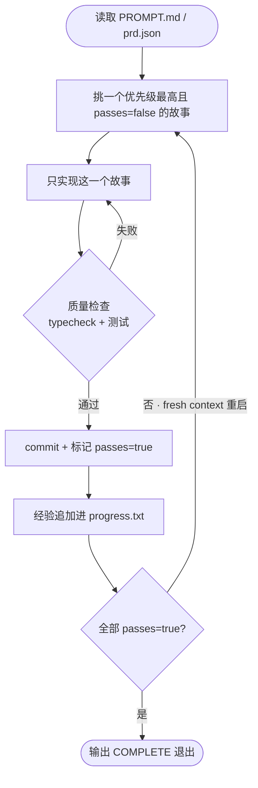

> [!NOTE]
> **一句话结论**：Ralph 是一个把「重启纪律」做到极致的 Bash 无限循环，靠**丢弃而非管理**上下文来对抗模型退化；它和 iLoop 是**同一种生物的两个变种**——Ralph 把「循环/重启」这根轴拉满、反馈层极薄，iLoop 把「反馈丰富度/可达性」这根轴拉满、重启机制克制（按需冷启动而非每轮烧毁）。两者的取舍恰好互补，各自的强项正是对方的薄弱面。

本文分三部分：先讲透 Ralph Loop 的本质与三个赌注，再论证 iLoop 与 Ralph 的同源关系，最后给出四条可落地的启示 + 两条反向验证。

---

# Ralph Loop 是什么

Ralph 就是一个 **Bash 无限循环**，把同一个 prompt 反复喂给编码 Agent，直到任务全部完成：

```bash
while :; do cat PROMPT.md | claude -p --dangerously-skip-permissions; done
```

这个技法由 Geoffrey Huntley 在 2025 年 7 月命名，名字取自《辛普森一家》里那个一头撞门框还乐呵呵喊「我在帮忙」的 Ralph Wiggum，寓意「又笨又执着的循环反而出奇地好用」。`snarktank/ralph` 是把这套裸循环工程化后的开源实现。

> [!NOTE]
> **说明：关键不在「循环」，而在「每一轮都是全新、干净上下文的 Agent 实例」。**这是设计核心，不是副作用。

# 它到底在赌什么：三个层层递进的赌注

Ralph 的全部聪明压缩成一句话：**它不试图让模型变强，而是承认模型会退化，然后用系统结构把退化「锁在每一轮之内」。**拆成三个赌注：

| 赌注 | 主张 | 为什么反直觉却有效 |
|-|-|-|
| **① 丢弃 > 管理** | 上下文腐烂不可逆，对抗它的唯一手段是「丢弃」而非「续接」 | 业界主流靠压缩、召回、RAG 来「续接」；Ralph 直接把上下文**烧掉重来**。循环边界 = 上下文重置点，每轮从满血状态开始 |
| **② 状态外置** | 记忆不放对话里，放文件系统里 | 对话历史易失、有损、会被 auto-compact 悄悄改写；`git log` / `progress.txt` / `prd.json` 持久、可校验、可 diff。重启读一遍磁盘即可恢复进度 |
| **③ 结构收敛** | 用确定的结构框住非确定的元件 | 单次调用「稳定地平庸」（deterministically bad），但「小步 + 硬反馈 + 循环」能让平庸的单步**累积收敛**到确定结果，等同于「用不可靠的包传出可靠的传输」 |

Ralph 每次迭代喂进去的都是同一份 `PROMPT.md` / `AGENTS.md` / spec，变的只是磁盘上的代码库和一个小 TODO 文件，**输入稳定，仓库逐步向 spec 收敛**。Huntley 把这叫 「deterministically bad in an undeterministic world」：模型每一轮都可靠地平庸，但累积起来能把代码库磨成形。

> [!NOTE]
> **最大软肋（Ralph 自己也承认）：只有反馈闭环够硬，循环才 work，否则错误会跨迭代复利式累积。**而 Ralph 的反馈其实很薄，基本只有 typecheck + test + CI。记住这个软肋，下一节 iLoop 正是它的主场。

# snarktank/ralph 的工程化工作流

它在裸循环之上加了结构化任务管理，核心机制是**每轮只做一件事、并自终止**：



让它能跑起来有几个硬前提，否则错误会跨迭代复利累积：

1. **任务必须切小**：小到一个上下文窗口能完成（加个数据库列、加个 UI 组件、改个 server action）。「加认证」「重构 API」这种必须拆开。
2. **反馈信号要硬**：typecheck 抓类型错、测试验行为、CI 必须常绿。
3. **AGENTS.md 持续更新**：每轮把发现的模式、坑、约定写回，这是唯一能让「经验」沉淀给未来迭代的机制。
4. **UI 类任务要能自验证**：验收标准里要求用浏览器实际点一遍确认。

---

# 关键发现：iLoop 和 Ralph 是同一种生物

把两者的底层判断并排看，会发现**第一性原理逐字重合**，这不是巧合，是同一个底层判断：

| 底层判断 | Ralph 的说法 | iLoop 的说法 |
|-|-|-|
| 不靠模型变聪明 | 「deterministically bad」稳定平庸的元件 | 「不调教模型，给它一把分层瑞士军刀」 |
| 对抗上下文腐烂 | 每轮 fresh restart，烧掉重来 | 「每轮只带命中的 flow + 压缩归纳 + 外存重建」 |
| 记忆外置到文件 | `progress.txt` / `prd.json` / git | lessons 错题本 / task 清单 / 轮次记录落盘 |
| 小步 + 硬反馈 | one item per loop + test/CI | 最小步改动 + 编译/真机/取证 |
| 观察失败域再固化 | 「看循环，戴上工程师帽子修掉它」 | 「补一条断链，它就聪明一截」 |

> [!NOTE]
> **但两者的优化轴完全不同，且恰好互补**:iLoop ≈ 一个反馈层厚了一个数量级的 Ralph;Ralph ≈ 一个把重启纪律做到极致的 iLoop。

> [!NOTE]
> **Ralph：循环轴拉满**
> 上下文卫生做到极致（全量重启），但反馈层极薄，只有 test / CI。

> [!NOTE]
> **iLoop：反馈轴拉满**
> 端侧真机取证、UI 树、crash、抓包、埋点、把平台断链接回闭环，正是 Ralph 缺的那块地基；重启机制则是**按需触发**的克制设计（人在关键节点换会话冷启动，而非每轮强制烧毁），契合「人在环交付助手」的定位。

# Ralph 能给 iLoop 的四条启示

## 1. 把 checkpoint 重建做成结构化动作（触发看「准不准」，不看 token）

iLoop 的「每轮只带最重要的 + 外存重建」是**按需触发**的，由人在关键节点换会话冷启动。对「人在环的交付助手」来说这是恰当取舍而非缺陷：每一步本就有人确认，没必要每轮强制烧毁上下文。值得从 Ralph 偷的不是「卡 token 阈值」，而是把重建**从隐性习惯升级成有结构的显式动作**：到点了就把进度按结构写全（task 清单 + lessons + 三层可信度标记），再从这张 checkpoint 冷启动。**触发信号看「准不准」，不看花了多少 token**，iLoop 的资源画像里 token 不是约束，准确性才是。命中任一即建议重建：同一个错反复出现（绕圈）、动作违反盘上写死的约束（破了 §0/Constitution）、忘了确认过的决策（重问已答过的事）、连续几步没有一个 `[机验]` 进展（梯度不降）。这几乎零成本，且直接命中文档已点的 context rot。

## 2. 「无人值守批量收敛」是可借鉴的**结构**，但不是可照搬的**模式**

Ralph 最出彩的场景是**跑一晚上，早上醒来几十个 commit**。但要说清楚：iLoop 的 flow 是**人在环的交互式设计，这是主动取舍，不是没做到**。无人值守批量自治不匹配 iLoop 的风险画像，稳定优先、大生产仓、要求一键回退，还有 hard constraint「生产仓必留人工闸门」，随机游走在这种仓里烧不起也担不起。所以「整夜无人值守」这个**模式**不照搬。真正值得借的是它底层的**结构**：「挑一个 passes=false 的子项 → 只做这一个 → 取证验收 → 过了标记 passes=true → 全绿收口」这套单步收敛的骨架，可以用在 `big_task` / `refactor_regress` 的人在环巡回里，每轮仍由人确认推进，但用同一个真值源锚定进度。你们已有 task 清单和独立验收子 Agent，把它们串成「每轮一件事、可勾选」是顺水推舟；区别只在于**方向盘始终握在人手里**。

## 3. 让 DoD 变成机器可判定的 passes 标志

Ralph 的 `prd.json` 里每个 story 带 passes 真值，循环靠它自己判断该不该停。iLoop 的验收现在是「起子 Agent 判 pass/fail」，建议再往前一步：**把验收结论回写成 task 清单里每个子项的机器可读状态**。这样终止条件、断点续传、dashboard 进度都锚在同一个真值源上，把 Ralph 的「可勾选 + 自终止」和你们的「换个脑子复查」焊在一起。

## 4. Ralph 反对多 Agent，但你们其实不冲突

Huntley 明确反对多 Agent 编排，怕把非确定性叠成「一团火」。iLoop 用了独立验收子 Agent，乍看像踩雷。**但你们的多 Agent 不是「编排复杂度」，而是「上下文卫生」**，起一个干净脑子做验收，恰恰是 Ralph fresh context 精神的另一种实现。建议在对外叙事里点破：你们的多 Agent 用在「换视角复查」，不是「分工干活」，与 Ralph 单循环哲学**一致而非对立**。

---

# 反过来：Ralph 验证了 iLoop 押对的两件事

> [!NOTE]
> **① 反馈丰富度是护城河，不是锦上添花。**Ralph 血淋淋地证明了「反馈薄 → 错误复利累积」。iLoop 把身家押在「反馈可达性 + 端侧取证 + 断链接回」，押对了。Ralph 恰好是「没有厚反馈会怎样」的反面教材，可直接写进对外定位：「我们做的正是 Ralph 这类裸循环最缺的那层。」

> [!NOTE]
> **② 前馈这块 Ralph 几乎空白，是 iLoop 的净增量。**Ralph 的前馈只有一份静态 `PROMPT.md`，每轮重读；iLoop 的七层上下文工程 + inputs 自动归纳是实打实的超越。别只把 iLoop 讲成「反馈底座」，前馈的结构化同样是相对裸循环的代差。

> [!NOTE]
> **③ Ralph 最该被借的两样，iLoop 已经在做，还在往前补。**Ralph 活命靠的不是无限循环本身，而是「结构化落盘 + 机器复验」，这两样 iLoop 早有基座（§0 关键上下文、task 恢复卡、lessons 错题本外置，验收起独立子 Agent 判 pass/fail），并正在用 v0 的**三层可信度标记**（`[机验]`/`[证据]`/`[假设]`）把「软假设伪装成硬事实」这个长期记忆投毒风险锁死。更关键的是前馈上的结构性差异：Ralph 只能**事后**靠 test/CI/DoD 熔断，iLoop 的 **clarify gate 在开工前**就拦住缺失前提（设备口径、验收标准、缺的接口/PRD），把「发现方向错了」的时机从「跑完一轮撞墙」提前到「还没动手」。这不是谁模仿谁，是同一底层判断在前馈端更早一步的落地。

# 一个可以立刻落地的动作

> [!NOTE]
> **建议优先落地第 1 条**：把 checkpoint 重建做成有结构的显式动作，进度按结构写全（task 清单 + lessons + 三层可信度标记），由**准确性信号**触发（同错反复/违约/忘决策/连续无 `[机验]` 进展），而非卡 token。它成本最低、跟现有 task 清单 / lessons 外存天然咬合，直接命中文档已承认的痛点（context rot）。**这一步的 v0（三层可信度标记 + 验收挂探针）已在 `task_new` 模板落地并通过 selftest**，等于借 Ralph 的结构化落盘 + 机器复验，补齐 iLoop 前馈/落盘的最后一块结构。

---

# 参考

- [snarktank/ralph 仓库](https://github.com/snarktank/ralph)
- [Ralph Wiggum as a "software engineer" · Huntley 原文](https://ghuntley.com/ralph/)
- [everything is a ralph loop](https://ghuntley.com/loop/)
- [The Ralph Loop 深度解析](https://thomas-wiegold.com/blog/ralph-loop-how-recursive-ai-agents-work/)
