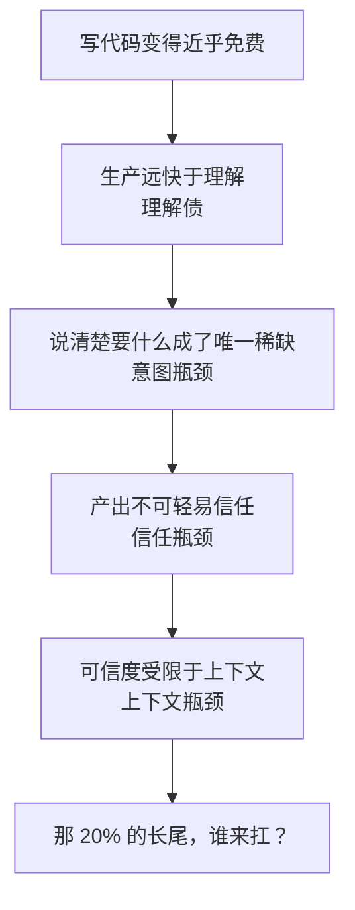

周五下午四点，一个入职不久的新人把一个 PR 甩进群里。四千行代码，测试全绿，CI 一路放行。你点开想扫一眼就批，滚到第八百行，手停住了：这些代码跑得起来，可全组没有一个人真正读懂过它。

你批，还是不批？

类似的场景正在越来越多的工程团队里发生。它背后压着一个问题：AI 把写代码变快了这么多，它真的把“做软件”变便宜了吗？

我的答案是：没有想象中那么多。

## 软件的成本大头，从来不在写代码

很多人默认一条等式：软件工程约等于写代码，写得越快越省钱。这条等式是后面很多误会的根。

写代码只是把一个想清楚的结构落成实现。真正贵的是另外三件事：

- 系统要跑很多年，今天图省事留下的隐患会在几年后连本带利找回来。
- 很多人同时修改一个系统，任何改动都不能撞坏别人的依赖和边界。
- 需求持续变化，系统必须能改而不塌。

四十年前，Fred Brooks 在《没有银弹》中把软件复杂度分成两半。一半是**本质复杂度**：想清楚系统应该是什么、模块如何划分、状态如何流动。另一半是**偶然复杂度**：把那个结构翻译成代码。

AI 是目前最强的偶然复杂度消除器。它能快速查语法、拼样板、写接口、搭脚手架。但它没有替我们完成最贵的那部分：想清楚问题、守住系统边界、证明结果正确。

所以两个看似矛盾的现象可以同时成立：AI 让写代码快了很多，软件工程的总成本却没有等比例下降。

## 成本没有消失，只是搬到了验证

代码生成越便宜，下游越容易被产出淹没。

我把重新收走这部分效率的钱叫作**验收税**：AI 在生产端省下的每一分钟，都会在下游读懂它、信任它、把它安全放进系统时被重新收走。

这笔税沿着一条链条传递：

1. 代码生产远快于人的理解速度，形成理解债。
2. 当实现不再稀缺，说清楚“到底要什么”成为新的瓶颈。
3. 意图清楚仍不代表结果可信，于是测试、评审和约束变重。
4. 验证能力最终受限于上下文：系统特有的历史、运行状态和隐性规则。

### 理解债

过去有一条默认规则：写代码的人至少理解这段代码。AI 第一次把“生成”和“理解”拆开了。

当仓库里出现越来越多能跑、却没人真正读懂的代码时，系统会积累一种比技术债更安静的债。技术债常用编译变慢、改一处坏三处来提醒你；理解债给你的却是代码整洁、测试全绿的假象。

更麻烦的是速度关系反了。过去老手阅读代码的速度，往往快于新人写代码的速度，评审还能兜住底。AI 让代码生产速度超过了批判性审查的速度，那道闸门自然会被冲垮。

### 意图瓶颈

写代码接近免费后，价值链上仍稀缺的是精确表达意图。

规格驱动开发重新受到关注，不是因为文档突然变时髦了，而是因为模糊需求过去可以由经验丰富的工程师补全，如今 AI 也会补，但它补出的方向完全取决于你提供了多少上下文和约束。

这里也没有银弹。如果一份规格精确到足以消除所有歧义，并让 AI 稳定产出正确系统，那这份规格本身已经接近一种编程语言。最难的“构思系统”并没有消失，只是换了容器。

### 信任瓶颈

AI 生成的代码可能错得很有道理。你需要一套在不完全信任它的前提下仍敢使用它的机制：

- 自动测试和静态检查；
- 严格的类型与接口契约；
- 沙箱和最小权限；
- 限定可修改范围；
- 可观测、可回滚的发布流程。

验证有多便宜，你才敢让 AI 跑多快。

### 上下文瓶颈

复杂工程里最难的长尾，往往不是模型智力不够，而是答案根本不在公开语料中。

幂等规则、历史迁移、灰度策略、并发冲突、某个模块为什么不能动，这些知识通常散落在运行日志、事故复盘和少数老工程师脑子里。模型再强，也无法凭空知道一个从未被记录的事实。

所以长尾问题不会只靠换更大的模型缩小。真正有效的办法，是让系统变得更透明：

- 写清模块边界和系统不变量；
- 把运行状态做成可查询的证据；
- 把隐性知识沉淀为可维护的文档；
- 让反馈链能自动回到 Agent 手里。

这是彻头彻尾的工程工作。

## 让 AI 敢放开用，靠边界和验证

AI 当然值得用。只是顺序不能反。

第一，先圈定范围。用接口、类型、权限和模块边界，为 AI 划出一个即使出错也不会闯大祸的空间。

第二，把验证做厚。测试、CI、日志、截图、监控和回滚能力越扎实，AI 的高速度越能转化为真实交付。

第三，把隐性知识显性化。系统特有的业务语义、历史包袱和运行规律，应当成为人和 AI 都能读取的资产。

这些原则并不新。过去由人写代码时，我们也知道应该这么做，只是经常靠几个聪明人硬扛。AI 把生产速度拉高后，不做这些事的代价，从“以后慢慢烂”变成了“现在就失控”。

## 经典软件工程反而在升值

AI 没有写出新的软件工程原则。它反而在给经典理论续命。

《没有银弹》依然是总纲：AI 把偶然复杂度压低，却没有消灭本质复杂度。概念完整性、清晰边界、可靠验证和可演进性不但没有过时，反而变得更重要。

读书的方向也在变化。语法手册的价值下降，系统设计、可靠性和数据工程的知识在升值。模型会背“熔断、幂等、退避”这些词，却不能替你判断具体系统该不该用、边界在哪里、阈值设多少。

人的价值也随之上移：

- 能把模糊需求想清楚，翻成精确目标；
- 能判断 AI 产出哪里不对、以后可能在哪里爆炸；
- 能把系统知识、边界和可观测性建设成基础设施。

纯粹的编码手速不再是一道深护城河，判断力却变得更贵。

## 写代码免费以后，谁为结果签字

AI 把瓶颈从生产推到了验收、理解和上下文。该做的事一直没变，变的是不做的代价。

过去是人写代码、机器读代码；如今越来越多时候是机器写代码、人读代码。会让 AI 快速产出的人只会越来越多，能判断“这些代码该不该产、应该放在哪里、剩下的长尾由谁来扛”的人只会越来越少。

回到周五下午那个 PR。四千行绿灯代码摆在你面前，你真正要签下的从来不是“它能不能跑”，而是：

**出了事，谁读得懂它？**
