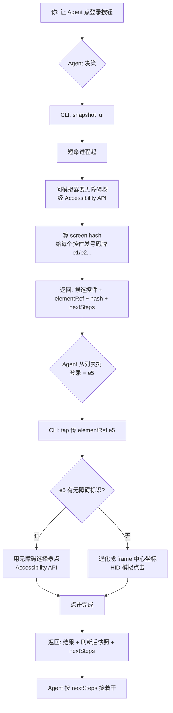

> [!NOTE]
> **一句话结论**：这次没有发明任何新的定位原理。底层还是那两把老武器：无障碍(Accessibility)+ 模拟输入(HID)。真正变的是**上面套的那层封装**：给控件发「号码牌」、给屏幕算「指纹」，把原来甩给大模型的脏活自己接管了。所以省下来的是**跟模型的来回**，不是跟设备的来回。这篇从原理、进程边界、交互流程到迁移，整个起底一遍。配套增量清单见姊妹篇《XcodeBuildMCP 还能这么玩？》的「新版本新特性」一节。

# 1. 先破三个误解

> [!NOTE]
> 调研过程里，最容易卡住的就是这三个问题。先把它们说清，后面就顺了：
> 1. 无障碍不是公开 API 吗？为什么说它用的是「私有 API」?
> 2. 「号码牌」到底是个啥？听着太抽象。
> 3. 它有没有中央服务器？我用 CLI 的时候，那个「服务端」在哪？

# 2. 两把老武器：无障碍 + 模拟输入

iOS 做 UI 自动化，能用的手段本来就只有两个：靠无障碍标签选控件，或者靠坐标点屏幕。它不像安卓每个控件都有个全局唯一 ID 兜底。XcodeBuildMCP 2.6 也没跳出这个圈，用的还是这两把：

> [!NOTE]
> **Accessibility API(无障碍)** —— 读界面上那棵「无障碍树」(每个控件的 label / value / 位置 / 角色)，按无障碍标识选控件。本质是「读结构、按标签选」。
> **HID(Human Interface Device)** —— 模拟硬件级的点、滑、按键，直接把触摸事件注进模拟器。本质是「模拟手指」。

## 2.1 关键澄清：无障碍明明是公开的，为什么叫「私有 API」?

因为 iOS 的无障碍其实分两层，公开的和私有的不是同一件事：

| 层 | 谁在用 | 是否公开 | 干什么 |
|-|-|-|-|
| 应用内无障碍 | App 自己 | ✅ 公开(`UIAccessibility`) | App 给自己的控件打无障碍标签，喂给 VoiceOver。开发者天天用 |
| 跨进程自动化 | 自动化工具（在 App 外面） | ❌ 私有框架 | 站在 App 外部，把**另一个进程**的整棵无障碍树读出来，还往模拟器里注入触摸/按键 |

> [!NOTE]
> **说人话**：你自己 App 里给按钮加无障碍标签，用的是公开 API，没问题。但「站在 App 外面、把别人进程的无障碍树整棵抓出来 + 帮它模拟点击」这条路，Apple **没有开放公开 API**，只通过 XCTest / XCUITest 这个「官方壳」间接放出来。AXe / idb 干的事，就是**绕开 XCTest 那层壳，直接调 Apple 私有框架**(和 XCUITest 幕后调的是同一批)自己实现跨进程读树 + 注入输入。所以不是用了什么黑魔法，而是「XCUITest 底层同款的私有框架，被搬到壳外面直接用」，这就是「私有 API」的由来。

# 3. 三个本地入口：没有中央服务器

> [!NOTE]
> **先回答那个最要命的疑问**:XcodeBuildMCP **没有任何远程 / 中央服务器**。它就是装在你 Mac 上的一个 npm 包。文档里老出现「服务端」这个词，指的是它在**你本机**起的进程，不是云上的服务器。数据全程在你机器里打转，不出门。

它有三种「入口」(front door)，背后调的是同一套工具函数：

| 入口 | 你怎么用 | 谁起进程 | 状态活多久 |
|-|-|-|-|
| MCP stdio server | `xcodebuildmcp mcp`，被 Cursor / Claude 这类客户端拉起 | 客户端 fork 一个常驻进程，走标准输入输出 | 跟着会话活 |
| 进程内 CLI | `xcodebuildmcp ` | 就是你敲命令那一下的短命 shell 进程 | **命令跑完就死** |
| daemon 路由 CLI | 同样的命令，涉及有状态操作时自动转发 | 一个按 workspace 分的**本地后台守护进程**，走 Unix socket | 守护进程空闲约 10 分钟才退 |

守护进程的 socket 就落在本机文件：\`\~/.xcodebuildmcp/daemons//daemon.sock\`,\`ls\` 一下能看到。它是本地文件，不是网络端口。

> [!NOTE]
> **CLI 模式到底走哪条？**
> · **无状态**的活（列模拟器、读 metadata、单次点击），直接在那个短命 CLI 进程里干完，不碰 daemon。
> · **有状态**的活（debug 会话、录屏、长驻任务、Xcode IDE 桥接），CLI 把请求经 Unix socket 转给本地 daemon，因为这些东西必须活过「一条命令」的生命周期。

# 4. 号码牌 + 指纹：这层封装到底封了什么

## 4.1 号码牌(elementRef)是个啥

> [!NOTE]
> **打个比方**：你进银行大厅，一排窗口就是一排控件。
> · **旧做法**：把整个大厅的照片（整棵无障碍树 / 一张截图）甩给模型，让模型自己数「登录窗口在左边第三个，坐标大概 x=200 y=880」，又慢又容易数错。
> · **新做法**：一进门，叫号机给每个窗口贴了张号码牌 e1 / e2 / e3...，还附一张小抄：「e5 = 登录按钮，无障碍标签『登录』，在这个位置」。模型只要说「我要 e5」，至于 e5 具体怎么点（用无障碍标签还是退化成坐标），由**本机进程查它自己那张小抄**决定。

所以号码牌不是 iOS 自带的，是 XcodeBuildMCP \*\*临时发的\*\*，存在本机进程内存里的一张映射表：\`e5 → {label, id, frame, role}\`。你 `tap e5` 时，进程去查表：有无障碍标识就用无障碍选（优先），没有就退化成 frame 中心点坐标，再交给 HID。\*\*「用哪把武器」的判断，从模型手里挪到了进程手里。\*\*

## 4.2 指纹(screen hash)是个啥

screen hash 就是当前无障碍树结构的一个「指纹」。界面没变，指纹就没变。你传 \`sinceScreenHash\` / \`--since-screen-hash\`，进程一比对指纹发现没变，就跳过「重新抓整棵树」这一大坨开销，直接告诉你「没变，接着用老号码牌」。

## 4.3 号码牌的有效期（这是个坑）

> [!NOTE]
> 号码牌存在**进程内存**里，所以它能不能跨命令用，取决于进程活不活：
> · **MCP 模式 / daemon 路由**：进程一直活着 → 号码牌从 snapshot 到 tap 一路有效，顺畅。
> · **纯进程内 CLI**:`snapshot_ui` 那条命令跑完进程就死了，内存里的号码牌**跟着没了**。下一条 `tap e5` 是个全新进程，它不认识 e5。
> （此条为架构文档交叉验证 + 合理推断，非官方逐字明写。)

> [!NOTE]
> **纯 CLI 想「先 snapshot 再 tap」跨命令生效，两条路**:
> 1. 这类 UI 操作被判定为有状态、自动路由到那个活着的本地 daemon，由 daemon 保住号码牌；
> 2. 更省事 —— 用 `batch`，一条命令里把多个同屏 tap 全跑完，进程没死，号码牌全程有效。这也是官方在 CLI 场景里力推 `batch` 的原因：天然规避「号码牌跨进程失效」。
> 另外，页面一跳转，旧号码牌**整体作废**(叫号机重置)，必须重新 `snapshot_ui` 拿新牌。

# 5. 完整交互：本地 CLI 点一个按钮

# 6. 为什么快：省的是跟模型的来回

快的来源不是定位变快了（还是那套无障碍 + HID），而是\*\*砍掉了大模型的来回\*\*:

| 环节 | 旧法(2.5.x) | 新法(2.6.x) |
|-|-|-|
| 看界面 | 每步把整棵无障碍树塞给模型，上下文又厚又慢 | 进程预排好候选控件，模型只挑号码牌 |
| 算位置 | 模型自己算坐标，容易错 | 进程按无障碍标签选，坐标只做兜底 |
| 判断没变 | 每步都重新截图 / 重新 dump | 指纹没变直接跳过，不重发快照 |
| 下一步 | 模型从一堆文字里猜「接下来点哪」 | 结果自带 `nextSteps`，机器可读直接接 |

> [!NOTE]
> 官方 Weather App 基准：墙钟时间 **-70%**、token 用量 **-68%**、工具调用次数 **-76%**。全省在「跟模型交互」这一层，不是「跟模拟器交互」这一层。信源：[XcodeBuildMCP Changelog](https://www.xcodebuildmcp.com/docs/changelog)。

# 7. 迁移指南：老写法怎么改

| 老写法(2.5.x) | 新写法(2.6.x) |
|-|-|
| `describe_ui` dump 整棵树，自己算中心点 | `snapshot_ui` 拿稳定 elementRef + screen hash |
| `tap x y`(按坐标) | `tap` 直接传 elementRef，不猜坐标 |
| 每步后重新 `screenshot` / describe | 上一步结果已带快照 + `nextSteps`，直接接 |
| 一步一次往返 | `batch` 一次跑完多个同屏 tap |
| 无 | 传 `sinceScreenHash`，屏幕没变就跳过整份快照 |

> [!NOTE]
> **升级动作**:`brew upgrade xcodebuildmcp` 或 `npm i -g xcodebuildmcp@latest`，也可直接 `xcodebuildmcp upgrade`(v2.6.2 起以最新 GitHub release 为准)。`describe_ui` 时代的坐标流保留做兜底（自定义控件 / 无 a11y 标识时）。信源：[Tools Reference](https://www.xcodebuildmcp.com/docs/tools)。
