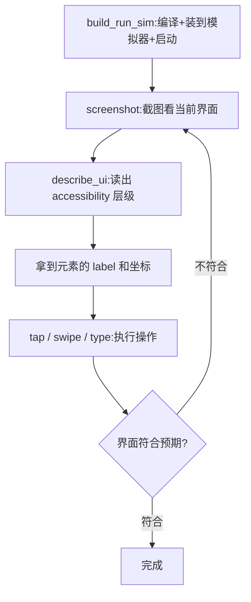
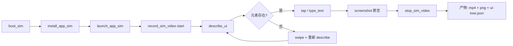
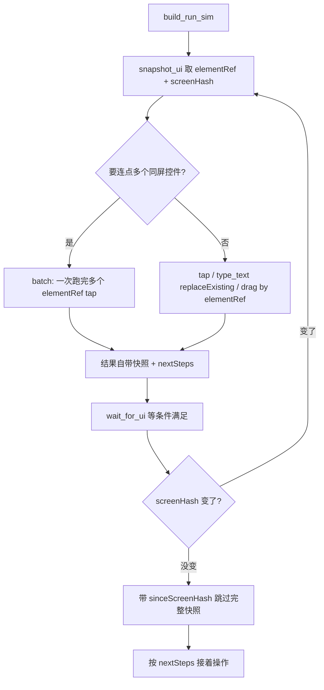

> [!NOTE]
> **一句话定位**：XcodeBuildMCP 把 `xcodebuild` / `xcrun simctl` / AXe / LLDB / xcresult 全部包成 MCP 工具，给 IDE 智能体一个稳定、结构化、可并发的 iOS/macOS 工程操作面板。
> **本篇定位**：跳过安装小白教程，专注 **高阶玩法** —— UI 自动化与录屏、LLDB 调试、测试与覆盖率、**多工程并行**，以及来自 8 个 App 实战的社区配置工程经验。
> **核心信源**：[XcodeBuildMCP Docs](https://www.xcodebuildmcp.com/docs)、Blake Crosley 的 [iOS Agent Development Practitioner's Guide](https://blakecrosley.com/guides/ios-agent-development)（8 个上架 App / 293 个 Swift 文件实战）、Sentry 官方 workshop、Cameron Cooke 在 VS Code 频道的演示、Reddit r/iOSProgramming、Level Up Coding《自动化 80% iOS 工作流》。

# 原理速览:它到底怎么跑起来的

> [!NOTE]
> 一句话:它把 Xcode 那套命令行工具(`xcodebuild` / `simctl` / `devicectl` / `lldb` / `AXe`)包成一层 MCP 中间层,让 Agent 用稳定的工具接口去操控 Xcode,而不是自己拼又长又脆的命令行。

整体分四层,从下往上各管一段:

| 层 | 干的活 | 底层依赖 |
|-|-|-|
| **协议层** | MCP over stdio,跟 Agent 客户端对话;Server 模式和 CLI 模式共用同一份代码、同一份配置 | Model Context Protocol |
| **工具层** | 82 个 tool 把命令行薄封装一层,工具名和参数**按版本号锁定**,Xcode 怎么变接口不变 | xcodebuild / simctl / devicectl / lldb |
| **输出层** | 把原始日志**预解析成结构化诊断**,编译错误单独拎出来,Agent 不用自己从几百行里捞 | 自研解析 + NDJSON 流 |
| **状态层** | session defaults 设一次工程/scheme/模拟器后免重复供参;per-workspace daemon 托管录屏、调试、抓日志这类有状态操作 | 后台守护进程 |

## UI 自动化是怎么做到的

关键在它接了一个叫 **AXe** 的桥(早期版本用 Facebook 的 `idb_companion`),这个桥底层调的是 **Apple 自己的 Accessibility(无障碍)API** 加 **HID(模拟硬件输入)**。所以 Agent 既能像真人一样点屏幕、滑动、打字,又能"看见"界面上有哪些元素 [XcodeBuildMCP UI Automation](https://www.async-let.com/posts/xcodebuild-ui-automation)。一个典型闭环长这样:



## 问题一:运行起来自动跳转一个 URL Scheme,能吗?

能。模拟器跳 URL Scheme / Deeplink 的底层就是 `xcrun simctl openurl myapp://path`,XcodeBuildMCP 把它包成一个工具。所以你让 Agent "启动后跳到某个页面",它会先 `build_run_sim` 把 app 跑起来,再调 openurl 把你的 scheme 发给模拟器,系统路由到你的 app,触发 `SceneDelegate` / `onOpenURL` 里的处理逻辑——和你手动在 Safari 里敲这个链接是完全一样的效果。

## 问题二:能找到某个 UI 元素并触发点击吗?

能,而且有两条路:

1. **按坐标点**:先 `describe_ui` 把整棵 accessibility 层级 dump 出来(每个元素的类型、label、frame 坐标都在里面),Agent 算出目标元素的中心点,再 `tap x y` 点下去。
2. **按无障碍标识点**:AXe 支持直接用 accessibility id / label 定位元素并点击,不用自己算坐标——前提是你给控件设了 `accessibilityIdentifier`。

> [!NOTE]
> 常踩的坑:别拿 `screenshot` 的像素去猜坐标。截图是给人和模型"看个大概"的,真正能精确点中的坐标在 `describe_ui` 返回的 frame 里,以它为准。

---

```bash
brew install cameroncooke/xcodebuildmcp/xcodebuildmcp
```

# 0. 极简安装与官方文档

更详细的安装、客户端接入、配置层级、Server 模式等，直接看官方文档：[XcodeBuildMCP Docs](https://www.xcodebuildmcp.com/docs)

> [!NOTE]
> **子页面阅读情况说明**：左侧目录 12 项中，**已读 8 项**（Introduction / Installation / Configuration / Tools Reference / Workflows / Output Formats / Clients / Doctor）；其中 **4 项在 v2.5.2 线上文档实际为 404**（MCP Server Mode、Xcode IDE Bridge、Device Code Signing、Migration from v1）—— 内容来自 README、release notes 与 tools schema 推断，可能与未来正式页有出入。

---

# 1. 三个 Agent Runtime 怎么搭配

> [!NOTE]
> 2026 年生产环境跑 iOS Agent 的 **三种 Runtime 是互补不是互斥**：Claude Code CLI 干主活、Xcode 26.3 原生 Agent 干轻量补丁、Codex CLI 干评审/批处理。

| Runtime | 最佳场景 | 关键限制 |
|-|-|-|
| **Claude Code CLI** + XcodeBuildMCP + xcrun mcpbridge | 跨文件重构、build-test-fix 自治循环、深度调试；1M context 能装下 50 个 Swift 文件 | 需要终端，不适合 1-2 行的小修改 |
| **Xcode 26.3 原生 Agent**（Intelligence 面板里选 Claude / Codex） | 单文件 inline 编辑：加 computed property、写一个单测、把 ObservableObject 改成 @Observable | ⛔ 不读 CLAUDE.md、⛔ 没有 hook 系统、⛔ 不能下达 subagent |
| **Codex CLI** + XcodeBuildMCP | "第二意见" 评审、headless 批处理、CI 集成；适合 SpriteKit / Metal 这种容易模型偏见的领域 | Hook 系统不如 Claude Code 成熟（v0.119.0+ 才支持） |

> [!NOTE]
> **Blake 的搭配公式**：90% 的 MCP 调用走 XcodeBuildMCP（不依赖 Xcode 进程，更快更稳）；剩下 10% 走 Apple 的 `xcrun mcpbridge`，专门用它独有的三件事 —— `ExecuteSnippet`（Swift REPL）、`RenderPreview`（无头跑 SwiftUI Preview）、`XcodeListNavigatorIssues`（拿 Xcode Analyzer 实时诊断，不只是 build error）。

---

# 2. 模拟器 UI 自动化 + 录屏

> [!NOTE]
> **核心价值**：让 Agent 像真人一样"看、点、滑、敲键盘、录屏"，闭环验证 UI 而不是只看日志。底层是 [AXe](https://github.com/cameroncooke/AXe) + `simctl`，输出全部走 structured envelope，可直接喂回 LLM。

## 2.1 工具清单（ui-automation workflow）

| 能力 | 关键工具 | 高阶用法 |
|-|-|-|
| 截屏 + 视图层级 | `screenshot`、`describe_ui` | `describe_ui` 返回带 frame / accessibility label 的 JSON 树，比纯截图 OCR 准；让 Agent 先 describe 再决定点哪里 |
| 触摸手势 | `tap`、`long_press`、`swipe`、`gesture` | `gesture` 支持自定义路径与速度，做惯性滑动 / 自定义手势 |
| 文本输入 | `type_text`、`key_press`、`key_sequence` | 需先 `set_sim_appearance` / `toggle_hardware_keyboard` 关闭物理键盘代理，避免吞字符 |
| 系统按键 | `button`(home/lock/volume/siri) | 配合 `screenshot` 做"锁屏 → 解锁 → 重新进入"流 |
| 录屏 | `record_sim_video` / `stop_sim_video` | 返回 `.mp4` 路径，可直接附到 PR / Bug 单；`codec` 支持 h264 / hevc |
| 状态栏覆盖 | `status_bar_override` | 截图前固定时间 / 满电 / 满信号，专治 App Store 截图 |

## 2.2 一个典型 UI 闭环



> [!NOTE]
> **注意**：UI 工具默认作用于 **booted 的模拟器**，多机并发时务必显式传 `simulatorUuid`，否则会打到错的设备上。

---

# 3. LLDB 调试

> [!NOTE]
> **核心价值**：debugging workflow 把 LLDB 包成 **DAP 协议**（Debug Adapter Protocol）+ MCP 工具，Agent 可以 attach 进程、下断点、看栈帧、读寄存器，**无需人在 Xcode 里点鼠标**。

## 3.1 工具清单（debugging workflow）

| 阶段 | 工具 | 说明 |
|-|-|-|
| 启动 / 接入 | `debug_launch_sim`、`debug_attach_sim`、`debug_attach_macos` | launch 会同时 build + install + 起 LLDB；attach 走 PID 或 bundleId |
| 断点 | `debug_set_breakpoint`、`debug_list_breakpoints`、`debug_remove_breakpoint` | 支持文件:行、Symbol、正则；条件断点用 `condition` 字段 |
| 执行控制 | `debug_continue`、`debug_step_over/in/out`、`debug_pause` | 所有命令是异步的，下一步用 `debug_get_state` 拉当前线程状态 |
| 查看现场 | `debug_get_threads`、`debug_get_frames`、`debug_get_variables` | variables 默认按 scope（locals/args/registers）分组返回 |
| 表达式 | `debug_evaluate` | 等价 `po` / `p`，结果走结构化 envelope，避免解析 LLDB 文本 |
| 会话管理 | `debug_terminate`、`debug_list_sessions` | 多调试会话可并行，每个有独立 sessionId |

## 3.2 高阶配置（容易踩坑）

- **等待 attach**：`debug_attach_sim` 可设 `waitFor: true`，App 启动瞬间就断住，调 `application(_:didFinishLaunching...)` 必备
- **StopOnEntry**：`debug_launch_sim` 的 `stopOnEntry` 等价于 Xcode 的 "Wait for executable to be launched"
- **DerivedData 隔离**：调试器读符号表依赖 build 产物，**必须和触发 build 的命令使用同一 `derivedDataPath`**（参见第 5 章并行配置）
- **Crash 复盘**：配合 `get_sim_log_stream` + `debug_evaluate`，可以在 Agent 内复现 "崩溃 → 回放栈 → 打变量"
- **Live Activities / Widget**：`debug_attach_sim` attach 到扩展进程而不是主 App，传 `--target widgetExtension`

---

# 4. 测试 + 覆盖率

> [!NOTE]
> **核心价值**：所有 test 工具产出 **xcresult bundle**，再由 `get_coverage_report` / `get_file_coverage` 二次解析，Agent 拿到的是结构化用例结果 + 行级覆盖率，而不是 `xcodebuild` 的几千行原始日志。

## 4.1 工具矩阵

| 目标 | 工具 | 关键参数 |
|-|-|-|
| 模拟器测试 | `test_sim` | `onlyTesting[]` / `skipTesting[]` 精准选用例；`showTestTiming: true` 拿耗时排序 |
| 真机测试 | `test_device` | 需提前 `device_install`；签名问题走 `doctor` 排查 |
| macOS 测试 | `test_macos` | 支持 `destination=platform=macOS,arch=arm64` |
| SwiftPM 测试 | `swift_package_test` | 不依赖 Xcode 工程，CI 友好 |
| 覆盖率汇总 | `get_coverage_report` | 读 xcresult，输出 target / file 两级覆盖率 |
| 单文件覆盖 | `get_file_coverage` | 返回 **每行命中次数**，可让 Agent 精准补单测 |
| 结果回放 | `list_test_runs` / `get_test_run_details` | 历史 run 都缓存在 `~/.xcodebuildmcp/test-runs/`，可对比回归 |

## 4.2 结构化产物（envelope.data）

```json
{
  "schema": "test-result",
  "data": {
    "summary": { "total": 128, "passed": 126, "failed": 2, "skipped": 0, "duration": 42.7 },
    "testCases": [
      { "identifier": "LoginTests/testInvalidPassword", "status": "passed", "duration": 0.18 }
    ],
    "testFailures": [
      {
        "identifier": "PaymentTests/testRefund",
        "file": "PaymentTests.swift", "line": 87,
        "message": "XCTAssertEqual failed: expected 100, got 99",
        "stack": ["..."]
      }
    ],
    "xcresultPath": "/tmp/.../Test.xcresult",
    "coverage": { "linePercent": 0.732, "reportToolHint": "get_coverage_report" }
  }
}
```

## 4.3 玩法

1. **Failing-first 自愈循环**：`test_sim` → 拿 `testFailures[].file:line` → Agent 改代码 → 只跑 `onlyTesting` 失败用例，5–10 秒级反馈
2. **覆盖率驱动补测**：`get_file_coverage` 找出 0 命中行 → Agent 直接生成对应单测 → 再跑一遍验证覆盖率上升
3. **耗时治理**：`showTestTiming: true` + 排序 → 找 top 10 慢用例集中优化
4. **CI 等价复现**：本地 `swift_package_test` 与 CI 用同一组工具，Agent 可在出问题时一键复跑

---

# 5. 多工程 / 多 Agent 并行

> [!NOTE]
> **结论**：**可以并行**。XcodeBuildMCP 从 v2 起按 **workspace 维度隔离 daemon、DerivedData、session defaults**，只要每个 IDE 的 MCP server 各自指向自己的工程根目录，Agent A 跑工程 A、Agent B 跑工程 B 互不干扰。

## 5.1 隔离机制（为什么能并行）

| 维度 | 隔离方式 | 落地点 |
|-|-|-|
| Daemon 进程 | per-workspace 自动起 / 10 分钟 idle 自动停 | `~/.xcodebuildmcp/daemons//daemon.sock` |
| 工作目录 | 环境变量 `XCODEBUILDMCP_CWD` 强制锚定 | MCP server 启动参数 / IDE 配置 |
| 会话默认值 | `session_set_defaults` + Named Profiles | `.xcodebuildmcp/config.yaml` 的 `sessionDefaultsProfiles` |
| 构建产物 | 每个 workspace 独立 `derivedDataPath` | session defaults 或 per-call 参数 |
| 配置层级 | `session_set_defaults` > `config.yaml` > env | 同一台 Mac 多工程互不串 |

## 5.2 玩法 A：多工程并行 —— 每个工程一个 `.cursor/mcp.json`

```json
{
  "mcpServers": {
    "xcodebuildmcp": {
      "command": "xcodebuildmcp",
      "env": {
        "XCODEBUILDMCP_CWD": "/path/to/ProjectA"
      }
    }
  }
}
```

```json
{
  "mcpServers": {
    "xcodebuildmcp": {
      "command": "xcodebuildmcp",
      "env": {
        "XCODEBUILDMCP_CWD": "/path/to/ProjectB"
      }
    }
  }
}
```

两个 Cursor / VS Code / Claude Desktop 窗口同时开，各自的 Agent 会拉起独立 daemon、独立 DerivedData、独立 sim 上下文，**真正并行 build / test / debug**。

## 5.3 玩法 B：同工程多 Feature 并行 —— Git Worktree

> [!NOTE]
> 多 Claude Code 会话开在同一目录会互相踩 `DerivedData` 与未提交改动；naive 复制仓库又同步不了 commit。社区现在主推 **git worktree 隔离**。

```bash
# main repo: ~/work/MyApp
git -C ~/work/MyApp worktree add ../MyApp-feat-login feat/login
git -C ~/work/MyApp worktree add ../MyApp-feat-pay   feat/pay
git -C ~/work/MyApp worktree add ../MyApp-refactor   refactor/observable

# 三个终端分别 cd 进去，每个开一个 claude；
# 每个 worktree 配独立的 .cursor/mcp.json 或 XCODEBUILDMCP_CWD
cd ../MyApp-feat-login && XCODEBUILDMCP_CWD=$PWD claude
cd ../MyApp-feat-pay   && XCODEBUILDMCP_CWD=$PWD claude
cd ../MyApp-refactor   && XCODEBUILDMCP_CWD=$PWD claude
```

**关键收益**：

- **Context 隔离**：每个 Agent 只看自己 worktree 的文件，不会被无关代码淹没
- **DerivedData 隔离**：每个 worktree 独立 build 产物，并发 build 不互锁
- **Branch 隔离**：天然走 PR 流；Agent commit 在自己分支，最后人来 review + merge
- **对比赛马**：让 3 个 Agent 在 3 个 worktree 里实现同一个 feature，挑最干净的那个 merge

## 5.4 玩法 C：Monorepo —— 用 Profile 区分子工程

```yaml
sessionDefaultsProfiles:
  app-ios:
    workspacePath: ./apps/ios/MyApp.xcworkspace
    scheme: MyApp
    configuration: Debug
    derivedDataPath: ./build/ios
  app-mac:
    projectPath: ./apps/mac/MyMacApp.xcodeproj
    scheme: MyMacApp
    derivedDataPath: ./build/mac
```

调用时带 `--profile app-ios` 或 `--profile app-mac`，**同一个 daemon 进程**下也能干净切换上下文。

> [!NOTE]
> **注意**：worktree 之间能"自己跟自己制造 merge conflict"，要给每个 Agent 划清边界（不同模块 / 不同 target）。真机并发：同一台 iPhone 同时只能被一个 `test_device` 占用；模拟器并发请用不同 `simulatorUuid`。

---

# 6. CLAUDE.md：Agent 入职文档（决定输出质量的最高杠杆）

> [!NOTE]
> Blake Crosley 8 个上架 App 实战的核心结论：**Agent 表现 ∝ 项目可读性，而不是项目大小**。63 个文件 + 详细 CLAUDE.md 的 App，比 41 个文件 + 没文档的 App 输出质量更高。

## 6.1 必备六段式

1. **Project Overview**：Bundle ID、最低部署版本、架构（SwiftUI + @Observable / UIKit / SpriteKit）、Swift 版本
2. **Project Structure**：每个文件后跟一行行内注释，例如 `TimerManager.swift # Timer state, logic, and repeat handling` —— Blake 说这是"**单位字符产出最高的文档**"
3. **Build & Test Commands**：写出 raw `xcodebuild` 命令 + 一句 "Prefer MCP tools (build_sim, test_sim) over raw commands"
4. **Key Patterns and Rules**：例如"`@Query` 只能在 View 里、`modelContext.fetch()` 在 Manager 里"
5. **Things the Agent Must Never Do**：负向约束比正向建议管用得多 —— 二元判定 vs 启发式
6. **Framework-Specific Context**：HealthKit 权限、SwiftData 关系、SpriteKit 节点层级、Metal pipeline 这些 Agent 看不出来的隐性知识

## 6.2 教会 Agent 用 MCP（这段直接抄进 CLAUDE.md）

```markdown
## Build & Test — Always Use MCP

Prefer MCP tools over raw shell commands for ALL build operations:
- **Build**: `build_sim` / `build_device` (NOT `xcodebuild` via Bash)
- **Test**: `test_sim` / `test_device` (NOT `xcodebuild test` via Bash)
- **Simulators**: `list_sims`, `boot_sim`, `open_sim` (NOT `xcrun simctl` via Bash)
- **Debug**: `debug_attach_sim`, `debug_stack`, `debug_variables`

MCP returns structured JSON. Bash returns unstructured text.
```

> [!NOTE]
> **没这段会怎样**：Agent 会 fallback 去 Bash 跑 `xcodebuild`，输出几千行非结构化文本占掉你的 context window，还可能把真正的 error 看漏。

---

# 7. Hooks：保护你的 Xcode 工程

> [!NOTE]
> **Blake 第一铁律**：**永远不让 Agent 改 `.pbxproj`**。Agent 改 `.xcodeproj` 文件几乎一定会损坏工程。一个 PreToolUse hook 拦住所有写入 `.pbxproj` 的操作，能省你几个小时的恢复时间。

| Hook 类型 | 作用 | 触发点 |
|-|-|-|
| PreToolUse | 拦截写入 `*.pbxproj` / `*.xcodeproj/` / `*.xcworkspace/contents.xcworkspacedata` | Agent 准备调 Write/Edit 工具 |
| PostToolUse | SwiftFormat 自动跑一遍：`brew install swiftformat` 然后 `swiftformat $FILE` | Edit / Write 完一个 .swift 文件 |
| PostToolUse | 每次写完代码自动 `build_sim` + `test_sim`，把失败原因塞回上下文 | 多文件改完之后 |
| Stop | 会话结束自动 commit + 打 tag，方便回滚 | Agent 主动结束 |

Blake 在他的 Claw 项目里用了 **84 个 hooks** 当编排层 —— 这套基础设施跨工程通用，迁过来只需要改一下路径。

---

# 8. 玩法速查（按场景）

| # | 场景 | 工具组合 | 关键技巧 |
|-|-|-|-|
| 1 | 新工程脚手架 | `scaffold_ios_project` → `build_sim` | 用 project-scaffolding 模板，直接拿可运行 SwiftUI / UIKit 工程 |
| 2 | 裸 App 启动验证 | `build_sim` → `install_app_sim` → `launch_app_sim` → `screenshot` | 5 步内自动验证一个 PR 不白屏 |
| 3 | 录屏交付 Demo / PR 凭证 | `record_sim_video` + UI 自动化序列 | 产物 mp4 直接贴 Slack / 飞书 / PR 评论区，比 GIF 清晰 |
| 4 | UI 回归断言 | `describe_ui` + `screenshot` | 用 a11y label 断言"登录按钮存在且为蓝色"，比像素 diff 稳 |
| 5 | 截屏驱动开发 | `screenshot` + 多模态 LLM | 跑一遍 App 截屏 → 喂回多模态模型描述视觉问题 → 改代码 → 再截屏对比（Cameron 官方 demo） |
| 6 | SwiftUI Preview 无头检验 | `RenderPreview`（Apple MCP） | Agent 改完 View 后调一下，比 build 更快地确认不崩 |
| 7 | Swift REPL 验证 API | `ExecuteSnippet`（Apple MCP） | 写代码前先试一下 `Date.now.formatted(...)` 行不行，省一次 build |
| 8 | 崩溃排查 | `get_sim_log_stream` + `debug_attach_sim` + `debug_evaluate` | Agent 自动从崩溃栈拉到当前帧变量 |
| 9 | Failing-first 修复 | `test_sim onlyTesting=...` + 代码改动 + 重测 | 只跑失败子集，10s 级反馈 |
| 10 | 覆盖率补测 | `get_file_coverage` → Agent 写单测 → `test_sim` | 0 命中行驱动 LLM 补测 |
| 11 | iCloud 同步多模拟器实测 | `boot_sim` ×2 + `describe_ui` | 开两个 sim 用同一 iCloud 账号，Agent 在 A 加数据，在 B 验同步 |
| 12 | Figma → SwiftUI 闭环 | Figma MCP + `build_sim` | frame JSON 出代码后自动 build 校验，闭环到通过为止 |
| 13 | Claude 写 + Codex 审 | Claude Code + Codex CLI | 双模型交叉评审，Metal shader / 并发代码尤其受益 |
| 14 | Subagent 编排 | Claude Code subagents | 主 Agent 派 unit-test-writer / documentation-writer / refactor-agent 并行干活 |
| 15 | Live Activities / Widget 调试 | `debug_attach_sim --target widgetExtension` | attach 到扩展进程而不是主 App |
| 16 | 多 Agent 并行（多工程） | per-project `.cursor/mcp.json` + `XCODEBUILDMCP_CWD` | 不同 IDE 窗口跑不同工程，daemon 自动隔离 |
| 17 | 多 Agent 并行（同工程） | git worktree + `XCODEBUILDMCP_CWD` | 3 个 worktree 并行做 3 个 feature，甚至赛马式开发 |
| 18 | Monorepo 多工程 | `sessionDefaultsProfiles` + `--profile` | iOS / macOS / Watch 子工程一键切换 |
| 19 | Xcode 26 IDE 联动 | `xcode-ide` workflow + `xcrun mcpbridge` | 让 Xcode 当前打开的工程上下文直通 Agent |
| 20 | 真机冒烟 | `list_devices` → `build_device` → `install_device` → `launch_device` | 签名报错走 `doctor` 自检 |
| 21 | SwiftPM 库开发 | `swift_package_build` + `swift_package_test` | 无 Xcode 工程也能完整 CI |
| 22 | 结构化输出对接 | 所有工具 + `--output jsonl` | NDJSON 流式喂给 LLM，长任务也能边跑边消费 |

---

# 9. 大家都踩的坑（高频）

| 坑 | 现象 | 解法 |
|-|-|-|
| Agent 改 `.pbxproj` | 工程打不开 / scheme 消失 | PreToolUse hook 拦截；新增文件让用户在 Xcode 手动加进 target —— 这条边界**不能妥协** |
| Code Signing | Agent 跑 `build_device` 一直失败 | 先在 Xcode 里手动开 Auto Signing 一次，让 Xcode 把证书写进 keychain，之后 MCP 才能复用 |
| Apple MCP 一调就 hang | Xcode 没开 / 没接受过 license | Apple 的 `xcrun mcpbridge` 走 XPC 必须 Xcode 在跑；XcodeBuildMCP 没这个限制，优先它 |
| Metal 视觉问题 | Agent build 通过但渲染错乱 | Simulator Metal 不代表设备 GPU；CLAUDE.md 强制写"**NEVER test Metal visual output in simulator — device only**" |
| Sentry 上传隐私数据 | 错误堆栈含本地路径外泄 | 装 MCP 时加 `-e XCODEBUILDMCP_SENTRY_DISABLED=true` |
| Context 爆炸 | 50+ 文件项目 Agent 答非所问 | 开 `XCODEBUILDMCP_DYNAMIC_TOOLS=true`，工具按需加载，省几千 token |
| SwiftData `#Predicate` 限制 | Agent 写出无法编译的谓词 | 把已知限制写进 CLAUDE.md（不支持嵌套关系等），Agent 才会避雷 |
| iOS 26 SDK 截止日期 | 2026-04-28 起 App Store 强制 Xcode 26 / iOS 26 SDK | 升 Xcode 26.3+ 是硬门槛；同时也是 `xcrun mcpbridge` 的最低门槛 |
| worktree 自相冲突 | 多 Agent 改同一文件，merge 时炸 | 给每个 Agent 划清模块 / target 边界 |

---

# 10. 进阶配置开关（值得你都打开）

| 环境变量 | 作用 | 推荐值 |
|-|-|-|
| `INCREMENTAL_BUILDS_ENABLED` | 实验性增量编译，二次 build 显著变快 | `true`（YMMV，慢工程能省一半时间） |
| `XCODEBUILDMCP_DYNAMIC_TOOLS` | 工具按需加载，初始 token 大幅下降 | `true`（Cursor 暂不支持 Sampling，关掉） |
| `XCODEBUILDMCP_ENABLED_WORKFLOWS` | 只加载需要的 workflow，进一步省 context | 例如 `simulator,debugging,coverage` |
| `XCODEBUILDMCP_SENTRY_DISABLED` | 关闭崩溃上报 | `true`（合规 / 隐私敏感场景必开） |
| `XCODEBUILDMCP_CWD` | 强制锚定工作目录 | 每个 IDE 窗口指向各自工程根 |

---

# 11. 最后的小提醒

> [!NOTE]
> **用好 XcodeBuildMCP 的两条铁律**：
> 1. **显式传 ID**：多机 / 多工程时，`simulatorUuid`、`workspacePath`、`profile` 全部显式传，不要依赖默认。
> 2. **用 structured envelope**：所有工具默认走结构化 schema，遇到一手日志先看 `data`，看不到再 fallback `raw`，避免让 Agent 解析未结构化文本。
> **社区一段话结论**：让 XcodeBuildMCP 真正出货的 4 件事不是 prompt 工程，而是 **配置工程** —— 一份扎实的 CLAUDE.md（六段式 + MCP 优先指令）+ 一组保命的 hooks（首要：拦 .pbxproj 写入）+ 用 git worktree 把多 Agent 隔离开 + 三个 Runtime 各司其职。

# 12. 新版本新特性(v2.6.x·基于旧版 2.5.x 的增量)

> [!NOTE]
> **深度起底看这里**:上面这节是 v2.6.x 的增量清单(有哪些新工具、新参数、怎么迁移)。如果你想搞懂**新 UI 自动化到底怎么跑起来的**——无障碍为什么算「私有 API」、elementRef「号码牌」和 screen hash「指纹」的底层原理、有没有中央服务器、本地 CLI 点一个按钮的完整交互流程、以及为什么快——单独写了一篇起底:[XcodeBuildMCP UI 自动化起底:从截图猜坐标到「号码牌」直操](/posts/xcodebuildmcp-ui-自动化起底/)。一句话剧透:没有新的定位原理,只是把甩给大模型的脏活自己接管了,省的是跟模型的来回。

> [!NOTE]
> 本篇正文的工具清单与玩法是基于 **v2.5.x** 封装调研的。2026-06 官方连发 **v2.6.0 / v2.6.1 / v2.6.2**,对 **UI 自动化**做了一次范式级重写(从"截图猜坐标"升级为"元素引用直接操作"),并新增了 headless、nextSteps 等能力。以下按"UI 自动化优先"梳理增量,信源:[XcodeBuildMCP Changelog](https://www.xcodebuildmcp.com/docs/changelog)、[Tools Reference](https://www.xcodebuildmcp.com/docs/tools)。当前线上 **v2.6.2 / 82 tools / 15 workflows / 需 Xcode 16+**。

## 12.1 UI 自动化范式重写(v2.6.0 的核心)

> [!NOTE]
> **一句话**:UI 工具不再只回一句"操作成功",而是**每次操作后顺带回传一份当前前台界面的轻量快照** —— 带稳定元素引用(elementRef,如 e1/e2)+ 屏幕哈希(screen hash)。Agent 拿到后可以**直接选下一个控件**,不用再截一次图、也不用重跑一次完整 accessibility dump。

在官方一个确定性的 Weather App 任务里,这套"操作即带上下文"的机制把 **墙钟时间砍掉约 70%、token 用量约 68%、工具调用次数约 76%**[XcodeBuildMCP Changelog](https://www.xcodebuildmcp.com/docs/changelog)。

**新旧闭环对比(这是和正文第 2 章最大的差异):**

| 维度 | 旧版 2.5.x(正文写法) | 新版 2.6.x |
|-|-|-|
| 看界面 | `describe_ui` dump 整棵树 → 自己算中心点坐标 | `snapshot_ui` 返回**稳定 elementRef + screen hash**,候选控件按真实无障碍数据排序 |
| 点控件 | `tap x y`(按坐标) | `tap` 直接传 elementRef,不再猜坐标 |
| 下一步 | 每步后重新 `screenshot` / 重新 describe | 上一步结果里已带快照 + `nextSteps` 建议,直接接着点 |
| 多步同屏 | 一步一次往返 | `batch` 一次调用跑完多个同屏 tap |
| 免刷新 | 无 | 传 `sinceScreenHash`,屏幕没变就跳过整份快照 |

> [!NOTE]
> **迁移提醒**:正文第 2 章"别拿截图像素猜坐标、用 `describe_ui` 的 frame"的建议在 2.6 进一步升级 —— 现在**连坐标都不用算了**,优先用 `snapshot_ui` 给的 elementRef 直接操作。`describe_ui` 时代的坐标流可作为兜底(自定义控件 / 无 a11y 标识时)。

## 12.2 UI 自动化新增工具 / 参数

| 新增项 | 类型 | 作用 | 关键点 |
|-|-|-|-|
| `wait_for_ui` | 新工具 | 轮询界面直到条件满足 | 谓词支持:元素存在 / enabled / focus / 可见文本 / 布局稳定(settled),替代盲目 sleep |
| `batch` | 新工具 | 一次调用执行一串 elementRef 动作 | 入参 key 是 `steps`(不是 commands),每步形如 `{"action":"tap","elementRef":"e1"}`;开关类控件省略 preDelay/postDelay |
| `drag` | 新工具 | 基于可见 elementRef 的拖拽手势 | 展开 sheet、滚动真实列表区域,**不用屏幕坐标**;执行后回传刷新后的 UI 快照 |
| `snapshot_ui` | 增强 | 返回稳定 elementRef + screen hash | 传 `sinceScreenHash`(MCP)/ `--since-screen-hash`(CLI),屏幕没变时跳过完整快照 |
| `type_text` | 增强 | 新增 `replaceExisting` | 替换输入框现有内容,而不是追加 |

> [!NOTE]
> **v2.6.1 补丁**:修了 tab bar 项发现问题,Agent 现在能正确切换 `UITabBar` 的 tab([#439/#441](https://www.xcodebuildmcp.com/docs/changelog))。做底部 tab 导航的 UI 流建议直接升到 2.6.1+。

## 12.3 nextSteps:机器可读的"下一步建议"

> [!NOTE]
> 结果里新增 `nextSteps` 字段,把"接下来该干嘛"结构化给出来,Agent 不用再从 prose 里猜:
> - MCP 端:`structuredContent` 里带 **MCP 工具调用提示**(指向具体 elementRef,而非猜的坐标)
> - CLI 端:`--output json` 里带 **可直接执行的 shell 命令行**  
> 带 `nextSteps` 的结果 schema 升到 **version 2**;老的 v1 schema 文件仍保留给存量校验器,不算破坏性变更。

## 12.4 其他值得打开 / 注意的增量

| 项 | 说明 | 归类 |
|-|-|-|
| `XCODEBUILDMCP_HEADLESS_LAUNCH` | 新增可选 headless 模式:macOS app 后台启动、不把模拟器窗口抢到前台(模拟器仍照常 boot),键盘快捷键类动作会**明确 fast-fail** 提示需要前台焦点。**适合 CI / 无人值守跑批**,不打断你手头操作 | 环境变量 |
| 结构化输出修复 | 发布的 schema 现在**自包含**,解决了 JSON Schema 2020-12 校验器的 `PointerToNowhere` 类加载失败;之前载不进工具的 MCP 客户端恢复正常 | 修复 |
| `debug_attach_sim` 校验 | schema 明确 `pid` 必须**单独用**(不能与 bundleId / waitFor 同时给);非法的 `pid + waitFor:true` 在调 LLDB 前就报错 | 修复 |
| `type_text` 国际字符 | AXe 打不出的字符(重音符 / 其他国际字符)现在在聚焦输入框**之前**就给出可恢复错误,不再是笼统的输入失败 | 修复 |
| CLI 数字数组入参 | 逗号分隔如 `--key-codes 23,18,14` 现在正确按数字解析,不再校验失败 | 修复 |
| `xcodebuildmcp upgrade`(v2.6.2) | 更新检查以**最新 GitHub release** 为准(不再用过期的包管理器元数据),跨多版本升级能正确显示目标版本 release notes | 修复 |

## 12.5 新版 UI 自动化推荐闭环



> [!NOTE]
> **升级动作**:`brew upgrade xcodebuildmcp` 或 `npm i -g xcodebuildmcp@latest`,也可直接 `xcodebuildmcp upgrade`(v2.6.2 起以最新 release 为准)。正文里所有 `describe_ui` + `tap x y` 的 UI 玩法,建议同步改写成 `snapshot_ui` + elementRef + `batch` 的新范式。
