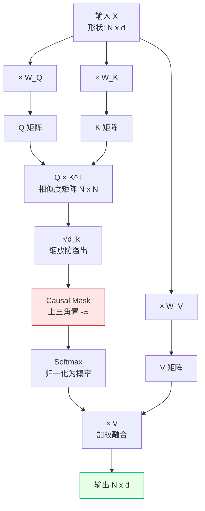

> [!NOTE]
> **《写给客户端工程师的 AI 底层原理》连载 · 第 2 期**
> 上一篇序章，我们走完了一次 API 调用的 7 步流水线。其中最核心、也最烧算力的一步，是「N 层 Transformer」。这一层里真正在干活的，就是今天的主角——**自注意力机制**。它是整个大模型能读懂上下文的根本原因。

# 一、 核心引擎：自注意力机制 (Self-Attention)

## 🟢【通俗版】客户端视角的"数据绑定"与"模糊搜索"

做 UI 时，一个列表里的 Item 状态往往受其他 Item 影响。自注意力机制解决的就是这个问题：**在这个句子里，我这个字，应该吸收哪些字的信息？**

大模型把每个字变成了一个角色，在内部进行一次"数据库联表查询"：

- **Q (Query) 查询条件：**我拿着我的 SearchKey，去问所有人"谁跟我有关系？"
- **K (Key) 目标索引：**每个人身上挂着的 Index 标签，用来跟 Q 匹配。
- **V (Value) 真实数据：**如果匹配上了，你要提取给我的真实内容。

比如"**苹果**发布了新**手机**"。"苹果"拿着自己的 Q 去和"手机"的 K 计算相似度，发现相似度极高（80%），于是"苹果"就吸收了 80% "手机"的 V。最终，"苹果"从一个单纯的水果，变成了"包含科技语境的苹果"。

> [!NOTE]
> **两个客户端必须知道的"约束"：**
> 1. **Causal Mask（因果掩码）**：生成模型只能看"自己之前的"字，不能偷看后面的。就像群聊里你只能看到自己发言之前的消息。
> 2. **计算复杂度 O(N²)**：N 个 token 两两计算相关性，4096 token 就是约 1600 万次点积。这是为什么"上下文越长越烧钱"的根本原因。

## 🔴【进阶版】矩阵乘法、Causal Mask 与 KV Cache

在底层没有"字"，只有高维向量（如 512 维）。Q、K、V 是通过三个可学习的权重矩阵 W_Q、W_K、W_V 线性变换得来的。**为什么必须是三个矩阵而不是一个？**因为"我用来查询别人的特征""我用来被别人查询的特征""我真正想贡献的内容"在数学上是三件不同的事，强行用同一个向量代替会让模型表达能力崩塌。

**计算管线（Compute Pipeline）：**

1. **点积求相似度：**Score = Q · Kᵀ。向量空间中夹角越小，相关性越高。
2. **缩放：**除以 √dₖ，防止维度变大时点积过大导致 Softmax 梯度消失。
3. **Causal Mask：**把"未来位置"全部置为 -∞，Softmax 后变成 0，确保只能看前文。
4. **Softmax：**把分数变成总和为 1 的概率分布。
5. **加权求和：**Output = Weights · V。

**📊 流程图 2：QKV 自注意力计算时序**

**KV Cache：把"重复计算"缓存起来**

Decode 阶段每生成一个新 token，都要重新对所有历史 token 算 Attention。但前面那些 token 的 K 和 V 矩阵在之前的步骤已经算过了 —— **这是典型的"可以 Memoize 的纯函数"**。

于是工程上引入 KV Cache：

- 缓存所有历史 token 的 K 和 V 向量；
- 每生成一个新 token，只算这一个 token 的 Q、K、V，并把新的 K、V append 到缓存；
- 计算复杂度从每步 O(N²) 降到 O(N)，但**显存占用线性增长**。

> [!NOTE]
> **客户端类比：**KV Cache 就像 React 的列表渲染 Memo —— 已经算过的不重复算，只算 diff 出来的新项。但缓存占的内存随对话长度线性增长，这就是为什么"长对话越聊越占显存"。

🎮 **想直观看到 Attention 是怎么算的?** 这个网页 demo 可以让你逐 token 看每一步矩阵运算:

> 📚 **推荐阅读：**
> 
> \- [The Illustrated Transformer (Jay Alammar)](https://jalammar.github.io/illustrated-transformer/)：全网公认最通俗易懂的图解 Transformer。
> 
> \- [Attention Is All You Need (Vaswani et al., 2017)](https://arxiv.org/abs/1706.03762)：开创大模型时代的封神论文。

---

> [!NOTE]
> **下期预告 · 第 3 期**
> 自注意力很强，但它有三个先天缺陷：分不清词的**先后顺序**、只用**一个视角**看世界、长文本一外推就**翻车**。下一篇，我们看看工程师是怎么用「多头」和「位置编码」这两张架构补丁，把这三个 Bug 一个个修好的。
