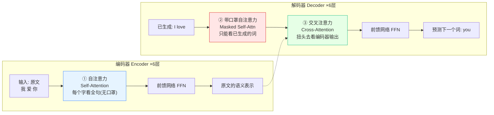
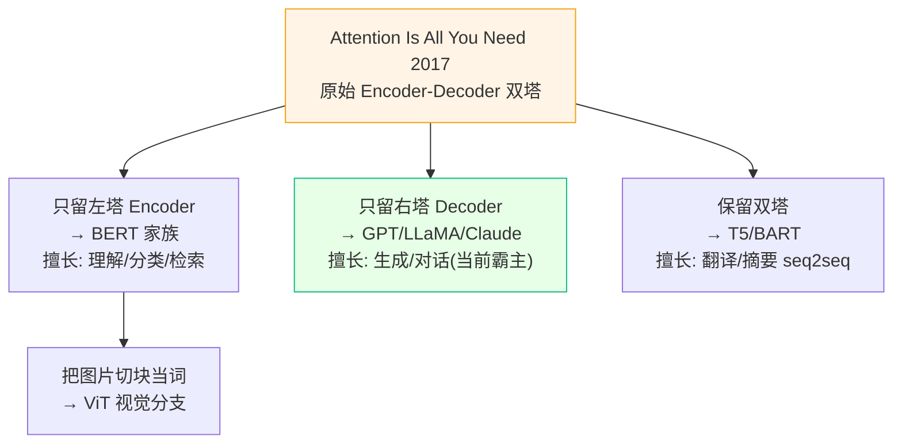

> [!NOTE]
> **《写给客户端工程师的 AI 底层原理》连载 · 第 8 期**
> 上一篇我们聊了想掀翻 Transformer 的挑战者 Mamba。这一篇反过来——回到 2017 年那台整车第一次被造出来的地方，重读被奉为「AI 圣经」的《Attention Is All You Need》。前面拆的都是零件，这一篇，看它当年到底长什么样。

# 七、 AI 圣经：Attention Is All You Need 还说了什么

> [!NOTE]
> 前面 1\~6 章已经把这篇论文的**核心机件**（Attention、多头、位置编码、KV Cache）拆得很细了。这一章不重复，只补一件事**：把论文原文里"我们前面还没正经讲过、但它其实是主角"的部分捞出来。**一句话——前面讲的是"注意力这颗发动机怎么转"，这一章讲"2017 年这台发动机第一次被装进的那辆整车长什么样"。

## 🟢【通俗版】论文原文的三个"其实你没细看"的点

老实说，大部分人（包括很多天天调 API 的人）对这篇论文的印象就是"哦，Attention 嘛"。但原文 15 页里，真正的主线其实是这三件事，而它们在前面几章里我们要么一笔带过、要么压根没提：

**① 它是一篇"翻译论文"，不是"聊天机器人论文"。**2017 年这篇文章的正经任务是**机器翻译**（英译德、英译法），刷的是 WMT 2014 榜单。所以它的原始架构是一个**完整的 Encoder-Decoder（编码器-解码器）**——左边一坨读懂原文，右边一坨吐出译文。我们前面讲的 GPT/LLaMA 那种"只有 Decoder"的结构，其实是**后人把这台整车拆了一半**才有的。

**② 里面藏着三种不同的 Attention，不是一种。**前面第一章我们只讲了"一个字去看别的字"这一种。但原文的整车里，注意力被用在了三个完全不同的地方（编码器内部自己看自己、解码器内部带口罩地看自己、解码器扭头去看编码器）。第三种"扭头去看"——也就是 **Cross-Attention（交叉注意力）**——是翻译能work的关键，前面完全没提。

**③ 它最大的卖点其实是"快"，不是"准"。**论文标题喊的是 "Attention Is All You Need"——潜台词是**"把 RNN/LSTM 全扔了"**。RNN 像接力赛，必须第一棒跑完才能交第二棒，没法并行；Transformer 像开圆桌会议，所有人同时发言、同时互相看。结果就是：同样的翻译质量，训练时间从"几周"砍到 **8 张 GPU 跑 3.5 天**，还顺手把 BLEU 分数刷到了当年的 SOTA（英德 28.4 / 英法 41.8）。**"能并行"才是它掀翻整个领域的真正原因，Attention 只是实现并行的手段。**

> [!NOTE]
> **一个常见误区**：很多人以为"大模型 = Transformer = Decoder"。错。原始 Transformer 是**双塔（Encoder + Decoder）**。后来分了三家：BERT 只留左塔（Encoder，擅长理解/分类），GPT 只留右塔（Decoder，擅长生成），原始双塔结构反而退居翻译/摘要等 seq2seq 场景。你现在用的 ChatGPT 是"半台车"。

## 🔴【进阶版】Encoder-Decoder 全景 & 三处注意力的分工

把前面散落的知识点拼成论文原本的整车，就是下面这张图。注意看注意力出现的**三个位置**——这是原文 Figure 1 的灵魂，也是前面章节没展开的部分。

**📊 全景图：原始 Transformer 双塔架构**

**三处注意力的分工**——同一套 QKV 机制，喂进去的东西不同，作用天差地别：

| 位置 | 名字 | Q 来自 | K/V 来自 | 干什么 |
|-|-|-|-|-|
| 编码器内 | Self-Attention | 原文 | 原文 | 读懂原文，每个词无遮挡地看全句 |
| 解码器内 | Masked Self-Attn | 已生成译文 | 已生成译文 | 带 Causal Mask，只准看已经吐出来的词 |
| 解码器→编码器 | Cross-Attention | 已生成译文 | **编码器输出** | 译文每生成一个词，都回头对齐原文该看哪里 |

> [!NOTE]
> **费曼比喻 · 同声传译**：编码器是"听原文的耳朵"，把整句话嚼碎理解好（Self-Attn）；解码器是"说译文的嘴"，一边只能顺着自己已经说出口的话往下接（Masked Self-Attn），一边又不停用余光瞟一眼原文的意思、确认没跑偏（Cross-Attn）。**Cross-Attention 就是那道"原文↔译文"的对齐视线**——没有它，翻译就成了闭着眼睛瞎编。

**为什么前面章节能"只讲一半"？**因为 GPT 这类生成模型直接砍掉了整个编码器和 Cross-Attention，只留解码器的 Masked Self-Attention。于是"翻译式的双塔"简化成了"续写式的单塔"，前面 1\~2 章讲的就是这单塔里的机件。但要理解 BERT 为什么擅长理解、T5 为什么适合翻译摘要，就得回到这张双塔全景。

**📊 分叉图：一篇论文，三支血脉**

> [!NOTE]
> **一句话讲完这一章**：这篇论文真正的贡献不是"发明了注意力"，而是"**敢把 RNN 彻底删掉、用纯注意力搭出一台能并行的 Encoder-Decoder 翻译机**"——并行带来速度，双塔+三种注意力带来质量，后人把这台整车拆成 BERT / GPT / T5 三支，才有了今天的一切。

> 📚 **回到原文**：
> 
> \- [Attention Is All You Need (Vaswani et al., 2017)](https://arxiv.org/abs/1706.03762)：15 页，重点看 Figure 1（双塔全景）和 3.2 节（三处注意力）。

---

> [!NOTE]
> **下期预告 · 收尾篇**
> 正文到此全部讲完。最后一篇不讲新概念，是一张给你随时查的**工程师速查卡**——参数换显存、三大架构对比、术语英中对照，收藏向压轴。
