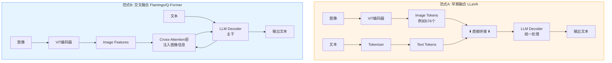

> [!NOTE]
> **《写给客户端工程师的 AI 底层原理》连载 · 第 4 期**
> 前三篇，我们把纯文本模型从里到外拆透了。但现实里的大模型早就眼观六路——能看图、能读视频。这一篇讲清楚一件事：一张图，是怎么被切成模型能吞下去的 **token 流**的。

# 三、 视觉破圈：多模态机制 (ViT)

## 🟢【通俗版】万物皆 token 流

大模型怎么看懂一张猫的图片？对客户端开发来说，这就叫"统一数据模型 (Unified Model)"。

把一张图切成无数个小方块（像马赛克），把这些小方块拉直成一串数字（向量）。**对于底层的 Transformer 来说，"一个图片方块"和"一个汉字"长得一模一样，都是长度为 512 的数组**。模型并不"看"图，它只是在这个统一空间里，做图片切片和文字的匹配连线游戏。

> [!NOTE]
> **客户端必须知道的"成本陷阱"：**一张 1024×1024 的图片按 16×16 切成 patch，会产生 **4096 个 image token**，几乎吃满一个 4K 上下文。所以"上传图片"在 API 计费上往往比"上传文字"贵几十倍。

**不止图片，音频和视频也一样：**

- **音频**：Whisper 等模型把每 80ms 切一帧、做 Mel 频谱、再 token 化。
- **视频**：抽帧（如每秒 1 帧）+ 每帧再走图像 token 化 → 30 秒视频 ≈ 30 × 4096 = 12 万 token，**所以视频理解模型都要做"视觉 token 压缩"**。

## 🔴【进阶版】Patching、对比学习与两种融合范式

**ViT (Vision Transformer)：**颠覆了 CNN 提取图像特征的方式。将 224×224 的图片切成 16×16 的 Patches，拉平后通过一个线性层投影（Linear Projection）映射到与文本相同的 Embedding 维度。然后照搬 Transformer 那套。

**跨模态对齐 (CLIP)：**模型怎么知道哪个 patch 是猫？训练时输入"猫的图片"和"含有猫的文本"作为一对正样本，损失函数强制要求：匹配的图文对点积最大化，不匹配的最小化。通过上亿次的推拉，模型在隐空间里建立了一座"图文桥梁"。

**融合范式：早期融合 vs. 交叉融合**

**📊 流程图 4：多模态融合架构对比**

| 范式 | 代表模型 | 客户端类比 | 适用场景 |
|-|-|-|-|
| 早期融合 | LLaVA、Qwen-VL | 把图片和文字"图层叠加"成一张 | 简单、训练快、适合通用 VQA |
| 交叉融合 | Flamingo、BLIP-2 | CALayer mask，文字主干上"贴"图像信息 | 高效处理多张图、长视频 |

> 📚 **推荐阅读：**
> 
> \- [An Image is Worth 16x16 Words (Dosovitskiy et al., 2020)](https://arxiv.org/abs/2010.11929)：ViT 架构开山之作。
> 
> \- [Learning Transferable Visual Models From Natural Language Supervision (OpenAI CLIP, 2021)](https://arxiv.org/abs/2103.00020)：多模态对齐核心基石。

---

> [!NOTE]
> **下期预告 · 第 5 期**
> 会读会看之后，模型还差最后一口气：像人一样**慢慢想**，而不是脱口而出。下一篇，聊最前沿的深度思考模型 System 2——用算力换逻辑。
