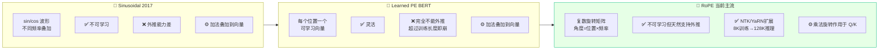

> [!NOTE]
> **《写给客户端工程师的 AI 底层原理》连载 · 第 3 期**
> 上一篇我们讲透了自注意力，也留了三个先天 Bug：分不清顺序、单一视角、长文外推差。这一篇就是三张架构补丁——**多头**让模型多几双眼睛，**位置编码**给每个词标上坐标。

# 二、 架构补丁：多头与位置编码

## 🟢【通俗版】解决三大 Bug

- **Bug 1：单线程偏科。**只有一组 QKV 可能只注意到了"语义关系"，忘了看"语法关系"。    

  - **补丁：多头注意力（Multi-Head）**。相当于开多个独立线程，8 个头分别关注语义、语法、时态等，最后拼起来。
- **Bug 2：无序集合。**QKV 计算就像遍历 HashSet，打乱顺序结果一样，分不清"我爱你"和"你爱我"。    

  - **补丁：位置编码（Positional Encoding）**。给每个 token 打上"位置印记"。**2017 年用 Sinusoidal 正弦波，但 2024 年起主流大模型（LLaMA / Qwen / DeepSeek）全部改用 RoPE（旋转位置编码）**。
- **Bug 3：长上下文显存爆炸。**多头注意力时，每个头都要存自己的 K、V Cache，128K 上下文很容易把显存打爆。    

  - **补丁：GQA（Grouped-Query Attention）**。让多个 Q 头共享同一组 K、V，显存直接砍半甚至更多。LLaMA-3、Qwen2 标配。

> [!NOTE]
> **客户端类比 RoPE：**给每个字的向量做一次"旋转"，旋转角度由它的位置决定。两个字之间的"相对位置"等于它们的旋转角度差 —— 天然支持"位置编码外推"。这就是为什么 LLaMA-3 训练时只用了 8K，推理却能撑到 128K。

## 🔴【进阶版】多头切分、RoPE 旋转、长上下文外推

**多头（Multi-Head）的维度切分：**如果总维度是 512，开 8 个头，那么每个头只负责 64 维子空间的运算。它们在各自的子空间里独立计算 Attention，最后 Concat 拼接回 512 维并乘以输出矩阵 W_O。**整体计算量并没有增加，但模型可以从多个角度同时关注信息**。

**位置编码三代演进：**

**📊 流程图 3：位置编码方案演进对比**

**Sinusoidal 公式（仅供进阶查阅）：**

PE(pos,2i) = sin(pos / 10000^(2i/d))

PE(pos,2i+1) = cos(pos / 10000^(2i/d))

**RoPE 核心思想：**把每个 Q、K 向量看成一堆"复数对"，乘以一个角度为 mθ 的旋转矩阵（m 是位置，θ 是预设频率）。两个 token 做点积时，结果只依赖于它们的**相对位置差**，而非绝对位置。这种"相对性"是它能外推的根本原因。

**长上下文外推：NTK 缩放与 YaRN**

训练时只见过 8K，推理时要撑到 128K 怎么办？直接用模型会"懵"。NTK-aware 缩放和 YaRN 是两种工程方案，本质上是**调整 RoPE 的频率参数**，让模型在没见过的位置上也能正确推理。客户端工程师只需知道：**API 文档里 "context window: 128K" 背后就是这套机制**。

**GQA / MQA：减少 K、V 头数**

| 方案 | Q 头数 | K/V 头数 | 显存占用 |
|-|-|-|-|
| MHA（原版） | 32 | 32 | 100% |
| GQA（LLaMA-3） | 32 | 8 | \~25% KV Cache |
| MQA（极端） | 32 | 1 | \~3% KV Cache |

---

> [!NOTE]
> **下期预告 · 第 4 期**
> 到这里，纯文本的大模型就讲完了。可你每天用的模型早就能看图、看视频了——它是怎么把一张图，变成和文字一样能读的 token 流的？下一篇，我们让模型**长出眼睛**，聊多模态 ViT。
