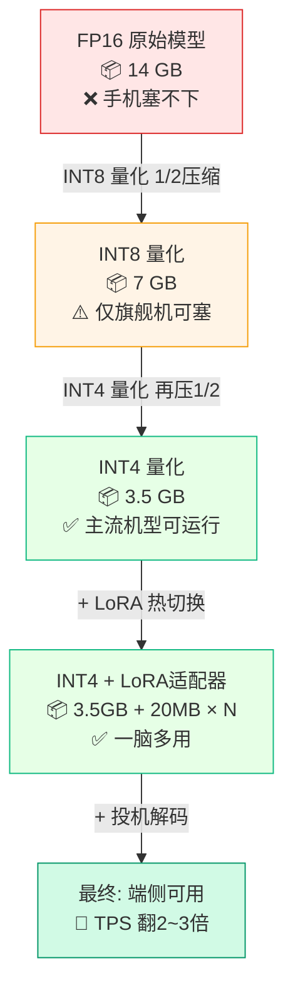
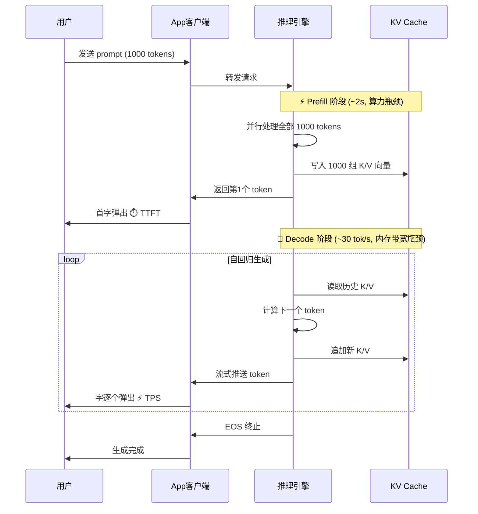

> [!NOTE]
> **《写给客户端工程师的 AI 底层原理》连载 · 第 6 期**
> 前五篇，我们把大模型的脑子从头讲到尾。现在到了最落地的一步：怎么把一个动辄几十上百亿参数的庞然大物，塞进一台内存捉襟见肘的手机里。这一篇，是给端上工程师的**实战手册**。

# 五、 端侧部署：把大模型塞进手机里

## 🟢【通俗版】端侧四件套

把一个 14GB 的 7B 模型塞进 4GB RAM 的手机里，需要四件套配合：

1. **量化（Quantization）**：把模型权重从 FP16（每个参数 2 字节）压缩到 INT4（每个参数 0.5 字节），**体积直接缩小 4 倍**。类比："PNG 转 JPEG，画质损失一点点，体积省一大截。"
2. **LoRA（流式适配器）**：手机系统自带一个 3GB 的通用大脑。打开写代码 App，App 就贴一个 20MB 的"代码补丁（LoRA）"，大脑瞬间变身代码专家。**即插即用，不用下载完整模型**。
3. **投机解码（Speculative Decoding）**：小模型先一口气猜出 5 个字（快但不准），大模型一次性验证这 5 个字（慢但权威）。验对几个就接受几个，**平均吐字速度翻 2\~3 倍**。类比："实习生先写代码 → 高级工程师 review，比让高级工程师亲手写快得多。"
4. **Prefill / Decode 双引擎**：Prefill 用满 GPU 算力（处理整段 prompt），Decode 用满内存带宽（逐字吐字）。**客户端体感上分别对应"首字延迟"和"吐字速度"两个旋钮**。

**📊 流程图 6：端侧推理性能瓶颈分解（7B 模型为例）**

## 🔴【进阶版】量化、LoRA、推理引擎与 Prefill/Decode

**5.1 量化（Quantization）：精度换体积**

| 精度 | 每参数占用 | 7B 模型大小 | 质量损失 | 典型方案 |
|-|-|-|-|-|
| FP32 | 4 字节 | 28 GB | 原始 | 训练用 |
| FP16 / BF16 | 2 字节 | 14 GB | 几乎无损 | 云端推理默认 |
| INT8 | 1 字节 | 7 GB | < 1% | GPTQ、AWQ |
| **INT4** | **0.5 字节** | **3.5 GB** | **1\~3%** | **GGUF (llama.cpp 主流)** |
| INT2 / 1bit | 极小 | < 2 GB | 明显 | 实验阶段 |

**5.2 LoRA (Low-Rank Adaptation)**

冻结预训练模型的全部原始权重。在原有矩阵旁边，旁路添加两个极其低秩的小矩阵 A 和 B（例如 10000×8 和 8×10000）。训练时只更新 A 和 B。前向传播为：y = W₀x + BAx。**训练成本降至 1%，部署时多个 LoRA 可热切换**。

**5.3 主流端侧推理引擎选型**

| 引擎 | 主战场 | 优势 | 客户端集成 |
|-|-|-|-|
| llama.cpp / GGUF | 桌面 + 服务端 | CPU 极致优化、量化方案最全 | C++ 库，可嵌入 |
| MLC-LLM | iOS / Android / Web | 跨端编译、WebGPU 支持 | 提供官方 SDK |
| Core ML | Apple 生态 | 调用 ANE 神经引擎 | Swift 原生 |
| MNN / TNN | 移动端（国产大厂自研引擎） | 国产硬件适配好 | Android/iOS SDK |
| ONNX Runtime | 跨平台通用 | 生态广、模型转换方便 | 多语言绑定 |

**5.4 Prefill vs. Decode：时序图视角**

**📊 流程图 7：Prefill / Decode 两阶段时序**

**5.5 投机解码（Speculative Decoding）**

核心思路：用一个轻量的"草稿模型"（draft model）一次性猜测 k 个 token，再让"目标模型"并行验证这 k 个 token 是否合理。验对的全部接受，碰到第一个不对的就回退。**由于目标模型一次 forward 同时验证 k 个 token 几乎不增加延迟（受益于 GPU 并行），整体 TPS 通常提升 2\~3 倍**。

> 📚 **推荐阅读**：
>
> \- [LoRA: Low-Rank Adaptation of Large Language Models (Hu et al., 2021)](https://arxiv.org/abs/2106.09685)：微调和端侧部署标配。
>
> \- [Fast Inference from Transformers via Speculative Decoding (Leviathan et al., 2023)](https://arxiv.org/abs/2211.17192)：投机解码原始论文。

---

> [!NOTE]
> **下期预告 · 第 7 期**
> 前面讲的一切，都建立在 Transformer 这套架构上。但它有个绕不过的天花板：**上下文一长就卡**，算力平方级暴涨。下一篇，聊聊可能掀翻它的挑战者，Mamba 与线性注意力。
