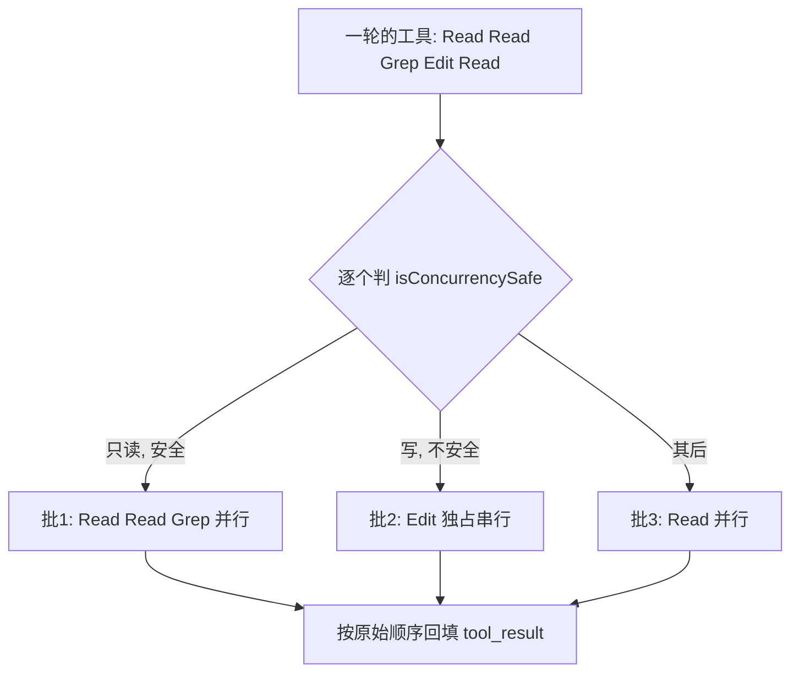

> [!NOTE]
> **这篇怎么读。**前两版要么只有"道理"(空谈)、要么只有"源码"(流水账)。这版每一条都走同一条链路:**① 源码事实(因)→ ② 它为什么非这么干不可(推导)→ ③ 我们的收获(果)**。你能清楚看到——每个收获都是从那行代码里**推**出来的,不是拍脑袋。
> 判断标准很简单:如果一条"收获"删掉上面的源码事实后还成立,那它就是废话;只有"非得有这段源码才能得出"的,才是真收获。

# 收获一:能交给模型的,别写进代码

| **因(源码)** | 反混淆后,整个 agent 的主循环是一个函数 `nO`,本质就是一个 `while`:调模型 → 有 tool_use 就执行 → 结果塞回历史 → 再调模型,模型不再要工具就停[[Agent design lessons]](https://jannesklaas.github.io/ai/2025/07/20/claude-code-agent-design.html)。**没有状态机、没有 DAG 编排、没有"任务规划器"那一层**。 |
|-|-|
| **推导** | 一个能干这么复杂活的工具,控制流却薄成一个 while——这不是偷懒,是**故意**。他们把"下一步干什么"的决策权,从代码手里完全交给了模型。代码只负责"把模型要的工具跑了,把结果还回去"。 |
| **果** | 判断"某个逻辑该写进代码还是交给模型",有了一条具体标尺:**凡是"模型再聪明一点就不需要的代码",就别写**。你写的编排逻辑越多,等于赌模型永远不会变强——而这显然是输的赌注。下次想加状态机/流程图式编排前,先问这一句。 |

---

# 收获二:可调试性,值得用"架构优雅"去换

| **因(源码)** | 它全程维护**一条扁平的 messages 数组**,所有对话、工具调用、工具结果都按顺序进同一个列表。子 agent 跑完,只把**最后一条 message** 作为 tool_result 塞回主列表,中间过程全留在子上下文里不污染主线[[Subagents docs]](https://platform.claude.com/docs/en/agent-sdk/subagents)。 |
|-|-|
| **推导** | 为什么不用更"高级"的多 agent 图状编排?因为一旦 agent 之间互相调用成网,出了错你根本定位不到是哪一跳坏的。一条扁平 list,你从头 print 到尾就能复现整个决策过程。他们**主动放弃了架构上的优雅,换来了"出事能查"**。 |
| **果** | "这个 agent 架构好不好"的评价标准要换:不是看它多能编排,而是看它**出错时你能不能一眼看懂哪儿坏了**。一个你 debug 不动的"聪明"系统,在生产环境就是定时炸弹。把可观测/可复现,排在架构花活前面。 |

---

# 收获三:技术选型先问"它藏了多少看不见的失败点"

| **因(源码)** | 找代码时它**不用向量检索(RAG),而是直接调 grep/glob 搜文件**,必要时读整个文件[[decoding-claude-code]](https://minusx.ai/blog/decoding-claude-code/)。一个 Anthropic 自家做的工具,放着最"AI"的方案不用,选了最朴素的文本搜索。 |
|-|-|
| **推导** | 关键不在"RAG 不好",而在 minusx 点破的那句:RAG 引入一堆**藏起来的失败点**——碎块怎么切、相似度怎么算、要不要重排序,每一个都可能坏,且坏了你查不出原因。grep 则是零隐藏状态、结果确定、可复现。他们宁可要"笨但可控",不要"聪明但黑盒"。 |
| **果** | 技术选型多一把尺子:**不比谁更高级,比谁引入的"不可控失败点"更少**。一个方案平时很美、出错时一脸懵(查不出根因),它的真实成本远高于一个朴素但确定的方案。能用确定、可复现的简单办法解决,就别上黑盒。 |

---

# 收获四:并发的真正难点是"分批 + 顺序 + 错误隔离"

| **因(源码)** | 它没有把一轮里的工具 `Promise.all` 一把梭,而是做了三件事[[ch07-concurrency]](https://github.com/alejandrobalderas/claude-code-from-source/blob/main/book/ch07-concurrency.md):  
① **按安全性保序分批**:只读工具(Read/Grep)合并并行,写工具(Edit)单独串行独占;  
② **结果按"模型要求的原始顺序"回填**,遇到没跑完的串行工具就 break、后面的结果再快也得等;  
③ **错误隔离**:三层 AbortController,只有 Bash 出错会级联取消同批兄弟,Read/Grep 的错误彼此独立。 |
|-|-|
| **推导** | 为什么这么费劲?因为工具之间有**隐式依赖**:Edit 改了文件,后面的 Read 必须读到改后的;Bash 的 `mkdir && cp` 前一步挂了后一步就没意义。无脑并行会让模型看到"错乱的世界"。所以并行的边界,必须卡在"有没有副作用、有没有依赖"上。 |
| **果** | 以后做任何"并发执行一批操作"的系统,知道真正要解决的不是"怎么并行",而是这三件事:**哪些能并行(看副作用)、结果怎么保序对齐、一个失败要不要拖垮一批(看依赖)**。读操作放开并行、写操作独占串行、失败按依赖关系决定级联范围——这是一套可直接复用的心智模型。 |

---

# 收获五:成本是设计出来的,不是省出来的

| **因  
(源码)** | 两处实打实的设计:  
① **超过一半的"重要"模型调用走便宜小模型 Haiku**——读大文件、解析网页、压缩历史、起标签,连 Bash 执行前的安全检查都用 Haiku 跑[[decoding-claude-code]](https://minusx.ai/blog/decoding-claude-code/)。  
② 压缩上下文时,命中缓存就**不改本地消息,而是发 `cache_edits` 让服务端按 id 外科式删除旧结果**,目的是**不让 prompt 缓存失效**[[Compaction Engine]](https://barazany.dev/blog/claude-codes-compaction-engine)。 |
|-|-|
| **推导** | 这两处都说明:省钱不是事后"挑个便宜模型"的运维动作,而是**写进架构里的决策**。任务分级(哪些活配什么档位的脑子)、缓存友好(改写历史时绝不能粗暴到让缓存全 miss),都是在设计阶段就定死的——因为它们一旦做错,后期没法靠调参补救。 |
| **果** | 做 AI 系统,成本要在**设计阶段**就当一等公民来考虑,具体两招可直接抄:**① 给任务分级,体力活(摘要/分类/预检)下沉到小模型;② 任何"重写上下文"的操作,先想会不会打掉缓存**。这两点决定了同样的功能,你的账单是别人的几倍还是几分之一。 |

---

# 收获六:长任务的上下文,要"分层管理"而非"一刀切"

| **因  
(源码)** | 压缩不是一个动作,是**分层**的[[Karan Prasad]](https://karanprasad.com/blog/how-claude-code-actually-works-reverse-engineering-512k-lines):  
• **微压缩(microcompact)**:每次 API 调用前都跑,只清旧的 tool_result、**只保留最近 5 条**,其余替换成 `[Old tool result content cleared]`,**不调模型、不动对话**;  
• **完整压缩**:要等剩余 token 触到 `autoCompactThreshold = 有效窗口 - 13000` 才上,用 LLM 把上下文按 9 段结构总结成摘要。 |
|-|-|
| **推导** | 为什么分层?因为不同"垃圾"清理成本差很多。旧工具结果是占地方但没信息量的——高频、零成本地清掉就行;而把整段对话浓缩成摘要会丢信息、还要烧一次 LLM 调用,只能等真快爆了才舍得做。**便宜的清理高频做,昂贵且有损的压缩留到最后做。** |
| **果** | 处理长任务/长对话的上下文,不要只有"满了就总结"这一招。学它**按"清理成本 × 信息损失"分层**:无损低成本的(清旧的中间产物)随手做,有损高成本的(LLM 摘要)卡阈值才做。这样既不丢关键信息,又不会动不动烧钱。 |

---

# 收获七:限制一个能力,最干净的做法是"让它看不见"

| **因  
(源码)** | 早期版本"子 agent 不能再派生子 agent",实现方式不是写个递归计数器去拦,而是**默认不给子 agent 配 Task/Agent 这个工具**,连搜索都搜不到它[[Subagents docs]](https://platform.claude.com/docs/en/agent-sdk/subagents)。要放开(v2.1.172 起)也只是把工具加回它的工具集。 |
|-|-|
| **推导** | 模型只能调它"看得见"的工具。所以控制模型行为,最可靠的手段不是在执行层写一堆 if 去拦截(拦截总有漏网),而是在**源头控制它能看到什么**——看不到的能力,它从根上就调不了,也没法被 prompt 注入绕过去。 |
| **果** | 给 agent 做能力边界/权限,优先用**"工具可见性"这个开关**,而不是事后拦截。想禁某类操作,第一选择是"压根不把这个工具给它",而非"给了再去判断该不该让它跑"。前者是从源头杜绝,后者是处处设防、总有疏漏。 |

---

# 收获八:给 agent 执行权,安全必须是"纵深防御"

| **因  
(源码)** | 执行 Bash 命令前,它叠了好几层[[An Evening with Claude Code]](https://blog.xpnsec.com/An-Evening-with-Claude-Code/):  
① **正则白名单**:像 `git status` 的正则刻意排除 ``$ ` \| & ;`` 等可注入字符;  
② **逐 flag 安全表**`safeCommandsAndArgs`:对 `sed`/`xargs` 这种危险命令一个参数一个参数地审;  
③ **小模型语义兜底**:把命令喂给 Haiku 跑 `policy_spec`,查出注入就返回 `command_injection_detected` 转人工[[Claude Code Internals]](https://kirshatrov.com/posts/claude-code-internals)。 |
|-|-|
| **推导** | 为什么不一招搞定?因为每一层都有盲区:正则挡得住明面上的危险字符,但挡不住语义上的恶意;小模型懂语义,但可能被绕过、也有延迟和成本。XPN 直接评价"正则不够用"。**所以靠的是几层各有专长的防线叠起来兜底,而不是指望某一层完美。**(顺带:它**没有**做完整的 shell AST 解析,是务实地用正则+前缀+小模型的组合。) |
| **果** | 但凡给 agent "动真格"的权力(跑命令、改文件、调外部接口),安全不能押在单点上,要**纵深防御**:确定性规则(正则/白名单)挡住大多数明显危险,小模型兜住语义层的狡猾攻击,再加用户可配的权限规则收口。三层任缺一层都不算稳。"用小模型当语义安全过滤器"这招尤其值得记。 |

---

# 收获九:Prompt 是可工程化的资产,不是玄学咒语

| **因  
(源码)** | 抓到的真实 prompt 有几个一致的手法[[claude-code-reverse]](https://github.com/Yuyz0112/claude-code-reverse):  
① 工具描述里写死"该用/不该用",比如 Bash 工具明令 ``You MUST avoid using ... `find` and `grep`. Instead use Grep, Glob``;  
② 高危行为用大写绝对量词钉死,如 `IMPORTANT: DO NOT ADD ***ANY*** COMMENTS unless asked`、`NEVER commit changes unless the user explicitly asks`;  
③ 用 `` 这个"非用户输入"的旁路通道做运行时动态提醒(如待办为空时提醒用 TodoWrite);  
④ 启动就注入 `` 现场(工作目录、是否 git 仓库、平台、日期、git status)。 |
|-|-|
| **推导** | 这些都不是"碰运气调出来的咒语",而是**有明确意图的工程动作**:工具描述里嵌指令,是把模型往正确工具上推;大写绝对量词,是给高危行为划红线、不留模糊;system-reminder 旁路,是不污染对话又能动态提醒;注入 env,是让模型一上来就有现场感、少问废话。每一条都对应一个要解决的具体问题。 |
| **果** | 写 prompt 别再靠玄学和反复试。可直接照搬的四个工程手法:**① 在工具/能力描述里写明"何时用、何时别用"+正反例;② 高危红线用大写绝对量词钉死,而不是写一堆温和又互相打架的建议;③ 用旁路通道(类 system-reminder)做运行时提醒,不污染主对话;④ 启动即注入环境现场。**Prompt 是能版本管理、能复盘优化的资产。 |

---

# 一页纸:九个收获 ← 各自的源码因

| 收获(果) | 推出它的源码事实(因) |
|-|-|
| 能交给模型的别写进代码 | 主循环 `nO` 只是个 while,无状态机/编排层 |
| 可调试性值得换架构优雅 | 全程一条扁平 messages,子 agent 只回最后一条 |
| 选型先问"隐藏失败点多少" | 弃 RAG,直接用 grep/glob 搜文件 |
| 并发难在分批+保序+隔离 | 按安全性分批、按原序回填、仅 Bash 错误级联 |
| 成本是设计出来的 | 过半调用走 Haiku;压缩用 cache_edits 保缓存 |
| 长上下文要分层管理 | 微压缩高频清旧结果,完整压缩卡阈值才上 |
| 限制能力靠"看不见" | 不给子 agent 配 Task 工具,而非写计数器 |
| 执行权要纵深防御 | 正则+逐flag白名单+Haiku 查注入,三层叠 |
| Prompt 是可工程化资产 | 工具描述嵌指令、绝对量词、reminder、env 注入 |
