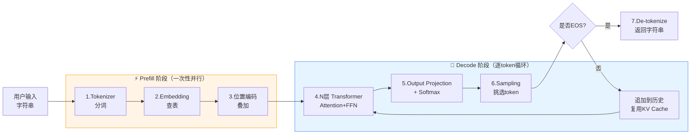
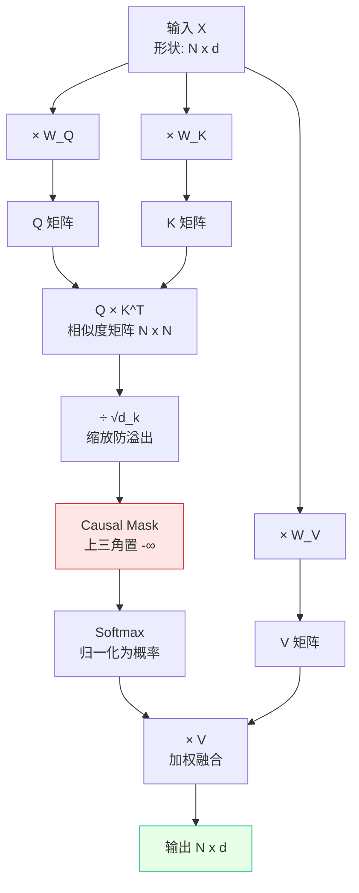
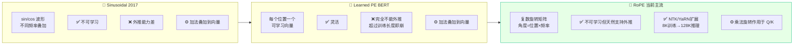
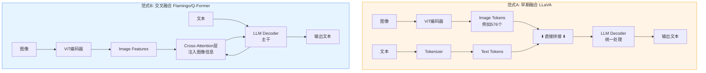
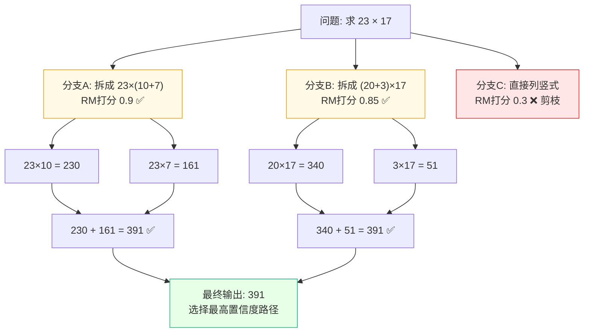
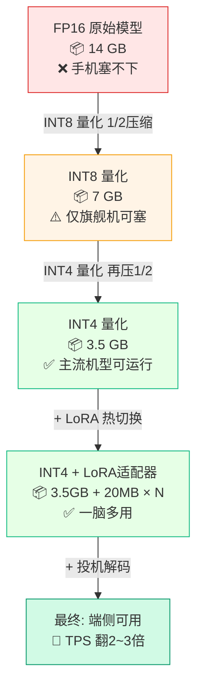
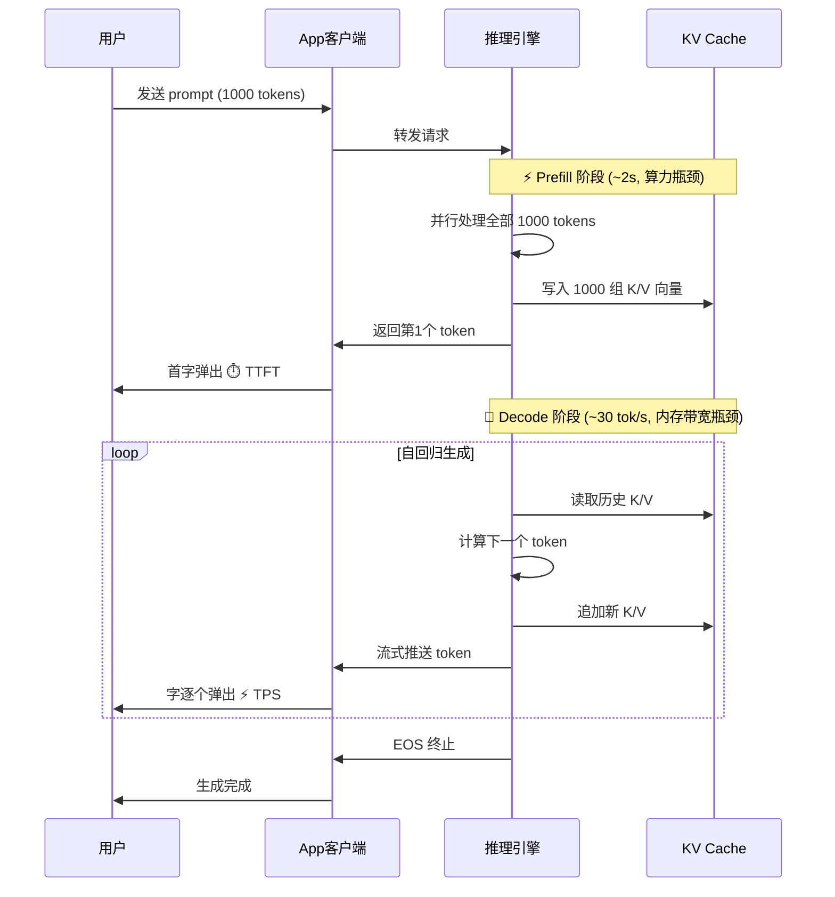
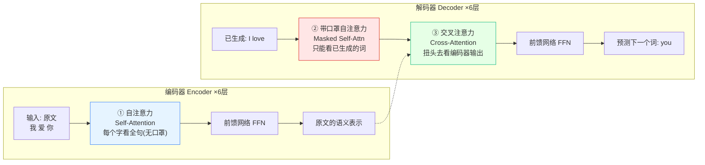
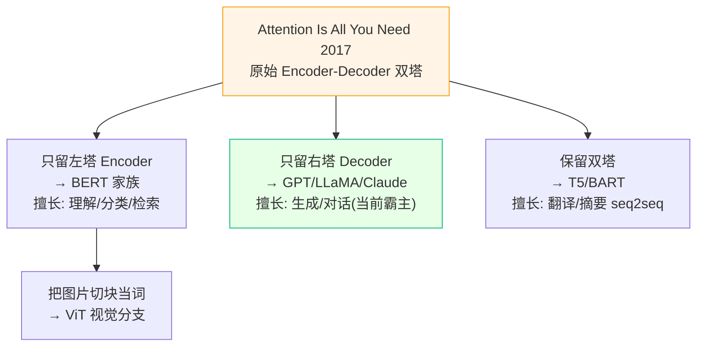

**写在前面：**

作为客户端/前端工程师，我们每天处理的是 UI 渲染、状态管理和多线程。面对动辄"千亿参数"的大模型（LLM），很容易觉得它是一个无法触碰的魔法黑盒。但剥开表象，**AI 的底层逻辑与我们熟悉的软件工程架构有着惊人的相似之处**。

这篇文档按章节切分，每章包含 **🟢【通俗版】**（建立直觉）和 **🔴【进阶版】**（硬核原理）。**读法建议：先把全文的【通俗版】快速扫一遍建立全景，再回头挑感兴趣的【进阶版】深挖细节。**

---

# 🗺️ 全局概览 (Table of Contents)

在深入细节前，请先在脑海中建立这张技术地图：

1. **序章：一次 API 调用的 7 步流水线** — 端到端心智模型，看清字符串"进"和字符串"出"之间到底发生了什么。
2. **核心引擎：自注意力机制（Self-Attention）** — QKV 查询机制、Causal Mask、KV Cache。
3. **架构补丁：多头与位置编码（Multi-Head, RoPE, GQA）** — 解决"偏科""无序""长上下文"三大 Bug。
4. **视觉破圈：多模态机制（ViT / CLIP / 融合范式）** — 万物皆 Token，以及多模态融合的两条路线。
5. **最前沿探索：深度思考模型（System 2 / Reasoning）** — CoT 与 o1 的本质区别、Reward Model、蒸馏。
6. **端侧部署：把大模型塞进手机里** — 量化、LoRA、推理引擎、Prefill/Decode、投机解码。
7. **面向未来：Mamba 与线性注意力** — 挑战 Transformer 王座。
8. **AI 圣经：Attention Is All You Need 还说了什么** — 回到 2017 原始双塔：Encoder-Decoder、三处注意力、以及 BERT/GPT/T5 的分家。
9. **附录：工程师速查卡** — 参数量/显存换算、架构对比、术语对照。

---

# 序章：一次 API 调用的 7 步流水线

## 🟢【通俗版】从按下回车到第一个字弹出

想象你在 App 里调了一行代码：

```swift
let reply = await llm.chat("写一首关于秋天的诗")
```

这一行代码背后，大模型经历了 **7 个步骤**，可以类比成一条客户端工程师熟悉的"数据处理流水线"：

1. **分词（Tokenizer）**：把字符串切成 token id 数组。类似 `String → [Int]` 编码，但用的是 BPE 子词字典。"写一首关于秋天的诗" ≈ 12 个 token。
2. **查表（Embedding）**：每个 token id 查出一个 512 维（或更高）向量。类似 `enum → 配置表 → 数据结构` 的查表。
3. **位置编码（Positional Encoding）**：给每个向量"打上位置印记"，模型才能分清字词顺序。
4. **N 层 Transformer Block 堆叠**：每一层都做"自注意力 + 前馈网络"两件事。GPT-3 有 96 层，相当于让数据流过 96 层 UI 组件树。
5. **预测下一个 token（Softmax + Sampling）**：输出是一个"下一个字"的概率分布，再按策略（贪心 / 随机采样）挑一个。
6. **自回归循环（Autoregressive Loop）**：把刚生成的字追加到输入末尾，回到第 1 步再来一遍。这就是为什么 ChatGPT 是一个字一个字蹦出来的。
7. **反编码（De-tokenize）+ EOS 终止**：遇到结束符（）就停，把 token id 数组还原成字符串返回。

> [!NOTE]
> **客户端类比：**第 1\~3 步像是**请求序列化**，第 4\~5 步像是**业务逻辑层**，第 6 步像是**长连接的流式推送**，第 7 步像是**响应反序列化**。

**📊 流程图 1：端到端推理管线**



## 🔴【进阶版】Prefill 与 Decode：两阶段算力画像

上面 7 步在工程上其实分成两个截然不同的阶段，它们的算力画像差别巨大，这也是后续讲 KV Cache、投机解码的前提：

| 阶段 | 做什么 | 瓶颈 | 体感指标 |
|-|-|-|-|
| **Prefill** | 把整段 prompt 一次性并行送进模型，建立完整的 KV Cache | 算力（FLOPS）—— 矩阵乘法密集 | **TTFT**（Time To First Token，首字延迟） |
| **Decode** | 逐个 token 生成，每次只算"新来的那一个 token" | 内存带宽 —— 反复读取 KV Cache 和权重 | **TPS**（Tokens Per Second，吐字速度） |

记住这张表，后面所有关于"推理性能"的讨论都围绕它展开。

---

# 一、 核心引擎：自注意力机制 (Self-Attention)

## 🟢【通俗版】客户端视角的"数据绑定"与"模糊搜索"

做 UI 时，一个列表里的 Item 状态往往受其他 Item 影响。自注意力机制解决的就是这个问题：**在这个句子里，我这个字，应该吸收哪些字的信息？**

大模型把每个字变成了一个角色，在内部进行一次"数据库联表查询"：

- **Q (Query) 查询条件：**我拿着我的 SearchKey，去问所有人"谁跟我有关系？"
- **K (Key) 目标索引：**每个人身上挂着的 Index 标签，用来跟 Q 匹配。
- **V (Value) 真实数据：**如果匹配上了，你要提取给我的真实内容。

比如"**苹果**发布了新**手机**"。"苹果"拿着自己的 Q 去和"手机"的 K 计算相似度，发现相似度极高（80%），于是"苹果"就吸收了 80% "手机"的 V。最终，"苹果"从一个单纯的水果，变成了"包含科技语境的苹果"。

> [!NOTE]
> **两个客户端必须知道的"约束"：**
> 1. **Causal Mask（因果掩码）**：生成模型只能看"自己之前的"字，不能偷看后面的。就像群聊里你只能看到自己发言之前的消息。
> 2. **计算复杂度 O(N²)**：N 个 token 两两计算相关性，4096 token 就是约 1600 万次点积。这是为什么"上下文越长越烧钱"的根本原因。

## 🔴【进阶版】矩阵乘法、Causal Mask 与 KV Cache

在底层没有"字"，只有高维向量（如 512 维）。Q、K、V 是通过三个可学习的权重矩阵 W_Q、W_K、W_V 线性变换得来的。**为什么必须是三个矩阵而不是一个？**因为"我用来查询别人的特征""我用来被别人查询的特征""我真正想贡献的内容"在数学上是三件不同的事，强行用同一个向量代替会让模型表达能力崩塌。

**计算管线（Compute Pipeline）：**

1. **点积求相似度：**$Score = Q \cdot K^T$。向量空间中夹角越小，相关性越高。
2. **缩放：**除以 $\sqrt{d_k}$，防止维度变大时点积过大导致 Softmax 梯度消失。
3. **Causal Mask：**把"未来位置"全部置为 -∞，Softmax 后变成 0，确保只能看前文。
4. **Softmax：**把分数变成总和为 1 的概率分布。
5. **加权求和：**$Output = Weights \cdot V$。

**📊 流程图 2：QKV 自注意力计算时序**



**KV Cache：把"重复计算"缓存起来**

Decode 阶段每生成一个新 token，都要重新对所有历史 token 算 Attention。但前面那些 token 的 K 和 V 矩阵在之前的步骤已经算过了 —— **这是典型的"可以 Memoize 的纯函数"**。

于是工程上引入 KV Cache：

- 缓存所有历史 token 的 K 和 V 向量；
- 每生成一个新 token，只算这一个 token 的 Q、K、V，并把新的 K、V append 到缓存；
- 计算复杂度从每步 O(N²) 降到 O(N)，但**显存占用线性增长**。

> [!NOTE]
> **客户端类比：**KV Cache 就像 React 的列表渲染 Memo —— 已经算过的不重复算，只算 diff 出来的新项。但缓存占的内存随对话长度线性增长，这就是为什么"长对话越聊越占显存"。

🎮 **想直观看到 Attention 是怎么算的?** 这个网页 demo 可以让你逐 token 看每一步矩阵运算:

[打开交互内容](https://poloclub.github.io/transformer-explainer/)

> 📚 **推荐阅读：**
> 
> \- [The Illustrated Transformer (Jay Alammar)](https://jalammar.github.io/illustrated-transformer/)：全网公认最通俗易懂的图解 Transformer。
> 
> \- [Attention Is All You Need (Vaswani et al., 2017)](https://arxiv.org/abs/1706.03762)：开创大模型时代的封神论文。

---

# 二、 架构补丁：多头与位置编码

## 🟢【通俗版】解决三大 Bug

- **Bug 1：单线程偏科。**只有一组 QKV 可能只注意到了"语义关系"，忘了看"语法关系"。    

  - **补丁：多头注意力（Multi-Head）**。相当于开多个独立线程，8 个头分别关注语义、语法、时态等，最后拼起来。
- **Bug 2：无序集合。**QKV 计算就像遍历 HashSet，打乱顺序结果一样，分不清"我爱你"和"你爱我"。    

  - **补丁：位置编码（Positional Encoding）**。给每个 token 打上"位置印记"。**2017 年用 Sinusoidal 正弦波，但 2024 年起主流大模型（LLaMA / Qwen / DeepSeek）全部改用 RoPE（旋转位置编码）**。
- **Bug 3：长上下文显存爆炸。**多头注意力时，每个头都要存自己的 K、V Cache，128K 上下文很容易把显存打爆。    

  - **补丁：GQA（Grouped-Query Attention）**。让多个 Q 头共享同一组 K、V，显存直接砍半甚至更多。LLaMA-3、Qwen2 标配。

> [!NOTE]
> **客户端类比 RoPE：**给每个字的向量做一次"旋转"，旋转角度由它的位置决定。两个字之间的"相对位置"等于它们的旋转角度差 —— 天然支持"位置编码外推"。这就是为什么 LLaMA-3 训练时只用了 8K，推理却能撑到 128K。

## 🔴【进阶版】多头切分、RoPE 旋转、长上下文外推

**多头（Multi-Head）的维度切分：**如果总维度是 512，开 8 个头，那么每个头只负责 64 维子空间的运算。它们在各自的子空间里独立计算 Attention，最后 Concat 拼接回 512 维并乘以输出矩阵 W_O。**整体计算量并没有增加，但模型可以从多个角度同时关注信息**。

**位置编码三代演进：**

**📊 流程图 3：位置编码方案演进对比**



**Sinusoidal 公式（仅供进阶查阅）：**

$$PE_{(pos, 2i)} = \sin(pos / 10000^{2i/d})$$

$$PE_{(pos, 2i+1)} = \cos(pos / 10000^{2i/d})$$

**RoPE 核心思想：**把每个 Q、K 向量看成一堆"复数对"，乘以一个角度为 $m\theta$ 的旋转矩阵（m 是位置，θ 是预设频率）。两个 token 做点积时，结果只依赖于它们的**相对位置差**，而非绝对位置。这种"相对性"是它能外推的根本原因。

**长上下文外推：NTK 缩放与 YaRN**

训练时只见过 8K，推理时要撑到 128K 怎么办？直接用模型会"懵"。NTK-aware 缩放和 YaRN 是两种工程方案，本质上是**调整 RoPE 的频率参数**，让模型在没见过的位置上也能正确推理。客户端工程师只需知道：**API 文档里 "context window: 128K" 背后就是这套机制**。

**GQA / MQA：减少 K、V 头数**

| 方案 | Q 头数 | K/V 头数 | 显存占用 |
|-|-|-|-|
| MHA（原版） | 32 | 32 | 100% |
| GQA（LLaMA-3） | 32 | 8 | \~25% KV Cache |
| MQA（极端） | 32 | 1 | \~3% KV Cache |

---

# 三、 视觉破圈：多模态机制 (ViT)

## 🟢【通俗版】万物皆 token 流

大模型怎么看懂一张猫的图片？对客户端开发来说，这就叫"统一数据模型 (Unified Model)"。

把一张图切成无数个小方块（像马赛克），把这些小方块拉直成一串数字（向量）。**对于底层的 Transformer 来说，"一个图片方块"和"一个汉字"长得一模一样，都是长度为 512 的数组**。模型并不"看"图，它只是在这个统一空间里，做图片切片和文字的匹配连线游戏。

> [!NOTE]
> **客户端必须知道的"成本陷阱"：**一张 1024×1024 的图片按 16×16 切成 patch，会产生 **4096 个 image token**，几乎吃满一个 4K 上下文。所以"上传图片"在 API 计费上往往比"上传文字"贵几十倍。

**不止图片，音频和视频也一样：**

- **音频**：Whisper 等模型把每 80ms 切一帧、做 Mel 频谱、再 token 化。
- **视频**：抽帧（如每秒 1 帧）+ 每帧再走图像 token 化 → 30 秒视频 ≈ 30 × 4096 = 12 万 token，**所以视频理解模型都要做"视觉 token 压缩"**。

## 🔴【进阶版】Patching、对比学习与两种融合范式

**ViT (Vision Transformer)：**颠覆了 CNN 提取图像特征的方式。将 224×224 的图片切成 16×16 的 Patches，拉平后通过一个线性层投影（Linear Projection）映射到与文本相同的 Embedding 维度。然后照搬 Transformer 那套。

**跨模态对齐 (CLIP)：**模型怎么知道哪个 patch 是猫？训练时输入"猫的图片"和"含有猫的文本"作为一对正样本，损失函数强制要求：匹配的图文对点积最大化，不匹配的最小化。通过上亿次的推拉，模型在隐空间里建立了一座"图文桥梁"。

**融合范式：早期融合 vs. 交叉融合**

**📊 流程图 4：多模态融合架构对比**



| 范式 | 代表模型 | 客户端类比 | 适用场景 |
|-|-|-|-|
| 早期融合 | LLaVA、Qwen-VL | 把图片和文字"图层叠加"成一张 | 简单、训练快、适合通用 VQA |
| 交叉融合 | Flamingo、BLIP-2 | CALayer mask，文字主干上"贴"图像信息 | 高效处理多张图、长视频 |

> 📚 **推荐阅读：**
> 
> \- [An Image is Worth 16x16 Words (Dosovitskiy et al., 2020)](https://arxiv.org/abs/2010.11929)：ViT 架构开山之作。
> 
> \- [Learning Transferable Visual Models From Natural Language Supervision (OpenAI CLIP, 2021)](https://arxiv.org/abs/2103.00020)：多模态对齐核心基石。

---

# 四、 最前沿探索：深度思考模型 (System 2)

## 🟢【通俗版】慢思考，用算力换逻辑

以前的模型（GPT-4、Claude 3.5）像在做"快问快答"，看一眼题目就靠直觉脱口而出。如果第一步说错了，后面只能硬着头皮错下去。

现在的 o1、DeepSeek R1 采用的是"慢思考（System 2）"：

遇到难题，它先不回复你，而是在后台默默开个"子线程"打草稿。它会试错、会自我怀疑："刚才那个解法走进了死胡同，我退回去换条路算算"。直到确认逻辑通顺，才输出给你。**表面上它只回了 500 字，其实它的 GPU 在后台已经疯狂推演了 30000 个字**。

> [!NOTE]
> **必须分清的两个东西：**
> 1. **CoT (Chain-of-Thought)**：是 **prompt 技巧**，任何模型都能用 —— 你在 prompt 里写"请一步步思考"就触发了。
> 2. **o1 / R1 的深度思考**：是 **训练范式**，通过强化学习把"会思考"的能力内化到模型权重里，**用户根本不需要写任何 prompt**。
> 用客户端术语：CoT 像是"用户手动写自动化脚本"，o1 像是"App 内置自动化引擎"。

## 🔴【进阶版】Test-Time Compute、Reward Model 与蒸馏

这是目前 AI 最大的范式转移：**Scaling Law（缩放定律）从训练期（Train-time）延展到了推理期（Test-time）**。

- **隐藏思维链 (Hidden CoT)：**模型输出前，在隐式空间生成极长的推导路径，用户只看到最终答案。
- **Reward Model (RM)：**本身就是**一个独立的小神经网络**，输入"问题 + 一段推理"，输出"这段推理有多靠谱"的分数。它就是"打分老师"，是强化学习闭环的核心。
- **强化学习与搜索 (RL & Search)：**类似 AlphaGo 的 **MCTS**。对一个数学题，模型同时向多个方向推演（分支），Reward Model 对步骤打分，低分剪枝、高分深入。

**📊 流程图 5：System 2 推理搜索树**



**蒸馏 (Distillation)：把大模型的"推理能力"传给小模型**

DeepSeek R1 的一个核心贡献是：让 R1（671B 参数）生成大量"带思考过程"的高质量样本，再用这些样本训练 1.5B / 7B 的小模型。结果是：**小模型也能在数学/代码题上达到接近大模型的水平**。这条路径直接连通了下一章的端侧部署 —— 让"会思考的大模型"塞进手机成为可能。

> 📚 **推荐阅读：**
> 
> \- [Learning to Reason with LLMs (OpenAI o1 blog, 2024)](https://openai.com/index/learning-to-reason-with-llms/)：o1 系列官方解读。
> 
> \- [DeepSeek-R1 Paper (2025)](https://arxiv.org/abs/2501.12948)：开源了强化学习如何催生复杂推理能力。

---

# 五、 端侧部署：把大模型塞进手机里

## 🟢【通俗版】端侧四件套

把一个 14GB 的 7B 模型塞进 4GB RAM 的手机里，需要四件套配合：

1. **量化（Quantization）**：把模型权重从 FP16（每个参数 2 字节）压缩到 INT4（每个参数 0.5 字节），**体积直接缩小 4 倍**。类比："PNG 转 JPEG，画质损失一点点，体积省一大截。"
2. **LoRA（流式适配器）**：手机系统自带一个 3GB 的通用大脑。打开写代码 App，App 就贴一个 20MB 的"代码补丁（LoRA）"，大脑瞬间变身代码专家。**即插即用，不用下载完整模型**。
3. **投机解码（Speculative Decoding）**：小模型先一口气猜出 5 个字（快但不准），大模型一次性验证这 5 个字（慢但权威）。验对几个就接受几个，**平均吐字速度翻 2\~3 倍**。类比："实习生先写代码 → 高级工程师 review，比让高级工程师亲手写快得多。"
4. **Prefill / Decode 双引擎**：Prefill 用满 GPU 算力（处理整段 prompt），Decode 用满内存带宽（逐字吐字）。**客户端体感上分别对应"首字延迟"和"吐字速度"两个旋钮**。

**📊 流程图 6：端侧推理性能瓶颈分解（7B 模型为例）**



## 🔴【进阶版】量化、LoRA、推理引擎与 Prefill/Decode

**5.1 量化（Quantization）：精度换体积**

| 精度 | 每参数占用 | 7B 模型大小 | 质量损失 | 典型方案 |
|-|-|-|-|-|
| FP32 | 4 字节 | 28 GB | 原始 | 训练用 |
| FP16 / BF16 | 2 字节 | 14 GB | 几乎无损 | 云端推理默认 |
| INT8 | 1 字节 | 7 GB | < 1% | GPTQ、AWQ |
| **INT4** | **0.5 字节** | **3.5 GB** | **1\~3%** | **GGUF (llama.cpp 主流)** |
| INT2 / 1bit | 极小 | < 2 GB | 明显 | 实验阶段 |

**5.2 LoRA (Low-Rank Adaptation)**

冻结预训练模型的全部原始权重。在原有矩阵旁边，旁路添加两个极其低秩的小矩阵 A 和 B（例如 10000×8 和 8×10000）。训练时只更新 A 和 B。前向传播为：$y = W_0 x + BAx$。**训练成本降至 1%，部署时多个 LoRA 可热切换**。

**5.3 主流端侧推理引擎选型**

| 引擎 | 主战场 | 优势 | 客户端集成 |
|-|-|-|-|
| llama.cpp / GGUF | 桌面 + 服务端 | CPU 极致优化、量化方案最全 | C++ 库，可嵌入 |
| MLC-LLM | iOS / Android / Web | 跨端编译、WebGPU 支持 | 提供官方 SDK |
| Core ML | Apple 生态 | 调用 ANE 神经引擎 | Swift 原生 |
| MNN / TNN | 移动端（国产大厂自研引擎） | 国产硬件适配好 | Android/iOS SDK |
| ONNX Runtime | 跨平台通用 | 生态广、模型转换方便 | 多语言绑定 |

**5.4 Prefill vs. Decode：时序图视角**

**📊 流程图 7：Prefill / Decode 两阶段时序**



**5.5 投机解码（Speculative Decoding）**

核心思路：用一个轻量的"草稿模型"（draft model）一次性猜测 k 个 token，再让"目标模型"并行验证这 k 个 token 是否合理。验对的全部接受，碰到第一个不对的就回退。**由于目标模型一次 forward 同时验证 k 个 token 几乎不增加延迟（受益于 GPU 并行），整体 TPS 通常提升 2\~3 倍**。

> 📚 **推荐阅读：**
> 
> \- [LoRA: Low-Rank Adaptation of Large Language Models (Hu et al., 2021)](https://arxiv.org/abs/2106.09685)：微调和端侧部署标配。
> 
> \- [Fast Inference from Transformers via Speculative Decoding (Leviathan et al., 2023)](https://arxiv.org/abs/2211.17192)：投机解码原始论文。

---

# 六、 面向未来：Mamba 与线性注意力

## 🟢【通俗版】流式压缩，看再长都不卡

传统的 Transformer 读小说，每读一个新字，都要把前面所有的字重新看一遍（越长越卡，O(N²)）。

Mamba 就像人在做阅读理解，读完一段就"在脑子里写个总结"，然后忘掉原句。它看再长的文章都不卡，**速度恒定 O(N)**，且推理时显存占用恒定 O(1)。

> [!NOTE]
> **客户端类比：**Transformer + KV Cache 像把所有聊天记录都加载到内存里（越聊越占内存）。Mamba 像 IM 系统的"会话摘要" —— 滚动维护一个固定大小的状态向量，把历史压缩进去。

## 🔴【进阶版】状态空间模型（SSM）

Mamba 基于**状态空间模型 (State Space Model, SSM)**，源自控制论。核心递推公式：

$$h_t = A \cdot h_{t-1} + B \cdot x_t$$

$$y_t = C \cdot h_t$$

其中 h_t 是一个固定维度的"隐状态"，A、B、C 是学习到的参数矩阵。每来一个新 token x_t，只需做一次矩阵运算更新 h_t，**计算复杂度 O(N)、显存 O(1)**。

Mamba 的关键创新是**"选择性 SSM"**：让 A、B、C 这些参数**本身依赖于当前输入**，从而具备类似 Attention 的"信息筛选"能力 —— 这正是早期 SSM 打不过 Transformer 的根本原因被解决了。

不过到 2026 年，主流大模型仍是 Transformer + 各种优化。Mamba 在长序列（百万级 token）和端侧场景表现亮眼，但通用能力上还未完全替代 Transformer。**主流趋势是"混合架构"**（如 Jamba：部分层用 Mamba、部分层用 Attention）。

> 📚 **推荐阅读：**
> 
> \- [Mamba: Linear-Time Sequence Modeling with Selective State Spaces (Gu & Dao, 2023)](https://arxiv.org/abs/2312.00752)：挑战 Transformer 王座的头号种子。

---

# 七、 AI 圣经：Attention Is All You Need 还说了什么

> [!NOTE]
> 前面 1\~6 章已经把这篇论文的**核心机件**（Attention、多头、位置编码、KV Cache）拆得很细了。这一章不重复，只补一件事：**把论文原文里"我们前面还没正经讲过、但它其实是主角"的部分捞出来。**一句话——前面讲的是"注意力这颗发动机怎么转"，这一章讲"2017 年这台发动机第一次被装进的那辆整车长什么样"。

## 🟢【通俗版】论文原文的三个"其实你没细看"的点

老实说，大部分人（包括很多天天调 API 的人）对这篇论文的印象就是"哦，Attention 嘛"。但原文 15 页里，真正的主线其实是这三件事，而它们在前面几章里我们要么一笔带过、要么压根没提：

**① 它是一篇"翻译论文"，不是"聊天机器人论文"。**2017 年这篇文章的正经任务是**机器翻译**（英译德、英译法），刷的是 WMT 2014 榜单。所以它的原始架构是一个**完整的 Encoder-Decoder（编码器-解码器）**——左边一坨读懂原文，右边一坨吐出译文。我们前面讲的 GPT/LLaMA 那种"只有 Decoder"的结构，其实是**后人把这台整车拆了一半**才有的。

**② 里面藏着三种不同的 Attention，不是一种。**前面第一章我们只讲了"一个字去看别的字"这一种。但原文的整车里，注意力被用在了三个完全不同的地方（编码器内部自己看自己、解码器内部带口罩地看自己、解码器扭头去看编码器）。第三种"扭头去看"——也就是 **Cross-Attention（交叉注意力）**——是翻译能work的关键，前面完全没提。

**③ 它最大的卖点其实是"快"，不是"准"。**论文标题喊的是 "Attention Is All You Need"——潜台词是**"把 RNN/LSTM 全扔了"**。RNN 像接力赛，必须第一棒跑完才能交第二棒，没法并行；Transformer 像开圆桌会议，所有人同时发言、同时互相看。结果就是：同样的翻译质量，训练时间从"几周"砍到 **8 张 GPU 跑 3.5 天**，还顺手把 BLEU 分数刷到了当年的 SOTA（英德 28.4 / 英法 41.8）。**"能并行"才是它掀翻整个领域的真正原因，Attention 只是实现并行的手段。**

> [!NOTE]
> **一个常见误区：**很多人以为"大模型 = Transformer = Decoder"。错。原始 Transformer 是**双塔（Encoder + Decoder）**。后来分了三家：BERT 只留左塔（Encoder，擅长理解/分类），GPT 只留右塔（Decoder，擅长生成），原始双塔结构反而退居翻译/摘要等 seq2seq 场景。你现在用的 ChatGPT 是"半台车"。

## 🔴【进阶版】Encoder-Decoder 全景 & 三处注意力的分工

把前面散落的知识点拼成论文原本的整车，就是下面这张图。注意看注意力出现的**三个位置**——这是原文 Figure 1 的灵魂，也是前面章节没展开的部分。

**📊 全景图：原始 Transformer 双塔架构**



**三处注意力的分工**——同一套 QKV 机制，喂进去的东西不同，作用天差地别：

| 位置 | 名字 | Q 来自 | K/V 来自 | 干什么 |
|-|-|-|-|-|
| 编码器内 | Self-Attention | 原文 | 原文 | 读懂原文，每个词无遮挡地看全句 |
| 解码器内 | Masked Self-Attn | 已生成译文 | 已生成译文 | 带 Causal Mask，只准看已经吐出来的词 |
| 解码器→编码器 | Cross-Attention | 已生成译文 | **编码器输出** | 译文每生成一个词，都回头对齐原文该看哪里 |

> [!NOTE]
> **费曼比喻 · 同声传译：**编码器是"听原文的耳朵"，把整句话嚼碎理解好（Self-Attn）；解码器是"说译文的嘴"，一边只能顺着自己已经说出口的话往下接（Masked Self-Attn），一边又不停用余光瞟一眼原文的意思、确认没跑偏（Cross-Attn）。**Cross-Attention 就是那道"原文↔译文"的对齐视线**——没有它，翻译就成了闭着眼睛瞎编。

**为什么前面章节能"只讲一半"？**因为 GPT 这类生成模型直接砍掉了整个编码器和 Cross-Attention，只留解码器的 Masked Self-Attention。于是"翻译式的双塔"简化成了"续写式的单塔"，前面 1\~2 章讲的就是这单塔里的机件。但要理解 BERT 为什么擅长理解、T5 为什么适合翻译摘要，就得回到这张双塔全景。

**📊 分叉图：一篇论文，三支血脉**



> [!NOTE]
> **一句话讲完这一章：**这篇论文真正的贡献不是"发明了注意力"，而是"**敢把 RNN 彻底删掉、用纯注意力搭出一台能并行的 Encoder-Decoder 翻译机**"——并行带来速度，双塔+三种注意力带来质量，后人把这台整车拆成 BERT / GPT / T5 三支，才有了今天的一切。

> 📚 **回到原文：**
> 
> \- [Attention Is All You Need (Vaswani et al., 2017)](https://arxiv.org/abs/1706.03762)：15 页，重点看 Figure 1（双塔全景）和 3.2 节（三处注意力）。

---

# 八、 附录：工程师速查卡

## 8.1 参数量 → 显存换算表（推理）

公式：**显存 ≈ 参数量 × 每参数字节数 + KV Cache + 中间激活**。下表只算权重部分，实际还要加 20%\~50% 余量。

| 模型规模 | FP32 | FP16 | INT8 | INT4 |
|-|-|-|-|-|
| 1.5B | 6 GB | 3 GB | 1.5 GB | 0.75 GB |
| 7B | 28 GB | 14 GB | 7 GB | 3.5 GB |
| 13B | 52 GB | 26 GB | 13 GB | 6.5 GB |
| 70B | 280 GB | 140 GB | 70 GB | 35 GB |
| 671B (DeepSeek) | \~2.7 TB | \~1.3 TB | \~670 GB | \~335 GB |

## 8.2 三大架构对比

| 架构 | 代表 | 擅长 | 不擅长 |
|-|-|-|-|
| Encoder-only | BERT | 分类、检索、Embedding | 生成 |
| **Decoder-only** | **GPT, LLaMA, Claude, Qwen** | **对话、生成、通用任务（当前霸主）** | 双向理解略弱 |
| Encoder-Decoder | T5, BART | 翻译、摘要等seq2seq | 开放生成不如 Decoder-only |

## 8.3 术语英中对照

| 英文 | 中文 | 一句话解释 |
|-|-|-|
| Token | 词元 | 模型处理的最小单位，1 个汉字 ≈ 1.5\~2 token |
| Embedding | 嵌入向量 | token 对应的 N 维数值数组 |
| Self-Attention | 自注意力 | 同一句话内 token 互相加权 |
| Causal Mask | 因果掩码 | 禁止偷看未来 token |
| KV Cache | 键值缓存 | 避免重复计算历史 K/V |
| RoPE | 旋转位置编码 | 用复数旋转表示位置，支持外推 |
| GQA | 分组查询注意力 | 多 Q 共享少 KV，省显存 |
| Quantization | 量化 | 用低精度数值存权重 |
| LoRA | 低秩适配 | 旁路小矩阵微调，省成本 |
| Prefill / Decode | 预填充 / 解码 | 推理的两个阶段 |
| TTFT / TPS | 首字延迟 / 吐字速率 | 客户端体感两大指标 |
| Speculative Decoding | 投机解码 | 小模型猜、大模型验 |
| Distillation | 蒸馏 | 用大模型教小模型 |
| MoE | 专家混合 | 每个 token 只激活一部分参数 |
| SSM / Mamba | 状态空间模型 | 线性复杂度的 Transformer 挑战者 |

---

> [!NOTE]
> **结语**
> 技术日新月异，但底层的数学与架构逻辑永远是我们最坚实的护城河。掌握了 Tokenizer / Attention / KV Cache / 量化 / Prefill-Decode 这些抓手，你不仅是一个 App 的构建者，更能成为下一代 AI Native 应用的架构师。
> 下一步建议：挑一个你感兴趣的章节，用本文的"通俗版"+ Mermaid 流程图作为索引，去读"推荐阅读"里的原始论文 —— 那里有最完整的细节和最一手的洞察。

---

# 九、答疑篇：那些一想就卡住的「为什么」

> [!NOTE]
> 前面这一整套，我陪你把大模型从头拆到尾。我赌你有过这么一个瞬间：读的时候一路点头，K 是索引、V 是内容、多头是开线程，全懂；可页面一合上，脑子里"啪"地冒出个问题——**等等，为什么非得三个矩阵？留着 V 不就行了，K 是干嘛吃的？**
> 这感觉，像小时候拆家里那台闹钟。每个齿轮你都认识，就是想不明白：凭什么少一个，它就不走了？
> 前面讲的是"它长什么样、怎么转"；这一章，专治那些**"为什么不能是别的样子"**。这类问题不解决，你对大模型的理解就永远隔着层玻璃——看得见，摸不着。规矩照旧：一条问到底，不问出本质不收手。

## Q1. QKV 为什么要三个矩阵？留 V 不就够了，K 是多余的吗？

全系列被问最多的一条。你盯着那张流程图，八成觉得三个矩阵有点铺张：V 是真货，那我要货，给我 V 不就完了？

**答案是：一个字在句子里同时打三份工，这三份工的 KPI 互相打架。硬塞进一个向量，必然互相拖累。**

先说 **K 和 V 为什么不能合**。K 是门牌号，V 是屋里的货。这俩天生两码事——一个字**"容不容易被找到"**，和它**"能贡献什么内容"**，毫不相干。拿"的"字举例：作为门牌号它得特别显眼，因为一堆字要回头定位它来搭语法；可作为货，它几乎是空的，没啥语义能给。你要逼 K=V，就等于逼"的"字用同一个向量，既当好那个人人来查的显眼门牌，又老实交代自己肚里没货——**一个向量扛两个打架的 KPI，两头都做不好，表达力当场塌方。**

再说 **Q 和 K 为什么也不能合**（也就是你问的"QV 行不行"）。因为**关系是有方向的**。"苹果→手机"的关联强度，不等于"手机→苹果"。语言里定语找中心词、和中心词找定语，是两个方向的动作。你要用同一个向量既当 Q 又当 K，数学上会把"A 看 B"和"B 看 A"的分数**强行拉成对称**——可现实里它俩就不该相等。Q、K 分开，模型才能分清"我主动问你"和"我被动被你问"这两种姿势。

所以本质是**一岗三责，且三责正交**：我怎么发问（Q）、我怎么挂牌等人来查（K）、我兜里揣着啥（V）。合并任意两个，都是逼两个独立职能共用一套参数——**省下的是参数，赔进去的是自由度**。而自由度，才是表达力的命根子。

> [!NOTE]
> **动手区**：光看文字不过瘾？去下面这个网页，你能在浏览器里输入一句话，**逐 token 亲眼看 Q、K、V 三个矩阵怎么算出分数、怎么加权**。拖一遍，比读十遍都清楚。

## Q2. 算完相似度为什么要除以 √dₖ？不除会死吗？

会。而且死得难看——**梯度直接消失，模型学不动。**

问题出在维度。Q 和 K 做点积，是每一维乘起来再求和。维度越高，加的项越多，这个和的**波动范围就越大**。dₖ = 64 时，分数动不动飙到几十上百。

坏就坏在下一步的 Softmax。它是个"赢家通吃"的家伙：喂进去的数字一旦悬殊，它就把几乎全部概率压给最大那个，其余全踩成接近 0。**这时候曲线陡得像一堵墙，墙上每一点的斜率都是 0。** 而模型靠斜率（梯度）学习，斜率一没，它就彻底不知道往哪调，原地卡死。这就是梯度消失。

除以 √dₖ，就是把这个被维度吹大的波动**重新拽回到正常区间**，让分数待在 Softmax 还能干活的温和地带。

一句话：**不是这个数好看，是不除它，Softmax 就从一个会分配注意力的裁判，变成一个只会喊"全给他"的暴君。**

## Q3. 多头注意力，为什么不干脆把单头的维度调大？

好问题。8 个头各 64 维，拼起来 512；那我直接来一个 512 维的大头，不更省事？

**不行。你缺的不是维度，是"第二种意见"。**

关键在：**一个注意力头，只出一个 Softmax，也就是只有一张注意力分布图。** 这张图只能表达**一种**关注模式。你把单头维度从 64 调到 512，只是让这**同一张图画得更精细**——分辨率高了，可还是一张图、一个视角。

而语言得同时看好几套关系：一套盯**语法**（主谓宾谁管谁），一套盯**指代**（这个"它"指前面哪个词），一套盯**语义**（近义、搭配）。这些关系还经常打架——盯语法时该重看的字，盯指代时可能压根不该看。逼一张图同时表达，只能得到一个和稀泥的平均值，谁都没照顾好。

多头的妙处，是把 512 维**切成 8 块，每块独立算自己那张图**。语法头管语法、指代头管指代，各画各的，最后拼起来。**总计算量没变，换来 8 个互不干扰的视角。** 这不是把一个人的眼睛做大，是请来 8 个各有专长的人同时看一句话。

**宽，只是把一件事看得更清；多，才是同时看清好几件事。**

## Q4. RoPE 凭什么能"训练只见过 8K，推理却撑到 128K"？

位置编码里最反直觉的一手。模型训练时最长只喂过 8K，推理却能读 128K——**它凭什么认识那些从没见过的位置？**

先看老办法为啥不行。BERT 那代用"可学习位置编码"：每个位置单独学一个向量。问题是**它只学过训练时见过的位置**，第 10000 个位置的向量？一片空白。一旦超长，直接懵圈。这路子**记的是绝对门牌号，门牌没发到的地方全是荒地。**

RoPE 换思路：不发绝对门牌，而是**按位置给每个字的向量"转一个角度"**，位置越靠后转得越多。妙在两个字做点积时，结果**只取决于它俩转角的差**，也就是它俩的**相对距离**，跟绝对位置无关。

这就通了：模型在 8K 范围内早把"隔 5 个字""隔 50 个字"该是什么关系学透了。等推理时字排到第 10 万位，它没见过这个绝对位置，但"隔 5 个字"这种**相对距离**它太熟了。**从背绝对门牌，变成认相对距离——距离这东西，天生就可外推。**

（严格说纯 RoPE 拉到 128K 也会飘，工程上还得靠 NTK、YaRN 微调旋转频率。但能外推的根，就是"只认相对距离"。API 文档那句 "context: 128K" 背后就是它。）

## Q5. 量化把精度砍掉一大半，模型为什么没变傻？

特别违背直觉。FP16 砍成 INT4，数据量掉到四分之一，**信息丢了一大半，它怎么还答得好？**

因为你丢的，是模型**根本不靠**的那部分精度。

打个你天天见的比方：JPEG。一张照片存成 JPEG，扔掉大量像素细节，文件小十几倍，可你一眼看去还是那张照片——它扔的是**你眼睛分辨不出的高频细节**，保住了你真正在看的轮廓和色块。量化一模一样。

大模型的"知识"，不藏在每个权重小数点后第八位那种**精雕细琢的绝对值**里，而藏在**成千上万个权重之间的相对大小关系**里。模型预测下一个字，靠的是比较一堆候选词的分数谁高谁低——**它要的是排序，不是精确读数。** 你把权重从 3.14159265 舍成 3.14，每个数糊了一点，但它们"谁大谁小"的格局基本没动。排序不变，输出就不变。

再加上神经网络天生抗造：训练时就被 dropout、加噪声反复折腾，本来就是个**缺胳膊少腿也能跑**的冗余系统。量化那点舍入误差，毛毛雨。讲究的量化（比如 AWQ）还会**把少数几个特别关键的"离群"权重单独留高精度**，专砍无关痛痒的，就更稳。

**砍的是描述的精度，留的是判断的次序。次序还在，脑子就还在。**

## Q6. Mamba 又快又好，O(N) 吊打 O(N²)，为什么没干掉 Transformer？

全系列最该泼冷水的一条。Mamba 读长文不卡、算力线性，看着像终结者。可两年过去，主流还是 Transformer——**为什么？**

因为 Mamba 的快，是拿**记忆力**换的。

Transformer 靠 KV Cache，把**每一个**历史 token 的 K、V 原封不动全存着。这叫**完美回忆**——你问它三万字前那个身份证号，它能精确翻回去一位不差抄给你。代价就是那个要命的 O(N²)：存得越多，越慢越费显存。

Mamba 反过来。它像人做阅读理解，读一段就在脑子里**写个总结，然后把原文忘掉**。它只维护一个**固定大小**的"状态摘要"，不管文章多长摘要就那么大——所以快，O(N)。可问题正出在这：一个装不满的固定盒子，读得越多就越得**边读边扔**。你回头问它三万字前那个精确身份证号，它大概率答不上——那串数字早在"写总结"时被当噪音丢了。

于是成了道选择题：**你要一个记性完美但越用越慢的，还是一个飞快但会选择性遗忘的？**

对"把前文某个精确信息拎出来"这类活儿（代码里引用一个远处变量、长文里做上下文学习），Mamba 的压缩是硬伤，而这恰恰是大模型最值钱的能力之一。所以业界现在不搞二选一，是**掺着用**——Jamba 这类混合架构，几层 Transformer 管精确回忆，几层 Mamba 管长程压缩，各取所长。

**Transformer 是背着整座图书馆赶路，慢但什么都查得到；Mamba 是只带一本随手记的笔记本，轻快，但翻不回已经撕掉的那页。**

## Q7. 深度思考模型多烧那么多算力，凭什么效果反而更好？

第四章讲了 o1、DeepSeek R1 这类"慢思考"模型，但漏了最该问的一句：**慢思考要多吐成百上千个"思考"字，每个字都费算力，凭什么这么烧，答得反而更准？**

先搞清它烧在哪。普通模型你问一句、它答一句，**一次 forward 吐一个字**，算力是固定的。慢思考模型不一样：它答之前，先哗啦啦写一大段**给自己看的草稿**——列步骤、试思路、自我否定，几百上千个 token。每个 token 都是一次完整 forward。**算力翻几倍几十倍，就烧在这堆草稿上。**

那凭什么值？关键洞察是这句：**一次 forward 的算力是死的，不管题难题易都一样多。**

这就荒唐了——"1+1"和一道要绕七道弯的推理题，在普通模型眼里享受**同样的思考预算**。简单题够用，难题就"想不动"，只能靠直觉硬蒙，蒙错了还没法回头。

慢思考干的事，是**把思考过程外化成文字，写进上下文当草稿纸**。这带来两个普通模型给不了的东西：

- **能踩着前一步往下走**。第 3 步的推理，能直接读到第 2 步写下的结论。等于把一道大题**拆成一串小题**，一步一个脚印，而不是一口气闷头猜到底。
- **能中途发现错、掉头重来**。草稿里写着写着"不对，这条路走不通"，它能划掉重开。普通模型第一个字说错，后面只能将错就错。

> [!NOTE]
> **再往下问：那为什么不训练时就学会"一步到位"，省掉草稿？**
> 因为模型的"深度"是死的——层数固定，一次 forward 能做的推理步数就那么多，装不下任意长的推理链。把推理摊成一串 token，等于**用"长度"换"深度"**：题越难，我就多写几步草稿，把算力**当场追加**上去。这就是这两年最火的那句"test-time compute"——**推理时才决定这道题值得想多久。**

一句话：**普通模型是抢答，想没想清都得马上开口；慢思考是允许打草稿，难题多算一会儿，拿算力换对错。**

## Q8. 总听说"蒸馏"，到底什么叫蒸馏？有几种蒸法？国内模型"蒸"国外，又在蒸什么？

这词满天飞，但十个人讲有八个讲拧巴。一次说清。

**先说什么叫蒸馏。** 一句话：**用一个已经很强的大模型（老师），去教一个小模型（学生）。**

但精髓不在"教"，在**教什么**。笨办法是让学生去啃原始数据的**硬标签**——这张图"是猫"（对）、"不是狗"（错），非黑即白。蒸馏高明在：让学生学老师给出的**软标签**——老师看这张图，给的是"猫 90%、狗 8%、老虎 2%"这么个概率分布。

**这个分布里藏着金子。** 它等于老师在悄悄告诉学生："猫和狗长得有点像，和老虎不太像。"——这种**判断的分寸感、经验里的弦外之音**，是硬标签（"就是猫"）里绝对没有的。学生学的不只是答案，是**老师的语感**。这就是蒸馏能让小模型"越级"的根：它继承的是消化过的经验，不是生的数据。

**再说有几种蒸法。** 按两个维度分：

按**学老师的哪一层**：

- **软标签蒸馏（学答案）**：只学老师最终输出的那个概率分布。最常见、最省事。
- **中间层蒸馏（学思路）**：不光对答案，还让学生的**中间层去对齐老师的中间层**——相当于不只抄结论，还抄老师的解题草稿。学得更像，但要能扒开老师的内部。
- **关系蒸馏（学品味）**：学老师对"一批样本之间谁跟谁像"的判断。

按**能不能扒开老师**（这个维度才是"国内蒸国外"的关键）：

- **白盒蒸馏**：老师是自家的，权重、概率分布随便看。信息最全，效果最好（比如自家大模型蒸一个小模型放手机上）。
- **黑盒蒸馏**：老师是别人家的，你**只能调 API，只看得见它吐出来的文字**，看不见内部那个概率分布。

**现在能回答你最后那个问题了——国内模型"蒸"国外，到底在干嘛？**

干的就是**黑盒蒸馏**：拿别家顶级模型的 API，海量地喂问题、收集它的回答，攒成一大批"问答对"和"推理过程"，再用这批数据去训练自己的模型。说白了，**把老师的答卷抄成一本习题集，让自己的学生刷。**

争议也在这。两个层面：

- **规矩层面**：这几乎必然踩人家服务条款的红线——API 买来是给你用的，不是给你扒着训竞品的。所以是笔糊涂账，谁都不会大方承认。
- **本事层面**（这个更要紧）：黑盒蒸馏学到的，是老师**"输出的影子"，不是"能力的本体"**。你只看得见它说了什么，看不见它为什么这么说。这决定了两件事——**你只能无限逼近老师，极难超过他**；而且**老师的错误、偏见，你也一起抄了进来**。

> [!NOTE]
> **再往下问：那为什么大厂还拦着不让蒸？抄都抄不过，不是白费劲？**
> 因为对"追赶者"来说，蒸馏是**最快抹平差距的捷径**——省掉了从零探索的天价成本，直接站在别人肩膀上够到 80 分。领先者真正怕的不是被超过，是这条捷径**让"领先"这件事的保质期变短**：你憋了一年砸了几亿练出来的本事，对手花几个月抄答卷就逼近了。护城河不是被填平的，是被抄近道绕过去的。

**一句话：蒸馏是让小模型继承大模型"消化过的经验"；能扒开老师就是白盒、只能抄答卷就是黑盒；而"国内蒸国外"之所以吵翻天，是因为抄来的是影子——够得着及格线，够不着天花板。**

## Q9. 模型答话，为什么是一个字一个字往外蹦，不能唰一下吐一整句？

天天见，却没人问为什么。答案藏在一个词里：**自回归**。

大模型骨子里只会干一件事——**预测下一个字**。它把你的问题读进去，预测出第一个字；然后把这个字**接回到输入末尾**，再预测第二个字；再接回去，预测第三个……**每一个新字，都得等前面所有字都定下来，才能开算。** 这是刻在架构里的死规矩，所以它天生串行，只能一个一个蹦。

> [!NOTE]
> **再往下问：那为什么不并行，一次算出后面十个字？**
> 因为第 10 个字**依赖**第 9 个字是什么，而第 9 个字这会儿还没定呢——你没法算准一个"建立在还不存在的东西之上"的字。这就是投机解码（第五章那个）的由来：让一个小模型先**大胆猜** 5 个字，再让大模型**一次性验**这 5 个——猜对几个赚几个。它不是打破了串行，是**用"猜+验"赌一把，把等待摊薄了**。

**它不是在打字，是在走一条只能往前、不能并排的独木桥。**

## 写在最后

写到这我越发觉得，大模型这套东西最迷人的地方，恰恰不在那些"是什么"，而在每个设计背后那句没说出口的"**本来可以那样，为什么偏偏是这样**"。三个矩阵、除个根号、切成多头、打一段草稿——每一步都不是天上掉下来的最优解，而是有人在某个岔路口，替一个说不出口的矛盾做了取舍。

看懂"它是什么"，你会用；想通"它为什么不能是别的"，你才算真的懂了它。

那么轮到你了：今天你用大模型，有没有哪个瞬间，也冒出过一个"这为什么不能反过来"的念头？**那个念头，可能就是你比别人多懂一层的入口。** 评论区丢给我，攒够了我出「答疑 · 卷二」。

> [!NOTE]
> **《写给客户端工程师的 AI 底层原理》全文到此完结。**八章讲流程，一章答疑较真。看懂它是什么，想通它为什么不能是别的——这一层玻璃，咱一起捅破了。
