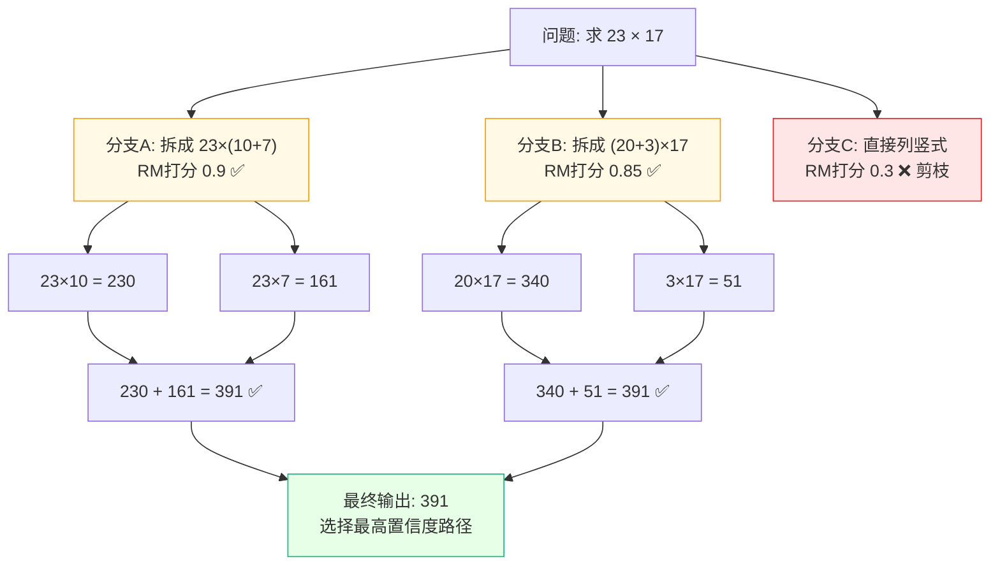

> [!NOTE]
> **《写给客户端工程师的 AI 底层原理》连载 · 第 5 期**
> 前面几篇的模型，都是脱口而出型选手：你问它答，快是快，但不会深思。这一篇讲一件正在发生的事——怎么让模型学会**慢思考**，用更多算力，换更强的逻辑。

# 四、 最前沿探索：深度思考模型 (System 2)

## 🟢【通俗版】慢思考，用算力换逻辑

以前的模型（GPT-4、Claude 3.5）像在做"快问快答"，看一眼题目就靠直觉脱口而出。如果第一步说错了，后面只能硬着头皮错下去。

现在的 o1、DeepSeek R1 采用的是"慢思考（System 2）"：

遇到难题，它先不回复你，而是在后台默默开个"子线程"打草稿。它会试错、会自我怀疑："刚才那个解法走进了死胡同，我退回去换条路算算"。直到确认逻辑通顺，才输出给你。**表面上它只回了 500 字，其实它的 GPU 在后台已经疯狂推演了 30000 个字**。

> [!NOTE]
> **必须分清的两个东西：**
> 1. **CoT (Chain-of-Thought)**：是 **prompt 技巧**，任何模型都能用 —— 你在 prompt 里写"请一步步思考"就触发了。
> 2. **o1 / R1 的深度思考**：是 **训练范式**，通过强化学习把"会思考"的能力内化到模型权重里，**用户根本不需要写任何 prompt**。
> 用客户端术语：CoT 像是"用户手动写自动化脚本"，o1 像是"App 内置自动化引擎"。

## 🔴【进阶版】Test-Time Compute、Reward Model 与蒸馏

这是目前 AI 最大的范式转移：**Scaling Law（缩放定律）从训练期（Train-time）延展到了推理期（Test-time）**。

- **隐藏思维链 (Hidden CoT)：**模型输出前，在隐式空间生成极长的推导路径，用户只看到最终答案。
- **Reward Model (RM)：**本身就是**一个独立的小神经网络**，输入"问题 + 一段推理"，输出"这段推理有多靠谱"的分数。它就是"打分老师"，是强化学习闭环的核心。
- **强化学习与搜索 (RL & Search)：**类似 AlphaGo 的 **MCTS**。对一个数学题，模型同时向多个方向推演（分支），Reward Model 对步骤打分，低分剪枝、高分深入。

**📊 流程图 5：System 2 推理搜索树**

**蒸馏 (Distillation)：把大模型的"推理能力"传给小模型**

DeepSeek R1 的一个核心贡献是：让 R1（671B 参数）生成大量"带思考过程"的高质量样本，再用这些样本训练 1.5B / 7B 的小模型。结果是：**小模型也能在数学/代码题上达到接近大模型的水平**。这条路径直接连通了下一章的端侧部署 —— 让"会思考的大模型"塞进手机成为可能。

> 📚 **推荐阅读：**
> 
> \- [Learning to Reason with LLMs (OpenAI o1 blog, 2024)](https://openai.com/index/learning-to-reason-with-llms/)：o1 系列官方解读。
> 
> \- [DeepSeek-R1 Paper (2025)](https://arxiv.org/abs/2501.12948)：开源了强化学习如何催生复杂推理能力。

---

> [!NOTE]
> **下期预告 · 第 6 期**
> 讲完这些越来越聪明的模型，一个现实问题砸下来：这么大的家伙，怎么塞进一台手机里？下一篇，也是客户端工程师**最该看**的一篇——端侧部署实战。
