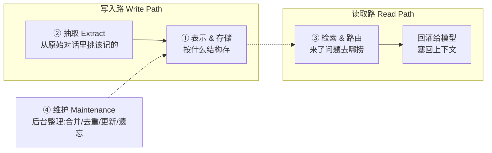
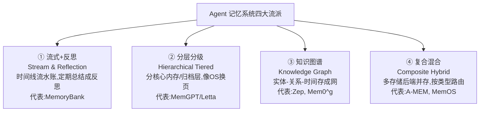

> [!NOTE]
> 起点：**OpenDataBox/awesome-agent-memory**(论文清单)+ **OpenDataBox/MemoryData**(统一评测套件)，背后是同一篇论文《Are We Ready For An Agent-Native Memory System?》(SJTU 等，arXiv 2606.24775)。本文结合这篇论文、其两个配套开源库，以及 GitHub 上 mem0 / Letta / Zep / Cognee / MemOS / A-MEM 等主流工程项目，做一次横向梳理。

# 一、先把「Agent 记忆系统」讲清楚

大模型本身是**没有记忆的**。每次调用，它只能看到你这次塞进"上下文窗口"(context window)里的那点文字，聊完就忘。所谓"记忆系统"，就是在模型外面挂一个**独立的数据管理系统**：把历史对话、工具执行结果、环境观察这些东西存下来，在下一次需要时，再挑出相关的部分重新塞回模型的上下文里。

用一句大白话打比方：

> 大模型像一个**失忆但很聪明的临时工**，每天上班前你得把相关资料摊在他桌上他才知道怎么干活。记忆系统就是那个**帮他归档资料、并在他需要时精准抽出正确那几页**的助理。这个助理干得好不好，直接决定这个临时工能不能胜任"长期项目"。

论文给了个更准的定义：记忆系统是 agent 的**数据管理系统(data management system)**，负责在"单次推理"之外持久地存储、检索、更新、整合信息，并管理其整个生命周期，和模型的"参数权重"与"易失的上下文窗口"是解耦的。

**为什么这事现在突然重要？** 因为 agent 要"长跑"。一个只聊三五轮的 chatbot，把全部历史直接塞进上下文就行(这叫 Long Context 基线)。但一个要连续工作几小时、跨几十个会话、边做边学的 agent，如果记忆层设计得烂，就会出现三种灾难：前后事实自相矛盾、灾难性遗忘、延迟和成本高到不可用。记忆层的可靠性和效率，基本决定了 agent 能力的上限。

# 二、理解一切的钥匙：把记忆系统拆成四个模块

市面上的记忆项目五花八门，论文最大的贡献，是提出一个**统一的拆解框架**——把任何一个记忆系统都拆成四个可以独立分析的模块。记住这四个模块，你看任何一个新项目都能秒懂它在哪个环节做文章。

| 模块 | 干的事(大白话) | 关键设计选择 |
|-|-|-|
| **① 表示与存储** | 记下来的东西**长什么样、存哪** | 存纯文本？存成树？存成知识图谱？存向量库还是图数据库？ |
| **② 抽取** | 从一大段对话里，**挑哪些内容值得记** | 全存原文？LLM 提炼成摘要？按主题切段？ |
| **③ 检索与路由** | 来了个新问题，**去哪捞、怎么捞** | 语义相似度匹配？关键词？图上遍历？要不要先"规划"再捞？ |
| **④ 维护** | 后台悄悄**整理记忆库** | 新事实来了怎么覆盖旧的？多久整理一次？整理范围多大？ |

> [!NOTE]
> **术语小注**
> - **向量 / embedding 检索**：把每句话压成一串数字坐标，意思相近的坐标也相近，靠"坐标距离"找相似内容。好处是懂语义(问"宠物"能捞到"我家猫")，坏处是捞不准确切的名字日期。
> - **知识图谱(Knowledge Graph)**：把信息拆成"实体—关系—实体"的三元组(如"老羊—养—猫")，连成一张网，擅长回答需要多跳推理、讲究前后关系的问题。
> - **BM25 / 稀疏检索**：老派的关键词全文匹配，认字面不认语义。

按照"表示"这一维度，论文把现有系统归成**四大流派**(这也是 awesome-agent-memory 清单的分类主线)：

# 三、实证结论：9 条最值得记住的发现

这才是这篇论文真正的干货。它在 **5 个基准、11 个数据集**上跑了 **12 个代表性记忆系统 + 2 个基线**，不是比"谁总分高"，而是拆成五个研究问题(RQ)去逼问。下面是提炼后的核心结论——**每一条都能直接改变你做技术选型的判断**。

## 贯穿全文的第一原则：没有银弹，只有「对不对得上」

> [!NOTE]
> **没有任何一种记忆架构能通吃所有场景。系统强不强，取决于它的记忆结构，是否对得上当前任务的瓶颈。**

这是全篇反复出现的主结论。具体到三类任务：

- **跨会话、找散落的事实**(信息分散在几十次对话里) → **知识图谱 / 时序结构**赢(Zep、Cognee)。因为它能把"实体—事件—时间"的关系连起来。
- **长但连贯的对话里抠一个确切细节**(某个日期、某个名字) → **由粗到细的过滤 / 摘要**赢(MemOS、MemoryOS)。先定位到相关那一段，再抠细节。
- **有状态的流程执行**(数据库操作、依赖前后步骤) → **保留完整原始轨迹**最重要(Long Context、MemoChat)。这里字面精确匹配反而不如"把过程原样留着"。

## RQ1-RQ5 & 模块消融：九条 Finding

| # | 发现 | 一句话说人话 | 实操启示 |
|-|-|-|-|
| **F1** | 记忆要对齐工作负载 | 别问"哪个记忆最强"，要问"我的任务卡在哪" | 先定位瓶颈类型，再选架构 |
| **F2** | 检索是"凑齐证据"，不是"排第一" | 好检索不是把最相关那条排最前，而是能把**散落各处、时间久远**的证据都捞全 | "早定位"和"凑齐证据"是两个独立目标；证据分散时，带链接/层级的结构(A-MEM、MemTree)完胜扁平向量检索 |
| **F3** | 更新可靠性是"管线问题"，不是"模型问题" | 事实被修正后能不能答对，靠的是记忆结构设计，而不是换个更强的大模型 | 可改写性要**内建到表示层**(让新事实绑到同一实体上，而非当成新文本追加)；换更强模型只能改善"表达"，救不了"记错" |
| **F4** | 长程稳定靠"结构"，不靠"塞更多" | 上下文越长/证据越远，难点不是存不下，而是**能不能把远处的事实和答题所需的抽象连着** | 纯长上下文 prompting 和扁平向量库，随 horizon 拉长会断崖式下跌；图结构/层级摘要则稳得多 |
| **F5** | 效率由"维护范围"决定，不由"用不用结构"决定 | 贵不贵，看每次写入要**惊动多大范围**的记忆库 | **局部维护**(LightMem、MemTree)性价比最高；**全局重组**(Cognee、Zep 全图整合)效果好但代价惊人(单次查询延迟可达 100\~150 秒) |
| **F6** | 保真度 > 压缩度 | 留住原始内容，比"多做抽象/多加层级"更重要 | 存原文(User-Only Raw)在多数指标上最好；摘要化损失惨重；**更深的树只改善"导航"，救不回被删掉的信息** |
| **F7** | 写入时要"晚过滤" | 抽取阶段别急着精挑细选，先把上下文留住 | 粗粒度分段、轻度改写、**同时存用户和助手的对话**，都比激进过滤更稳 |
| **F8** | 检索靠"有针对性的结构"，不靠"堆复杂度" | 加一步轻量规划有用，再加"反思"反而变差 | 适度的稀疏+稠密混合最佳；规划(Planning)有效，但规划之上再叠反思(Reflect)是负收益、纯增开销 |
| **F9** | 维护要"保守整合" | 别拖着不整理，也别一刀切粗暴总结 | 保守合并(提高相似度阈值再合) > 延迟刷新 > 强制单主题摘要 |

> [!NOTE]
> **把这九条拧成一句话**：好的记忆系统，是在**写入时尽量留全证据(F6/F7)**、用**匹配任务瓶颈的结构组织它(F1/F2/F4)**、把**更新能力内建进表示层(F3)**，并用**局部而非全局的方式低成本维护(F5/F9)**——而不是指望一个更聪明的大模型或更花哨的检索流程来兜底(F3/F8)。

# 四、主流工程项目横评

论文和 MemoryData 偏学术评测视角，而 GitHub 上真正被生产环境用的，是下面这几个工程项目。它们和论文里的方法多有重叠，但关注点是"跑得起、接得上、省钱"。

| 项目 | 定位 | 记忆怎么组织 | 更新/维护策略 | Star | 差异化卖点 |
|-|-|-|-|-|-|
| **mem0** | AI Agent 通用记忆层 | 以"事实条目"为单位存向量库，配实体抽取；User/Session/Agent 三级 | 新算法转为**纯累加(ADD-only)**，靠时序排序区分新旧，不做覆盖 | \~60k | 主打生产可用、低 token、单遍检索；库/自托管/云三档商业化 |
| **Letta**(原 MemGPT) | 有状态 Agent 平台 | 核心是常驻上下文的 **memory blocks**，配外部存储做分层(类 OS 换页) | **Agent 自主编辑**自己的记忆块(self-editing) | \~24k | "stateful agent"范式开创者；记忆由 agent 自己管 |
| **Zep**(引擎 Graphiti) | 时序知识图谱记忆平台 | **时序知识图谱**，分 episodic/semantic/community 三层子图，存 Neo4j | **双时序(bi-temporal)**：每条 fact 记"何时为真/何时失效"，靠边失效处理演化而非删除 | 引擎 \~20k+ | 唯一以"时序图+双时序"为核心，擅长时间推理与多会话一致性 |
| **Cognee** | 开源 AI 记忆平台 | 向量 + 图推理 + 认知科学 ontology；1.0 起可整层跑在**单个 Postgres** 上 | 提供 remember/recall/**forget**/improve 四原语，forget 显式删除 | \~26k | "单库跑完整记忆层"降运维；强调 ontology |
| **MemOS** | 面向 LLM 的记忆操作系统 | **图结构记忆**(可读可编辑，非黑盒)，以 **MemCube** 做隔离与共享；支持多模态 | 自然语言反馈纠错；**四层自进化**(交互轨迹→策略→世界模型→结晶为 Skills) | \~10k | "记忆 OS"抽象 + 分层自进化 + 技能结晶；多模态与工具记忆 |
| **A-MEM** | Agentic 记忆(学术复现) | 基于 **Zettelkasten(卡片盒)**的互联笔记网，每条记忆带结构化属性 | LLM 自动生成 tags 并**在记忆间建立链接**，支持动态演化 | \~1k | 核心创新是"自组织 + 记忆间自动链接" |

> [!NOTE]
> **一个有意思的错位**：论文实证里，A-MEM 和 MemTree 这类"带链接/层级的结构"在**凑齐分散证据**上表现突出(F2)，而 mem0 这类偏扁平的方案在长程、分散场景会掉队——但 mem0 在 GitHub 上 star 却是碾压级的。这说明：**工程上的流行度，和学术 benchmark 上的分数，是两套评价体系。**

# 五、工程实现 vs 学术评测：两套目标函数

这也是理解 awesome-agent-memory(论文清单)和 MemoryData(评测套件)这两个库定位的关键。

> [!NOTE]
> **学术/评测侧**(MemoryData, LoCoMo...)
> 目标：在标准题上答得准、说清为什么
> - 提出新机制(自组织/时序图/分层进化)
> - 固定协议下做消融、对比 SOTA
> - 报准确率/召回/延迟 trace
> - 强调可复现
> - 不太管运维和成本

> [!NOTE]
> **工程/生产侧**(mem0, Letta, Zep...)
> 目标：在生产里跑得起、接得上、省钱
> - 稳定的 add/search/update API
> - 多语言 SDK、多存储后端选型
> - 多租户隔离、可观测性
> - token 与延迟成本、框架集成
> - 商业化(云/自托管分层)

两者交汇于 LoCoMo / LongMemEval 等 benchmark，但工程侧跑它主要是营销与选型佐证。**MemoryData** 的价值正在于**填平这道沟**：它把 4 大 benchmark 家族、22 个方法预设、统一 runtime 收进**一个 main.py 入口**，让异构的记忆方案在同一套执行接口和产物格式下横向对比。过去每篇论文自带一套 loader、adapter、metric，复现两个方法的一个对比数字往往意味着两个都得重写——这正是它要终结的痛点。

# 六、未来方向：什么才叫「Agent 原生记忆」

论文标题是个反问——"我们准备好迎接 agent 原生的记忆系统了吗？"——答案是**还没有**。现有系统大多是"给 NLP 任务做的记忆"，而非"为 agent 长跑而生的记忆"。结合全文，真正 agent-native 的记忆系统应当具备：

1. **按瓶颈自适应结构**(F1)：不是押注单一表示，而是能根据任务瓶颈动态选择图/树/原文的组织方式。
2. **把可改写性做进底层**(F3)：事实更新要能精确绑定到实体/事件上，而不是无差别追加文本——这是当前多数系统的硬伤。
3. **局部维护优先**(F5)：放弃"定期全局重组"的思路，改用只惊动局部的增量维护，这是成本可控的关键。
4. **写入留全、读取精选**(F6/F7)：写入阶段克制过滤、保住证据；把"挑选"的压力后移到检索阶段。
5. **超越 end-to-end 指标**：不能再把记忆当黑盒只看 F1/BLEU，要能独立测量检索保真度、更新鲁棒性、长程稳定性和操作成本——这正是 MemoryData 这套评测框架的意义。

# 七、给选型者的一页速查

| 你的场景 | 优先考虑 | 理由 |
|-|-|-|
| 个性化助手、聊天记忆、要快速接入 | **mem0** | 生态成熟、SDK 全、生产可用 |
| 需要 agent 自主管理记忆、长期自我改进 | **Letta** | self-editing 范式、有状态平台 |
| 强时间推理、多会话事实一致性(如客服/CRM) | **Zep / Graphiti** | 时序图 + 双时序，处理"事实随时间变化"最强 |
| 想自托管、降运维、数据要落自己库 | **Cognee** | 单 Postgres 可跑完整记忆层 |
| 多模态、工具轨迹记忆、想要"技能沉淀" | **MemOS** | 图结构 + 四层自进化 + 技能结晶 |
| 做研究、要横向复现对比 | **MemoryData** | 统一入口跑 22 个方法 × 4 大 benchmark |

> [!NOTE]
> **最后一句忠告**：选型前先做一件事——**搞清楚你的任务到底卡在哪**(是证据分散？是事实频繁更新？是流程状态依赖？还是纯长上下文？)。把这个瓶颈类型对上速查表，比纠结"哪个 star 多"靠谱得多。这正是这篇论文九条发现里，反复砸向你的那一个核心。

---

**资料来源**：[Are We Ready For An Agent-Native Memory System?](https://arxiv.org/abs/2606.24775) · [awesome-agent-memory](https://github.com/OpenDataBox/awesome-agent-memory) · [MemoryData](https://github.com/OpenDataBox/MemoryData) · 各项目 GitHub 主页(mem0 / Letta / Zep / Cognee / MemOS / A-MEM)
