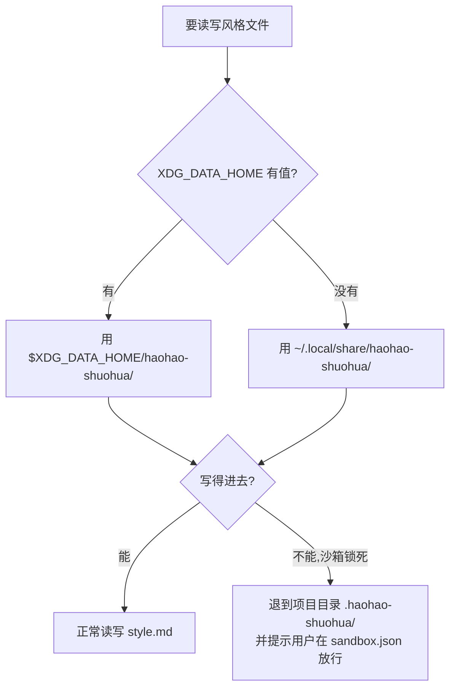
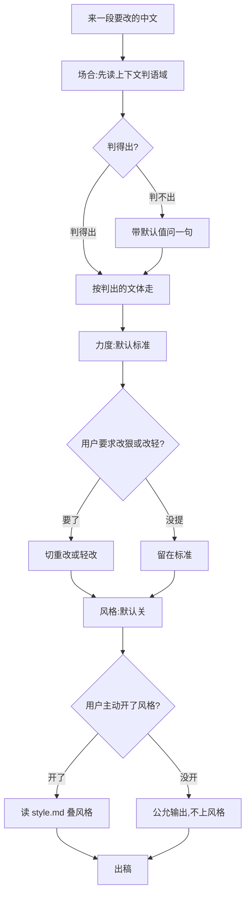

## 要做什么

给"好好说话"加三样可调设置：**力度、场合、风格**。

- **力度、场合**：技能现在其实已经在按这两样做事，只是没写明白。这次把规则显式定下来——改多狠、按什么文体改。
- **风格**：新增。要能记住用户给的写作样例，下次让它"照我的风格写"时用得上。

风格要"记住"东西，就带出一个存储问题：样例存哪、下次去哪读。这是三样里唯一牵扯落盘的，所以先把存储解决掉，再谈三样怎么调。

---

## 存储方案：落在 `~/.local/share/haohao-shuohua/`

**做法**：技能把风格样例写进 `~/.local/share/haohao-shuohua/style.md`，自己读、自己写。

**为什么是这条路**：它只靠文件系统和 `$HOME` 就成立，不依赖任何平台单独给的能力。mira-memory、`/data/userdata`、`~/files` 这些也能存，但都是 Mira 这个平台给的；技能一旦搬到 TRAE 或别处，这些就没了。判断标准只有一条——**换个平台，这个存法还在不在**。在，才用。

### 两个平台的写权限对照

Mira（远端）和 TRAE 沙箱（本地）对磁盘写权限的管法不一样，这是选路径的关键。

| 路径 | Mira（远端） | TRAE 沙箱（本地） | 能不能用 |
|-|-|-|-|
| 部署目录（技能自身所在） | 只读 | 只读 | 不行，技能改不了自己 |
| 任意 `~/.foo` | 可写 | 默认只读 | 不行，TRAE 沙箱挡掉 |
| `~/.local/share/` | 可写、持久 | 默认可写 | **行，交集在这** |
| `~/.cache/` | 可写 | 默认可写 | 会被清，存不住长期数据 |
| 项目目录 | —— | 默认可写 | 跟着项目走，不跨项目，不选 |
| `/tmp` | 可写 | 默认可写 | 重启即失，不选 |

TRAE 开沙箱后根目录默认只读，只放开了几处写：项目目录、`/tmp`、`~/.cache`、还有依赖目录（`~/.local/share`、`~/.local/bin`）。用户也能在 `sandbox.json` 里手动加可写路径，但不能指望用户去配，默认就得能用。

Mira 这头，`$HOME` 挂在 NAS 上，跨会话持久、随便写，部署目录只读。

两边取交集，**默认可写又跨会话留得住的，只有 `~/.local/share/`**。`~/.cache` 虽然也可写，但随时会被清，存不住风格这种长期数据。这个目录本来就是 XDG 规范里放"应用数据"的标准位置，语义也对。

### 路径解析（带兜底）

```
$XDG_DATA_HOME/haohao-shuohua/style.md   # XDG_DATA_HOME 有值,优先用它
~/.local/share/haohao-shuohua/style.md   # 否则落这
```



绝大多数情况走左边直接写。只有用户把沙箱锁得特别死时才走兜底：退到项目目录，同时提示他把路径加进 `sandbox.json`。

---

## 三样设置怎么调

三样的默认档都安全，读不出信号就待在默认档。区别在**怎么拿到用户想要的档**——有的自动判，有的绝不问，有的必须用户主动开。

### 力度：默认标准，绝不问

改多狠，默认标准档（句段全洗、该删就删、不主动动章节结构）。这一档不问用户，也不用问——用户说"帮我改改"，意思就是洗干净。

只有用户主动开口才切档："大改 / 放开手 / 重写"往重里走（连结构都能动），"别大改 / 只挑最刺眼的"往轻里收（只换词、不拆句）。没开口，就是标准。

### 场合：AI 自己读，拿不准才带默认值问

场合（什么语域）最适合自动判——AI 看这段东西是什么就知道：给客户的邮件、群消息、方案、slogan，各归各的口语化档位。

规矩是：

- **用户明说场合，就用他说的**("这是给客户的""发朋友圈""写危机公关")，不自作主张。
- **没明说，AI 读上下文自动判**，归到官方对外 / 敬语 / 要气势 / 私人软场合 / 技术议论这几类之一。
- **真判不出来，才带一个默认值问一句**——比如"我先按普通书面来改，如果是要对外发的正式文案，你说一声"。问的时候一定给默认值，不能空着让用户从零选。

### 风格：默认关，用户主动开，跟存储挂钩

三样里只有风格跟存储绑在一起，也只有它默认关。默认不学任何人，输出公允、不带个人色彩。

只有用户主动开才启用，分两步：

- **存**：用户说"记住我的风格"或甩几段样例过来，技能把样例和偏好写进 `style.md`。
- **用**：用户说"用我的风格写""像上次那样"，技能读 `style.md`，把风格叠上去。

风格只改"怎么说话"，改不动"说得对不对"——跟保真、去翻译腔任何一条红线打架，风格让路。

### 三样合起来怎么定



撞车时的让路顺序焊死：**保真 > 场合 > 力度 > 风格**。保真红线谁都不许越；场合搭骨架；力度在骨架里定改多狠；风格最后上色，绝不影响说得对不对。

---

## 落地要动哪些

- SKILL.md 里写清 `style.md` 的路径解析（XDG 优先、`~/.local/share` 兜底、沙箱锁死再退项目目录）和读写时机（用户说"记住"就写，说"用我的风格"就读）。
- 三样的获取规则各就各位：力度不问、场合自动判加兜底问、风格主动开。
- 存储和风格是新增，力度和场合基本是把现有行为写明白，风险小。风格牵扯读写文件，建议单独多测几轮再全量上。
