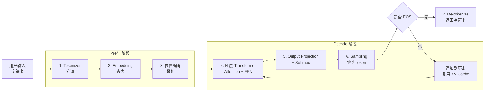

这是《写给客户端工程师的 AI 底层原理》系列的第一篇。

这一篇先不讲公式，只把一次 API 调用从头到尾走一遍。后面的文章，会分别拆开这条流水线里的关键环节。

## 从按下回车到第一个字出现

假设 App 里调用了这样一段代码：

```swift
let reply = await llm.chat("写一首关于秋天的诗")
```

这一行代码背后，大模型大致要经过 7 步。

1. **分词（Tokenizer）**：把字符串切成 token id 数组。它有点像 `String → [Int]` 编码，只是使用 BPE 子词字典。“写一首关于秋天的诗”大约会得到 12 个 token。
2. **查表（Embedding）**：每个 token id 查出一个 512 维或更高维的向量。可以把它理解成一次 `enum → 配置表 → 数据结构` 的查表。
3. **位置编码（Positional Encoding）**：给每个向量加上位置信息，让模型能够分清词语的先后顺序。
4. **经过 N 层 Transformer Block**：每一层主要处理自注意力和前馈网络。GPT-3 有 96 层，输入会在这些层之间逐步转换。
5. **预测下一个 token（Softmax + Sampling）**：模型输出下一个 token 的概率分布，再按贪心或随机采样等策略选出一个。
6. **进入自回归循环（Autoregressive Loop）**：把刚生成的 token 追加到输入末尾，继续预测下一个 token。聊天界面逐字输出，就是这个循环在运行。
7. **反编码（De-tokenize）并终止**：遇到 `<EOS>` 后停止生成，再把 token id 数组还原成字符串。

如果用客户端开发的流程来类比，第 1 至 3 步接近请求序列化，第 4 和第 5 步承担主要计算，第 6 步对应持续的流式输出，第 7 步完成响应还原。

## 一张图看完整条推理链



## Prefill 和 Decode 做的是两种工作

这 7 步在工程上可以分成两个阶段。两个阶段的计算方式不同，观察性能时用的指标也不同。

| 阶段 | 做什么 | 主要瓶颈 | 常用指标 |
|---|---|---|---|
| **Prefill** | 把整段 prompt 并行送进模型，建立完整的 KV Cache | 矩阵乘法密集，更依赖算力 | **TTFT**（Time To First Token，首字延迟） |
| **Decode** | 逐个生成 token，每轮只处理新加入的 token | 反复读取 KV Cache 和权重，更依赖内存带宽 | **TPS**（Tokens Per Second，吐字速度） |

后面讨论 KV Cache、投机解码和推理性能时，都会回到这两个阶段。

下一篇从自注意力开始，继续拆 Transformer 内部最关键的一步。
