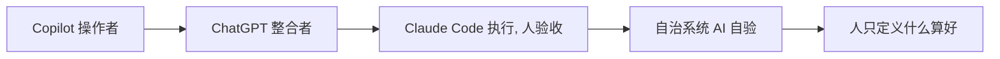

"AI 写、人来验"现在被当成终态，其实它是个半成品。真正的终态是 AI 写的东西 AI 自己验，人退到最末端只做收口。走到那一步，会顺带交出一样我们以前没敢想过要交的东西：读懂自己造物的能力。

上一篇讲过成本守恒，写代码变便宜，成本整个搬到了验收和理解那头。这篇不重讲那笔账，只钻一个点：验收这一环，最后会长成什么样。

## 人从操作者一路退到了定义者

把时间线拉长看，人的位置一直在挪。

Copilot 那会儿你是操作者，手放在键盘上，AI 只帮你补全下一段。ChatGPT 来了，你成了整合者，你提问它当场外参谋，活还是你自己干。到 Claude Code、Codex 这一代，第一次真正反转，AI 执行，你验收，你从写代码的人变成审代码的人。再往前推，到能自己规划、生成、评判、重试的自治系统，人退到只剩一件事：定义什么是好，把红线划在哪。

人离亲手做越来越远，离定义什么算好越来越近。

## AI 写、人来验，是个卡住的半成品

它只把"写"自动化了，把"验"原封不动留给了人。结果是产能上去了、检验没上去，瓶颈从写挪到验，人被焊死在流水线上一行行看 diff。AI 生成十个方案，你一个都验不过来，那九个的速度等于零。

只要人还是这条流水线上唯一的质检员，提效就有天花板，而且这个天花板就是一个人读代码的速度。第三阶段的瓶颈，只能靠第四阶段来破。

## 机器验机器要立住，判据必须独立于生成

让 AI 写的东西 AI 自己验，第一反应肯定是：这不既当运动员又当裁判吗。这个顾虑是对的。让写代码那个模型自己给自己打分，它只会一路盖章，把错的也说成对的。

所以自动验收立不立得住，不看你再叫几个 AI 来复核，看判据是不是独立于生成过程。能不能编过、测试过不过、符不符合事先定好的契约、有没有踩红线，这些标准提前定死，写代码那一方碰不到、改不了。机器照着这套独立的尺子卡，不合格就打回，自己重来，直到过线。裁判手里的尺子不是运动员发的，机器验机器才成立。

## 人退出逐行验收，退到上游造尺子

人不再逐行看，不等于甩手，恰恰相反，你得往前站一步，去干机器干不了的事：提前定义什么算好、什么算过、哪条线绝不能越。

位置越往后退，对理解的要求反而越高。逐行验收只要懂 AI 写的这一段；定义标准要懂到能提前说清整类问题的对错、边界在哪、什么情况必须停。前者是事后补理解，后者是事前立规矩，后者难得多，也值钱得多。

## 理解债没消失，只是浓缩进了那张标准

得诚实一点。理解债真被消灭了吗，没有，它只是从"读每一行代码"挪到了"读那套标准"。

你不再需要懂 AI 写的那一大坨，但你必须懂你定的标准够不够严、有没有漏。哪天线上出事，要么标准本身有洞，你没预见到；要么标准对了机器没卡住，执行漏了。这两处查的都是标准，不是代码。债从一大片代码浓缩成一小张标准，从事后追着还变成事前一次性付清。划算在于一张好标准能罩住机器生成的无数份代码，理解被复用了；凶险在于你押上的全部身家就是那张标准，它有个洞，机器会忠实地复制进每一份产出，而且没人再逐行看，可能很久都没人发现。

## 验收做强的代价：代码不再给人看

机器验机器一旦真的立住，会顺势滑向一个我们以前没敢想的地方。

过去代码有两个读者，机器和人。可读性、命名、注释、分层，那些讲究全是为人这第二个读者服务的。人退出逐行阅读，代码就只剩机器一个读者。它会越来越密、越来越不像人写的，只要能过那套独立验收，长什么样都无所谓。工程师这个职业的重心就此彻底挪走：你不再靠读懂代码吃饭，你靠的是能不能把"什么算好、什么算过、哪条线绝不能越"提前定死。

AI 提效的天花板，从来不在 AI 有多快，在你敢不敢把验收做到强得可以不再看代码，也敢不敢认下那个代价：从此你守的是标准，不是代码。说到底，我们正在亲手交出读懂自己造物的能力，还说服自己这是进步。
